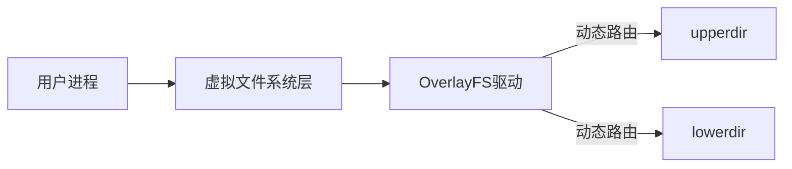

## 一、容器技术介绍

### 1. 容器技术的本质

- **定义**：一种轻量级的虚拟化解决方案，通过 **namespace**（隔离）、**cgroup**（资源限制）和 **UnionFS联合文件系统**（分层文件系统）实现进程级资源隔离。


### 2. 容器技术解决的问题与发展历程

#### 2.1 单机时代

##### 特点

- 一台计算机硬件仅运行一个操作系统，所有应用程序共享同一操作系统环境。

##### 核心问题

- **资源利用率低**：单机无法充分利用硬件资源。

##### 解决方案

- 在单操作系统上运行多个应用程序，提升资源利用率。

##### 新问题

- **可用性差**：应用程序与操作系统强耦合，一旦操作系统故障，所有应用崩溃（类似“所有鸡蛋放在一个篮子里”）。


#### 2.2 集群时代

#### 特点

- 多台独立计算机组成集群，每台机器运行独立操作系统，分散部署应用。

#### 核心问题

- **资源利用率与可用性矛盾**：
  - **提升可用性**：应用分散到不同机器，但单机资源利用率不足。
  - **资源浪费**：每台机器仍需独立操作系统，硬件资源未被充分共享。


#### 2.3 虚拟化时代


##### 特点

- 单台计算机通过虚拟化技术运行多个虚拟机（VM），每个VM包含完整操作系统，多VM组成集群。

##### 核心技术

- **虚拟化技术**（如KVM、ESXi、Xen）：
  - **隔离**：VM间资源隔离。
  - **资源限制**：预先分配VM的CPU、内存等资源。

##### **核心问题**

- **性能开销大**：每个VM需运行完整操作系统（内核+文件系统），导致资源浪费（如磁盘空间、内存占用）。


#### 2.4 容器时代


##### 特点

- 轻量级的虚拟化技术

- 容器直接运行在宿主操作系统上，共享内核，实现进程级虚拟化。

##### 核心技术

1. **Namespace**：隔离进程的视图（如PID、网络、文件系统），实现环境隔离。
2. **Cgroup**：限制容器对CPU、内存等资源的使用，避免资源争抢。
3. **UnionFS**：联合文件系统，支持镜像分层构建与共享，减少冗余。

##### 操作系统结构补充

- 完整操作系统分为：
  - **bootfs**：内核与启动文件（容器共享宿主机内核，只需自己 rootfs 来提供应用程序运行所需的文件和目录，而虚拟机则需要一个完整的操作系统环境，即 bootfs+rootfs）。
  - **rootfs**：用户空间文件系统（各容器独立，通过UnionFS实现轻量化）。

##### 优势

- **轻量高效**：无需重复加载内核，资源占用远低于虚拟机。
- **快速启动**：秒级启动，接近原生进程速度。
- **高可用与资源利用率**：既实现应用隔离，又充分利用硬件资源。

##### **与传统虚拟机的对比**

|     维度     |       虚拟机       |           容器            |
| :----------: | :----------------: | :-----------------------: |
|   **内核**   | 每个虚拟机独立内核 |      共享宿主机内核       |
| **启动速度** |    慢（分钟级）    |        快（秒级）         |
| **存储开销** |     大（GB级）     | 小（MB级，依赖分层复用）  |
|   **隔离**   |    硬件级虚拟化    | 进程级隔离，依赖Namespace |

------

#### 3. 发展脉络总结

|    时代    |     核心问题     |          解决方案           |        新挑战        |
| :--------: | :--------------: | :-------------------------: | :------------------: |
|  **单机**  |   资源利用率低   |         单OS多应用          |       可用性差       |
|  **集群**  |   单机可用性差   |        多机分散部署         |    资源利用率不足    |
| **虚拟化** | 资源与可用性矛盾 |     虚拟机隔离+资源限制     | 虚拟机臃肿，资源浪费 |
|  **容器**  |  虚拟化性能开销  | 进程级隔离+共享内核+UnionFS |          无          |

通过容器技术，最终实现了 **资源利用率** 与 **应用隔离** 的平衡，成为云原生时代的核心基础设施。

## 二、命名空间namespace


### 1. Namespace 的核心作用

- **本质**：容器引擎（如Docker、containerd）创建容器时，实质是创建一组 **隔离的命名空间**（namespace + cgroups），每个命名空间隔离特定**系统**资源。
- **目标**：保证容器内进程的 **资源独立性**，避免与其他容器或宿主机冲突，实现轻量级虚拟化。


### 2. 6种关键Namespace及其隔离资源

#### （1）**PID Namespace（进程隔离）**

- **功能**：隔离进程ID（PID），不同命名空间内的进程PID独立。
- **特点**：
  - 每个容器内PID从1开始计数，与宿主机或其他容器中的PID互不影响。
  - 宿主机可查看容器内所有进程，但PID不同（通过`ps -ef --pid <容器PID>`）。

#### （2）**UTS Namespace（主机名隔离）**

- **功能**：隔离 **主机名（hostname）** 和 **域名（domainname）**。

- **特点**：

  - 容器可自定义主机名，不影响宿主机或其他容器。
  - 常用于多容器环境标识服务（如`web-server`、`db-server`）。

- **示例**：

  ```bash
  docker run -it --hostname my-container centos hostname  # 输出：my-container
  # --hostname my-container: 设置运行中的 Docker 容器的主机名（hostname）为 my-container
  # hostname: 一个命令，用于显示当前系统的主机名
  ```

#### （3）IPC Namespace（进程间通信隔离）

- **功能**：隔离进程间通信（IPC）机制，包括：
  - 消息队列（Message Queues）
  - 共享内存（Shared Memory）
  - 信号量（Semaphores）
- **特点**：
  - 不同容器的进程无法通过IPC通信，增强安全性。
  - 同一容器内的进程可通过**共享内存**高效交互。

------

#### （4）**Mount Namespace（文件系统隔离）**

- **功能**：隔离 **文件系统挂载点**，每个容器拥有独立的文件系统视图。（隔离宿主机同容器的文件系统，让容器以为自己处于一个独立的操作系统）

- **特点**：

  - 容器可挂载/卸载目录，不影响宿主机或其他容器。
  - 结合 **UnionFS（联合文件系统）** 实现容器镜像的分层挂载。

- **示例**：

  ```bash
  # 容器内挂载临时文件系统
  docker run -it -v /tmp:/app centos ls /app  # 容器内访问宿主机/tmp目录
  # -v /tmp:/app: volume挂载选项，用于将宿主机的文件系统目录挂载到容器内的目录。这里：
  #	/tmp 是宿主机上的目录。
  #	/app 是容器内的目录。
  #   : 是分隔符，用于分隔宿主机目录和容器目录。
  ```

#### （5）**Network Namespace（网络隔离）**

- **功能**：隔离网络资源，包括：
  - 网卡设备（如`eth0`）
  - IP地址、端口号
  - 路由表、防火墙规则（`iptables`）
- **特点**：
  - 每个容器拥有独立网络栈，通过虚拟网卡（`veth pair`）与宿主机通信。
  - 支持容器间通过桥接网络或覆盖网络通信。

#### （6）**User Namespace（用户权限隔离）**

- **功能**：隔离 **用户ID（UID）** 和 **组ID（GID）**。

- **特点**：

  - 容器内用户（如root）映射到宿主机的非特权用户，提升安全性。
  - 避免容器内进程拥有宿主机root权限。

- **示例**：

  ```bash
  # 容器内以root运行，宿主机映射为普通用户
  docker run -it --user 1000:1000 centos id  # 输出：uid=1000 gid=1000
  # –user 1000:1000: 告诉Docker在容器内以指定的用户ID和组ID运行进程
  ```

#### 查看容器的Namespace

```shell
# 查看容器进程在宿主机上的PID(直接确定)
docker inspect --format '{{.State.Pid}}' <容器ID>
# 或列出系统中的所有命名空间（namespaces），自行判断
lsns

# 查看容器的Namespace文件（位于/proc/<PID>/ns）
ls -l /proc/<PID>/ns
```

------

### 3. Namespace与容器引擎的关系

- **容器引擎**：类比为“汽车引擎”，核心功能是创建并管理容器所需的命名空间。
- **工作流程**：
  1. 调用Linux内核API创建一组Namespace（上述6种）。
  2. 在隔离环境中启动进程，并配置资源限制（通过Cgroups）。
  3. 使用联合文件系统（如OverlayFS）构建容器文件系统。

------

### 4. 总结：Namespace的核心价值

|  命名空间   |    隔离资源    |      应用场景      |
| :---------: | :------------: | :----------------: |
|   **PID**   |     进程ID     |     进程独立性     |
|   **UTS**   |  主机名与域名  |      服务标识      |
|   **IPC**   |   进程间通信   |      安全隔离      |
|  **Mount**  | 文件系统挂载点 |    独立文件系统    |
| **Network** | 网络接口与配置 |     独立网络栈     |
|  **User**   |   用户与组ID   | 权限控制与安全增强 |

## 三、容器的镜像与UnionFS


### 1.容器镜像的组成


#### 1.1 **传统系统镜像 vs 容器镜像**

|       类型       |            组成部分            |                             说明                             |
| :--------------: | :----------------------------: | :----------------------------------------------------------: |
| **完整系统镜像** |      `bootfs` + `rootfs`       | - **bootfs**：内核与启动文件 <br />- **rootfs**：用户空间文件系统 |
|   **容器镜像**   | `rootfs`（仅用户空间文件系统） | - **不包含内核**，共享宿主机内核 <br />- 所有容器共用宿主机`bootfs`部分 |

#### 1.2 **容器镜像的核心特性**

- **依赖宿主机内核**：
  - 容器镜像中仅包含应用程序所需的文件系统（`rootfs`），**无独立内核**。
  - 所有容器共享宿主机内核，因此容器镜像需与宿主机内核兼容（如Linux容器无法在Windows宿主机运行）。
- **分层构建**：
  - 镜像通过**联合文件系统（如OverlayFS）** 分层叠加，实现高效复用与存储。

------

### 2. UnionFS联合文件系统

#### 2.1 **核心作用**

- 实现容器镜像的**分层存储**，解决镜像冗余问题。
- **典型实现**：OverlayFS（是对 UnionFS 的继承与优化，Linux内核原生支持，Docker默认存储驱动之一）。

#### 2.2 **OverlayFS 的三层结构**


> 针对这三层，我们从上往下看，看到的merged内容来自 `upperdir` 与 `lowerdir`，`upperdir`里的内容会遮挡住 `lowerdir` 的内容

|    层级    |    名称    | 读写特性 |                           功能说明                           |
| :--------: | :--------: | :------: | :----------------------------------------------------------: |
| **基础层** | `lowerdir` |   只读   | 由**镜像层**构成，多个只读层可叠加（如基础镜像、软件安装层、配置层）。 |
| **容器层** | `upperdir` |   可写   | 容器运行时所有修改（新增/删除/修改文件）均记录在此层，**数据持久化起点**。 |
| **展现层** |  `merged`  |          | 将`lowerdir`和`upperdir`合并后的统一视图，容器内进程看到的**文件系统**。 |

同一镜像启动的多个容器在宿主机的目录结构：

```
/var/lib/docker/overlay2/  # OverlayFS 存储根目录
│
├── l/                     # 【核心枢纽】符号链接目录（短名称映射）
│   ├── 6S6D2HXUXYD3WJYB5FQ2N74SM -> ../d873da...b2896   # 指向基础层1
│   ├── E9KJ7MZ3RT8XV4CPLQ1O5D6WFG -> ../e832bc...c7621   # 指向基础层2
│   ├── K3J92HB8N6D5F1AQ7RV4TXU7HQ -> ../a921bc...d5f21   # 指向容器1层
│   └── ...                # 其他层的短链接
│
├── d873dae...ab2896/      # 镜像层1目录（基础操作系统）
│   ├── diff/              # 实际文件内容
│   │   ├── bin/
│   │   ├── etc/
│   │   └── usr/
│   ├── link               # 链接ID "6S6D2HXUXYD3WJYB5FQ2N74SM"
│   ├── lower              # 描述下层依赖（如：l/E9KJ7MZ3RT8XV4CPLQ1O5D6WFG）
│   └── committed         # 写操作元数据（高级功能）
│
├── e832bc7...cc7621/      # 镜像层2目录（安装的软件）
│   ├── diff/
│   │   ├── usr/bin/nginx
│   │   └── etc/nginx/
│   ├── link               # "E9KJ7MZ3RT8XV4CPLQ1O5D6WFG"
│   └── lower              # 指向更底层（如：l/6S6D2HXUXYD3WJYB5FQ2N74SM）
│
├── a921bc3...dd5f21/      # 容器1可写层目录
│   ├── diff/              # 容器1的所有修改
│   │   ├── etc/hosts            # 修改的文件（从基础层复制而来）
│   │   ├── root/.bash_history   # 新增文件
│   │   └── etc/.wh.apache2      # 删除标记（白障）
│   ├── work/              # OverlayFS 工作目录
│   │   └── work/          # 原子操作临时空间
│   ├── link               # "K3J92HB8N6D5F1AQ7RV4TXU7HQ"
│   └── lower              # 描述基础层（如：l/E9KJ... l/6S6D...）
│
├── bb52cd1...ee8312/      # 容器2可写层目录
│   ├── diff/
│   │   └── var/log/app.log
│   └── ...                # 类似容器1结构
│
├── container1-merged/     # 容器1的运行时视图（通过mount命名空间实现）
│   ├── bin				  # 虚拟目录（自动聚合所有层的 bin 目录作为其实际内容）
│   ├── etc/               # 虚拟目录
│   │   ├── nginx/         # 来自镜像层2
│   │   ├── hosts          # 来自容器层（覆盖基础层）
│   │   └── # apache2 目录被隐藏（因白障）
│   └── root/.bash_history # 容器层新增
│
├── backingFsBlockDev       # 存储驱动使用的块设备信息
└── overlay2.db             # 数据库（记录层元数据和垃圾回收状态）
```

merged 目录是通过内核的虚拟文件系统层（而非符号链接）实现透明路径解析：

虚拟化原理：



- **动态路由规则**：
  - 文件存在于 `upperdir`？ → 直接返回
  - 不存在？ → 在 `lowerdir` 中查找
  - 被删除？ → 返回 `ENOENT` (白障生效)

|    **特性**    | 符号链接 (Symbolic Link)  |    OverlayFS 虚拟路径     |
| :------------: | :-----------------------: | :-----------------------: |
|  **物理存在**  |  是真实文件 (含目标路径)  | 纯内核虚拟化 (无磁盘实体) |
|  **路径解析**  | 用户空间完成 (`readlink`) |     内核 VFS 动态路由     |
|  `st_size` 值  | 目标路径长度 (如 20 字节) |     真实文件/目录大小     |
|  **性能开销**  |       额外寻址开销        | 零额外开销 (等同普通文件) |
| **跨设备支持** |       可跨文件系统        |      同设备内部分层       |

#### 2.3 **文件操作规则**

- **读操作**：优先从`upperdir`读取，若无则从`lowerdir`读取。

- **写操作**：

  - **修改文件**：将文件从`lowerdir`复制到`upperdir`后再修改（**写时复制，Copy-on-Write**）。
    - **写时复制**：
      - **初始状态**：
        - 多个进程或对象 **共享同一份原始数据**（如文件、内存块），无需立即复制。
      - **修改操作触发复制**：
        - 当某个进程尝试 **修改数据** 时，系统才会为它 **创建数据的独立副本**，后续操作仅影响副本，原始数据保持不变。
      - **共享与隔离**：
        - 未修改的部分保持共享，节省存储空间；
        - 修改的部分独立隔离，保证数据一致性。
  - **删除文件**：在`upperdir`中创建`whiteout`文件（字符设备文件）标记删除，使其在展现层中被隐藏。
  - **新增文件**：直接写入`upperdir`。

- **示例**：

  ```bash
  # 手动挂载OverlayFS（需提前创建目录）
  mount -t overlay overlay -o lowerdir=/lower,upperdir=/upper,workdir=/work /merged
  # -t overlay：指定了要挂载的文件系统类型为 overlay，即 OverlayFS
  # overlay：这是第一个 overlay，它是一个占位符，表示文件系统的类型。在 mount 命令中，第一个参数通常是要挂载的设备或特殊的文件系统名，但在 OverlayFS 的情况下，这里只需要一个占位符。
  # -o：用于指定挂载选项。
  # workdir=/work：指定了 OverlayFS 的工作目录，这个目录用于 OverlayFS 内部使用，例如存放一些临时文件。
  ```

#### 2.4 **核心价值**

|       优势       |                           说明                            |
| :--------------: | :-------------------------------------------------------: |
| **快速启动容器** |         无需复制完整镜像文件，直接挂载现有分层。          |
| **节省存储空间** |             多容器共享基础镜像层，减少冗余。              |
|   **高效写入**   | 写时复制（COW）减少磁盘IO，容器层独立修改不影响基础镜像。 |

### Question:

**Q：同一台机器上用同一个镜像启动的多个容器，是如何实现的文件系统隔离的？请说一下底层原理，比如为何每个容器内看到的系统都一样，但不同的容器写的数据彼此隔离，不会影响其他容器呢？**

**A：**主要是依靠 UnionFS 和 namespce 命名空间技术。UnionFS 允许将多个物理隔离的目录（这些目录可划分为基础层、可写层、合并层）合并挂载到同一目录下，形成统一的虚拟文件系统。每个容器都有自己独立的可写层，共享由镜像层构成的基础层，通过写时复制机制，即要修改文件时才会从基础层复制相应的文件到可写层来修改，确保对文件的修改只影响当前容器，同时命名空间通过文件系统隔离来隔离不同容器的文件系统挂载点，为每个容器提供了独立的文件系统视图，使得容器间数据彼此隔离，互不影响。

## 四、Docker 基础


### 1. Docker 安装

### 2. Docker 容器引擎数据目录详解与迁移指南

#### 2.1 数据目录存储的数据
默认情况下，Docker 将以下数据存储在 `/var/lib/docker` 目录（在宿主机）中：

- **本地镜像（Images）**  
   - 所有通过 `docker pull` 或 `docker build` 下载或构建的镜像文件。（或直接从网上下载一个 Docker 镜像的压缩包并上传到服务器）

- **容器运行时数据（未关联存储卷）**  
   - 容器运行过程中产生的数据（如临时文件、日志、未挂载卷的容器层数据）。

- **其他组件数据**  
   - 网络配置、卷元数据、插件数据等。


#### 2.2 需要迁移数据目录的场景
- **磁盘空间不足**：当 `/var/lib/docker` 所在磁盘空间即将耗尽，且无法直接扩容时。


#### 2.3 迁移数据目录的详细步骤

##### 1. 停止所有运行中的容器

防止迁移过程中出现写操作

```bash
# 停止所有容器
docker stop $(docker ps -aq)

# 确认无容器运行
docker ps -a
```

##### 2. 停止 Docker 服务
```bash
systemctl stop docker

# 验证是否停止成功
systemctl status docker
```

##### 3. 准备新磁盘与挂载目录（回顾存储管理相关知识）
- **新增磁盘**：物理机添加新硬盘，虚拟机挂载虚拟磁盘。

- **创建文件系统**（以 ext4 为例）：

  ```bash
  # 假设新磁盘为 /dev/sdb
  
  # 非必要操作
  # 使用 parted 命令创建 GPT 分区表并划分一个主分区
  # mkpart primary：创建一个主分区，分区类型为 ext4（只是做了类型标记，并未实际格式化），0% 和 100% 指定了分区的起始和结束位置，意味着分区将使用整个磁盘
  parted /dev/sdb mklabel gpt
  parted /dev/sdb mkpart primary ext4 0% 100%
  
  # mkfs.ext4：将新创建的分区 /dev/sdb1 格式化为 ext4 文件系统
  mkfs.ext4 /dev/sdb1
  ```

- **挂载到新目录**（建议使用 LVM 便于未来扩展）：

  ```sh
  mkdir /data
  mount /dev/sdb1 /data
  ```

- **处理挂载持久化**  

  修改 `/etc/fstab` （File System Table，文件系统表，告诉系统在启动时[或手动使用 `mount -a` 命令时]需要挂载哪些文件系统，以及如何挂载它们）使**系统启动时自动挂载 `/dev/sdb1` 到 `data`**：

    ```bash
  echo "/dev/sdb1 /data ext4 defaults 0 0" >> /etc/fstab
    ```

**拓展：使用 LVM 管理磁盘**

若使用 LVM 管理新磁盘，可按以下步骤操作：

```bash
# 创建物理卷、卷组、逻辑卷
pvcreate /dev/sdb
vgcreate vg_docker /dev/sdb
lvcreate -l 100%FREE -n lv_docker vg_docker

# 格式化并挂载
mkfs.ext4 /dev/vg_docker/lv_docker
mount /dev/vg_docker/lv_docker /data
```

**核心作用**：

- **动态扩容**：当 Docker 数据增长导致磁盘空间不足时，无需停机或迁移数据

  ```bash
  # 添加新物理磁盘（如 /dev/sdc）
  pvcreate /dev/sdc
  vgextend vg_docker /dev/sdc  # 将新磁盘加入卷组
  lvextend -l +100%FREE /dev/vg_docker/lv_docker  # 扩展逻辑卷
  resize2fs /dev/vg_docker/lv_docker  # 在线扩展文件系统
  ```

- **简化存储管理**

  - **抽象化物理存储**：将多个物理磁盘（如 `/dev/sdb`, `/dev/sdc`）合并为单一逻辑卷（`/dev/vg_docker/lv_docker`），操作系统只需与逻辑卷交互。
  - **统一命名**：无论底层物理磁盘如何变化，逻辑卷路径保持不变（如 `/data` 始终指向同一逻辑卷）。

- **支持高级功能**

  - **快照（Snapshot）**：创建数据一致性备份（如备份 Docker 镜像和容器状态）：

    ```bash
    lvcreate --size 10G --snapshot --name docker_snap /dev/vg_docker/lv_docker
    ```

    - **应用场景**：升级 Docker 前创建快照，失败后可秒级回滚。

  - **条带化（Striping）**：提升 I/O 性能（将数据分散到多块磁盘）。

  - **镜像（Mirroring）**：提供数据冗余（类似 RAID 1）。

- **在线运维能力**

  - **热迁移磁盘**：更换故障磁盘时，数据自动迁移到新磁盘（`pvmove`）：

    ```bash
    pvmove /dev/sdb /dev/sdc  # 将数据从旧盘迁移到新盘
    vgreduce vg_docker /dev/sdb  # 移除旧盘
    ```

  - **零停机扩容**：扩展存储时 Docker 服务无需停止。

**VS 传统分区**：

| **场景**       | **传统分区**               | **LVM**              |
| :------------- | :------------------------- | :------------------- |
| 磁盘空间不足   | 需停机、迁移数据、重新分区 | 在线动态扩展         |
| 管理多块磁盘   | 需手动挂载多个目录         | 多盘合并为单一逻辑卷 |
| 创建一致性备份 | 需停止服务或复杂工具       | 秒级快照             |
| 更换故障磁盘   | 复杂的数据恢复流程         | 在线数据迁移         |

##### 4. 迁移数据

```bash
# 使用 -a 保留权限和属性，-v 显示进度
cp -rav /var/lib/docker /data/

# 验证数据完整性（可选）
ls /data/docker
```

- **权限问题**  

  新目录 `/data/docker` 的权限需与原始目录一致（通常为 `root:root`，权限 `0710`）。

##### 5. 修改 Docker 配置
- **编辑 Docker 配置文件**（不同系统的配置文件路径可能不同）：

  ```sh
  vim /etc/docker/daemon.json
  ```

- **添加或修改 `data-root` 字段**：

  ```sh
  # Docker 守护进程用于存储所有 Docker 相关数据的根目录
  {
    "data-root": "/data/docker"
  }
  ```

##### 6. 重启 Docker 服务
```bash
systemctl start docker
systemctl status docker  # 确认服务状态正常
```

##### 7. 启动容器并验证
```bash
docker start <容器ID或名称>
docker ps  # 确认容器运行状态
docker info | grep "Docker Root Dir"  # 检查数据目录是否生效
```

#### 2.4 避免数据迁移的前瞻性规划
**核心策略与实施方案：**
1. **初始存储规划：** 在系统设计初期，为Docker数据目录分配一个足够空间的磁盘，并确保该磁盘具备扩容能力。建议使用逻辑卷管理（LVM）来实现磁盘空间的动态调整。
2. **外部存储卷使用：** 对于容器运行中产生的写操作数据，应将其关联到外部存储卷，确保数据的持久化和可管理性，避免直接写入Docker数据目录。

### 3. Docker 常用命令和操作
### 4. Docker镜像管理与制作

#### 4.1 部署私有镜像仓库

##### 4.1.1 基础部署

```bash
# 拉取官方registry镜像
docker pull registry

# 创建宿主机的仓库目录，用于存储Docker镜像数据
mkdir /opt/registry

# 启动registry容器（基础版）
docker run -d -p 5000:5000 \
	--restart=always \
    -v /opt/registry:/var/lib/registry \
    --name myregistry registry
# --restart=always: 设置了容器的重启策略。always意味着如果容器退出，它总是会被重新启动。
# 由于对镜像数据做了持久化，故后期删除容器后，之前下载的镜像不会消失
```

##### 4.1.2 配置 Docker 客户端

```sh
# 修改 daemon.json
cat > /etc/docker/daemon.json << EOF
{
  "insecure-registries": ["172.16.10.14:5000"],
  ...
}
EOF

systemctl restart docker
```

> 当Docker守护进程尝试从某个仓库拉取或推送镜像时，如果该仓库的地址包含在`insecure-registries`列表中，Docker将不会验证该仓库的TLS（传输层安全协议）证书。这在以下情况下很有用：
>
> 1. 你正在使用一个私有仓库，而这个仓库没有配置TLS证书。
> 2. 你正在开发或测试环境，并且不希望处理TLS证书的复杂性。
>
> 需要注意的是，将仓库列为不安全的会有安全风险，因为它允许中间人攻击，攻击者可能会截取你的数据或篡改你的镜像。因此，在**生产环境**中，应该**始终使用**TLS来保护Docker仓库通信，并且不应该将仓库列为不安全的。如果在生产环境中必须使用私有仓库，应该确保仓库配置了有效的TLS证书，并且不应该将其添加到`insecure-registries`列表中。

##### 4.1.2 往自定义仓库推送镜像

```bash
# 镜像打标签
docker tag myimage:tag 172.16.10.14:5000/tracy/myimage:tag

# 推送镜像到私有仓库
docker push 172.16.10.14:5000/tracy/myimage:tag

# 从私有仓库拉取镜像（在另外一台机器验证）
docker pull 172.16.10.14:5000/tracy/myimage:tag
```

##### 4.1.3 安全认证配置

确保不是所有人都能 `push`

**创建认证文件**

```sh
# 安装工具包
yum install httpd-tools -y

# 创建认证目录
mkdir -p /opt/registry-auth

# 生成用户凭证（用户：tracy，密码：123）
htpasswd -Bbn tracy 123 > /opt/registry-auth/htpasswd
```

**启动安全版Registry**

```sh
# 删除旧容器
docker rm -f registry

# 启动带认证的容器
docker run -d -p 5000:5000 \
    --name registry-auth \
    -v /opt/registry:/var/lib/registry \
    -v /opt/registry-auth:/auth \
    -e "REGISTRY_AUTH=htpasswd" \
    -e "REGISTRY_AUTH_HTPASSWD_REALM=Registry Realm" \
    -e "REGISTRY_AUTH_HTPASSWD_PATH=/auth/htpasswd" \
    registry
```

##### 4.1.4 客户端认证操作

**登录私有仓库**

```sh
docker login -u tracy -p 123 172.16.10.14:5000
```

**认证后操作**

```sh
# 推送镜像（需要先登录）
docker push 172.16.10.14:5000/tracy/centos:7

# 拉取镜像（私有镜像需登录后操作）
docker pull 172.16.10.14:5000/tracy/centos:7
```

**常见错误处理**

- **HTTPS问题**

  ```sh
  # docker登录私有仓库，发现登陆报错；
  Error response from daemon:Get “https:.//.../v2/"": http: server gave HTTP response to HTTs client
  ```

  - **解决方法**

    - 确保所有节点`daemon.json`中配置了`insecure-registries`

    - 重启Docker服务：`systemctl restart docker`

- **认证失败**

  ```sh
  # 清除旧凭证
  rm ~/.docker/config.json
  # 重新登录
  docker login -u tracy 172.16.10.14:5000
  ```


#### 4.2 镜像制作方法

##### 4.2.1 通过`docker commit`制作

- **底层机制**：基于联合文件系统（UnionFS）
  - lowerdir（基础镜像层） + upperdir（容器修改层） = 完整rootfs
- **操作流程**：
  1. 运行基础容器 `docker run -it centos:7 /bin/bash`
  2. 在容器内进行修改
  3. 提交修改 `docker commit [OPTIONS] CONTAINER [REPOSITORY[:TAG]]`

##### 4.2.2 通过 Dockerfile 制作（主流）


**核心指令说明**：

|      指令      |                           格式                            |                         作用                         |
| :------------: | :-------------------------------------------------------: | :--------------------------------------------------: |
|    **RUN**     |        `RUN <shell命令>` 或 `RUN ["exec格式命令"]`        |       构建时执行命令，用于安装软件、配置环境等       |
|    **CMD**     |        `CMD ["exec格式命令"]` 或 `CMD <shell命令>`        | 指定容器启动时的默认命令（可被`docker run`参数覆盖） |
| **ENTRYPOINT** | `ENTRYPOINT ["exec格式命令"]` 或 `ENTRYPOINT <shell命令>` |         指定容器启动时的主命令（不可被覆盖）         |

**CMD 与 ENTRYPOINT**

- **相同点**：都可以有多个，但是只会执行最后一条
- **不同点**：
  - `ENTRYPOINT ` 后跟的命令不能被覆盖
  - `CMD` 后跟的命令可以被 `docker run` 参数覆盖

- **组合使用示例**：

  ```sh
  # ENTRYPOINT要使用exec格式，然后里面只写命令，不写参数
  ENTRYPOINT ["nginx"]
  
  # CMD的内容就变成了ENTRYPOINT命令的参数，而且可以被覆盖
  CMD ["-g", "daemon off;"]
  ```

  - 最终命令：`nginx -g "daemon off;"`

  - 可通过`docker run`覆盖CMD参数：`docker run mynginx:v1 -g "daemon on;"`

**命令格式对比**：

|   格式类型    |                             示例                             |                           执行方式                           |
| :-----------: | :----------------------------------------------------------: | :----------------------------------------------------------: |
| **Shell格式** |              `mysqld --initialize-insecure...`               | 实际执行`/bin/sh -c "命令"`，支持环境变量解析（支持“--basedir=**$MY_VAR**”这样写） |
| **Exec格式**  | `["mysqld", "--initialize-insecure", ...]`<br />（将一条完整的shell命令以空格为分隔符，把每一部分都加上引号作为一个元素，放到列表里） | 直接执行命令（`mysqld --initialize-insecure...`），不会启动shell进程，不支持环境变量直接解析 |

------

#### 4.3 Dockerfile最佳实践示例

##### 4.3.1 完整示例文件

```dockerfile
# 基础镜像
FROM 172.16.10.14:5000/tracy/centos:7

# 添加仓库配置（将本地文件 nginx.repo 复制到镜像的 /etc/yum.repos.d/ 目录下）
ADD nginx.repo /etc/yum.repos.d/

# 安装软件并设置权限
RUN yum install nginx -y && \
    chmod u+s /usr/sbin/nginx && \
    yum clean all -y

# 切换运行用户
USER nginx
# nginx用户在安装Nginx软件包时自动创建
# 该命令将容器的默认运行用户切换到nginx用户
# 当容器启动并运行Nginx服务时，它将以nginx用户的身份运行，而不是root
# chmod u+s /usr/sbin/nginx：
#	为/usr/sbin/ng，inx文件设置setuid位，当任何用户（包括非root用户）执行这个文件时，程序将运行时以文件所有者(root)的权限运行，而不是以执行者的权限运行。
# 	很重要，如果没有该命令会使容器因权限问题，启动并运行Nginx服务失败。

# 暴露端口
EXPOSE 80

# 在容器内部设置一个工作目录
WORKDIR /etc/nginx/

# 环境变量
ENV x=111 y=222

# 启动命令
CMD ["nginx", "-g", "daemon off;"]
# nginx -g "daemon off"
```

**`ADD` VS `COPY`**

都用于将文件/目录复制到镜像中，但两者有重要区别：

| 特性              | `COPY`                       | `ADD`                                                   |
| :---------------- | :--------------------------- | :------------------------------------------------------ |
| **基本功能**      | 仅复制本地文件/目录          | 额外支持： <br />• 自动解压归档文件 <br />• 从 URL 下载 |
| **解压能力**      | ❌ 不支持                     | ✅ 自动解压 tar, gzip, bzip2, xz 等格式                  |
| **远程 URL 支持** | ❌ 只能复制构建上下文内的文件 | ✅ 可直接使用 HTTP/HTTPS URL 作为源                      |
| **行为可预测性**  | ✅ 更明确（只做复制）         | ⚠️ 可能因文件类型产生意外解压行为                        |
| **官方推荐度**    | ✅ 优先使用                   | ⚠️ 仅在需要特殊功能时使用                                |

```dockerfile
# ADD：自动解压压缩包
ADD app.tar.gz /app/   # 镜像内得到解压后的 app/ 目录内容

# ADD：支持从 URL 下载
ADD http://example.com/file.txt /tmp/

# 两者都支持 --chown 参数（需 Docker 17.09+）
COPY --chown=user:group source dest
ADD --chown=user:group source dest
```

**`ADD` 的潜在问题**

1. **意外解压风险**
   若本地有同名非压缩文件（如 `app` 文件夹），但误写为 `ADD app /app`，Docker 会尝试解压导致错误

2. **URL 下载问题**

   - 下载的文件权限为 600（需手动调整）

   - 下载大文件时会使镜像层膨胀

   - 推荐用 `RUN curl/wget` 替代，可清理下载缓存减少镜像体积

     ```dockerfile
     RUN curl -SL https://example.com/file.tar.gz \
         && tar -xzvf file.tar.gz \
         && rm file.tar.gz
     ```

##### 4.3.2 构建与运行命令

```bash
# 构建镜像：通过 Dockerfile 定制镜像(-t：--tag；./：build 命令的上下文路径，即 Dockerfile 所在的位置)
docker build -t mynginx:v1.0 ./

# 运行容器
docker run -d -p 9999:80 \
    -v /bbb:/usr/share/nginx/html \
    --name mynginx_test mynginx:v1.0
```


#### 4.4 镜像精简优化策略

##### 4.4.1 基础优化方法

- **删除无用安装包**：
  - 尤其是在源码安装软件包时，确保删除不必要的依赖和安装包，以减少镜像体积。

- **清理日志**：
  - 移除不再需要的日志文件，尤其是那些历史遗留的日志，以节省存储空间。


- **合并RUN指令**：
  - 将多个 RUN 命令合并为一条，使用 `&&` 符号连接，以减少镜像层数。
  - 因为每执行一个指令（无论是什么关键字），Docker 都会在上一层的镜像基础上创建一个新的镜像层来应用改指令带来的变化。（注释、空行不会产生层）
- **大文件压缩处理**：
  - 对于必须存在的大文件，在宿主机上将文件打包压缩，Dockerfile 中仅复制压缩包到镜像，在容器运行时再进行解压。
- **使用基础镜像**：
  - 从基础镜像开始构建，避免使用已经构建过的二手镜像。这有助于控制镜像的层数，并确保镜像尽可能精简。
- **清理临时文件**：
  - 在执行安装命令（如 `yum install`）后，运行 `yum clean all -y` 来清理缓存和临时文件，减小镜像体积。

##### 4.4.2 Dockerfile 多阶段构建

**（1）定义**

- **多个`FROM`指令**：允许在一个`Dockerfile`中定义多个构建阶段，每个阶段以`FROM`指令开始。
- **最终镜像**：仅最后一个`FROM`阶段的镜像会被保留，之前的阶段仅用于辅助构建。
- **跨阶段文件复制**：后续阶段可通过`COPY --from`从前置阶段或其他镜像中复制文件，实现环境分离。

**（2）用途**

- **分离编译与运行环境**：编译阶段安装工具链来生成产物，运行阶段仅保留产物，避免携带冗余工具。
- **精简镜像体积**：最终镜像仅包含运行所需的最小依赖，显著减少大小（如从795MB降至1.21MB）。
- **安全性增强**：减少攻击面，避免敏感信息（如编译脚本）泄漏到生产镜像。

**（3）使用方法**

- **基本语法**

  ```dockerfile
  # 阶段1：编译环境
  FROM [基础镜像] AS [阶段别名]
  # 构建操作（如安装依赖、编译代码）
  
  # 阶段2：运行环境
  FROM [精简基础镜像]
  # 从前一阶段复制产物
  COPY --from=[阶段别名或索引] [源路径] [目标路径]
  # 配置运行命令
  ENTRYPOINT ["/app"]
  ```

- **关键指令**

  - **`COPY --from`**：  
    
    - 从前置阶段（通过数字索引或别名）或外部镜像（已存在于本地镜像仓库的镜像）复制文件。
    - 示例：`COPY --from=0 /build/server /app` 或 `COPY --from=builder /build/server /app`。
    
  - **阶段命名**：使用`AS`为阶段命名，提高可读性。
    
    ```Dockerfile
    FROM golang:1.10.3 AS builder
    ```
  
  - **引用外部镜像文件**：直接从其他镜像复制文件。
    
    ```Dockerfile
    COPY --from=quay.io/coreos/etcd:v3.3.9 /usr/local/bin/etcd /usr/local/bin/
    ```


- **特殊镜像`scratch`**

  - **空镜像**：不包含任何文件或依赖，适合**静态编译**的程序（如Go二进制）。
  - **静态编译（Go、C/C++）**
    - 把程序运行需要的所有依赖（比如函数库）**全部打包到二进制文件内部**，形成一个“独立包裹”。
  - **动态编译（Python、Shell）**
      - 程序**运行时**需要**从外部系统调用共享库**（比如 `.dll` 或 `.so` 文件），故需要解释器或虚拟机（环境）才能运行（即基础镜像应该使用ubuntu之类的）。
- 使用场景：最小化镜像，仅添加**可执行文件**。

**（4）示例：Go程序多阶段构建**

- **传统Dockerfile（单阶段）**

  ```dockerfile
  FROM golang:1.10.3
  COPY server.go /build/
  WORKDIR /build
  RUN CGO_ENABLED=0 go build -o server
  ENTRYPOINT ["/build/server"]
  ```

  **问题**：镜像包含Go工具链，体积大（约795MB）。

- **多阶段优化**

  ```dockerfile
  # 阶段1：编译
  FROM golang:1.10.3 AS builder
  COPY server.go /build/	#  Dockerfile 所在构建上下文目录中的 server.go 文件复制到 当前阶段容器内部 的 /build 目录下
  WORKDIR /build
  RUN CGO_ENABLED=0 GOOS=linux GOARCH=amd64 go build -ldflags "-s -w" -o server
  
  # 阶段2：运行
  FROM scratch
  COPY --from=builder /build/server /
  ENTRYPOINT ["/server"]
  ```

  **效果**：最终镜像仅1.21MB，仅包含编译后的二进制文件。


#### 4.5 补充：Docker容器日志管理

##### 4.5.1 查看Docker容器日志存储路径

- **查看日志位置**
  通过以下命令查看容器日志在宿主机的存储路径：

  ```bash
  docker inspect 容器ID/名 | grep LogPath
  ```

  - 默认输出示例：`"LogPath":"/data/docker/containers/容器完整ID/容器完整ID-json.log"`（`/data/docker` 是之前修改的 docker 的数据目录）
  - 此路径为容器标准输出（`stdout`）和错误输出（`stderr`）在宿主机上的存储位置。

- **自定义日志存储路径**
  若需将日志永久存储到宿主机指定目录，可通过 `-v` 参数挂载卷实现：

  ```bash
  docker run -v /宿主机/自定义路径:/容器内日志路径 镜像名
  ```


##### 4.5.2 配置Nginx日志输出到标准流（推荐）

**核心原理**：

1. **标准日志流机制**：
   - Docker 会自动捕获容器内所有输出到 `stdout`（标准输出）和 `stderr`（标准错误）的内容
   - 这些内容会被 Docker 自动保存到宿主机的 JSON 日志文件中（即 `LogPath` 指向的文件）
2. **Nginx 默认行为**：
   - Nginx 默认将日志写入文件（如 `/var/log/nginx/access.log`）
   - 这意味着日志不会输出到标准流，Docker 无法自动捕获

```sh
RUM yum install nginx -y && \
	chmod u+s /usr/sbin/nginx && \
	ln -sf /dev/stdout /var/log/nginx/access.log && \ 	# 配置日志符号链接，将Nginx日志链接到标准流（访问日志 -> 标准输出【源】）
	ln -sf /dev/stderr /var/log/nginx/error.log			# 错误日志 -> 标准错误		
# /var/log/nginx/access.log和/var/log/nginx/error.log是nginx配置文件指定的nginx日志路径
```

**意义**：集中日志管理，可以使用`docker logs`对所有容器的日志进行统一监控和分析，从而简化日志管理和问题排查过程。

> #### Dockerfile编写规范
>
> 1. **关键字大写**：Dockerfile中的指令关键字（如FROM、RUN、CMD等）应使用大写，以便于区分和识别。
> 2. **指定明确的镜像Tag**：在FROM指令中，应指定明确的镜像版本Tag，避免使用`latest`，以确保使用的镜像版本稳定且可预期。
> 3. **合并命令减少层数**：尽量将多个相关命令放在同一个RUN指令下，减少镜像层数，降低镜像大小并提高构建效率。例如：
>
>    ```dockerfile
>    RUN yum install -y package1 package2 && \
>        yum clean all -y
>    ```
> 4. **避免多进程**：镜像中应避免多进程运行，若必须使用多进程，需引入`tini`命令来管理进程，防止信号处理问题。相关指令如下：
>    
>    ```dockerfile
>    RUN yum install tini -y && yum clean all -y
>    ENTRYPOINT ['tini', '--']
>    ```
> 5. **使用exec格式**：CMD与ENTRYPOINT的命令格式尽量使用exec格式（即使用执行列表形式），使应用进程的PID为1，避免因shell模式下PID为1的sh进程导致信号处理等问题。例如：
>    ```dockerfile
>    CMD ["app", "arg1", "arg2"]
>    ENTRYPOINT ["executable", "param1"]
>    ```
> 6. **清理临时文件**：在安装软件包或执行操作后，应及时清理临时文件。如yum安装后执行`yum clean all -y`。
> 7. **优化命令顺序**：将Dockerfile中**不常变化**的部分尽量放在**前面**，变化频繁的部分放在后面，以充分利用Docker的缓存机制，减少重复构建时间。
> 8. **指定工作目录**：使用WORKDIR指令指定工作目录，避免在Dockerfile中使用绝对路径，提高可维护性和可移植性。
> 9. **避免管道错误被忽略**：在使用管道符组合命令时，使用`set -o pipefail`，确保**管道中任何一个命令出错都会导致整个管道命令失败**，避免错误被忽略。例如：
>    
>    ```dockerfile
>    RUN set -o pipefail && wget -O - https://some.site | wc -l > /number
>    ```
> 10. **优先使用COPY**（不一定要遵循）：在将文件或目录复制到镜像中时，优先使用COPY指令而非ADD，因为COPY更简单明了，ADD功能更多但可能带来不必要的复杂性。
> 11. **暴露重要端口**：使用EXPOSE指令暴露容器运行时需要的重要端口，方便用户了解容器的网络通信需求。
> 12. **使用环境变量**：在Dockerfile中使用ENV指令定义环境变量，并为其设置默认值，方便在容器运行时进行配置和参数传递。例如：
>     ```dockerfile
>     ENV APP_PORT=8761
>     ```
> 13. **避免设置默认密码**：镜像中不应设置默认密码，以避免安全风险，应通过环境变量等方式在运行时动态设置密码。
> 14. **不安装sshd**：镜像中不要安装sshd服务，减少镜像大小和潜在的安全风险。
> 15. **显示设置挂载点**：使用VOLUME指令显式设置挂载点，让用户清楚知道镜像中哪些目录需要定义存储卷，方便数据持久化和共享。
> 16. **更新目录权限**：对于需要访问的目录文件，执行以下命令更新权限，以便任何用户都能访问：
>     ```dockerfile
>     RUN chgrp -R 0 /some/directory && \
>         chmod -R g+rwX /some/directory
>     ```
> 17. **指定数字用户**：在Dockerfile的最后使用USER指令指定数字用户（如1001），避免以root用户运行容器中的应用，提高安全性。
>     ```dockerfile
>     USER 1001
>     ```
> 18. **安装公用依赖库**：应用基础镜像应安装公用的依赖库，方便上层镜像使用，减少重复安装依赖的时间和空间。
> 19. **设置元数据**：使用LABEL指令为镜像设置元数据，如镜像的用途、版本、维护者等信息。一个镜像可以有多个label，推荐将多个labels合并到一个LABEL指令中，以减少镜像层数。例如：
>     ```dockerfile
>     LABEL io.openshift.tags="mongodb,mongodb24,nosql" \
>           io.openshift.min-memory="8Gi" \
>           io.openshift.min-cpu="4" \
>           io.openshift.non-scalable="true" \
>           io.k8s.description="The MySQL 5.5 Server with master-slave replication support" \
>           io.openshift.wants="mongodb,redis"
>     ```
> 20. **日志标准输出**：尽量将应用的日志以标准输出的形式输出，这样可以被容器平台统一收集管理，方便日志的监控和分析。
> 21. **健康检查探针**：镜像中为应用准备好健康检查的探针，通过HEALTHCHECK指令定义健康检查的方式和频率，方便容器平台对应用进行健康检查，及时发现和处理故障容器。
>


### 4. Docker 的网络模式

#### 4.1 单机网络模式

在同一宿主机上管理多个容器的网络通信。


##### （1）**Bridge 模式（默认）**  


- **选择方式**：

  ```bash
  docker run -it --name "test1" --network=bridge centos:7 /bin/bash
  ```

- **原理**：

  - 使用`docker0`网桥（虚拟二层交换机），每个容器通过`veth`对连接到网桥。
    - `veth`对：由两个虚拟网络接口组成，这两个接口像一根网线的两端，一端连接到网络命名空间A，另一端连接到网络命名空间B。通常用于容器和虚拟机环境中，允许这些环境与宿主机或其他容器/虚拟机进行通信。
  - **通信方式**：
    - **容器间**：通过`docker0`直接二层通信。
      - **二层网络**：遵循OSI模型第二层，即数据链路层的网络设备和协议。在二层网络中，主要处理的是帧（Frame）的传输，并负责在物理媒介上建立、维护和终止连接。
        - 将网络层（第三层）传来的数据包封装成帧，以便在物理层（第一层）上传输
        - 使用MAC地址来唯一标识网络上的每个设备
        - 常见设备：交换机、网桥
    - **访问外网**：容器流量经`docker0`转发到宿主机网卡，通过 NAT 转换（私有IP地址 -> 公网IP，docker0的IP -> 宿主机网卡的IP）。
    - **外网访问容器**：需映射宿主机端口到容器端口（如`-p 宿主机端口:容器端口`）。
  
- **特点**：

  - 默认模式，适合单机多容器隔离环境。
  - 外网访问依赖端口映射。

- **管理命令**：

  ```bash
  # 查看docker0网桥上的接口情况
  yum install -y bridge-utils
  brctl show
  brctl showmacs docker0  # 查看docker0维护的mac地址情况
  
  # 在容器内执行，获取容器内 eth0 接口的 iflink 值
  # iflink：逻辑上连接在一起的接口（比如 veth pair）会共享相同的 iflink 值
  cat /sys/class/net/eth0/iflink
  
  # 确定veth对的配对情况
  # 在宿主机执行，会列出所有网络接口，如果某个 veth 接口的 iflink 值与容器内 eth0 的 iflink 值相同，那么这两个接口就是一对 veth 接口
  ip link show                    
  ```

##### （2） **Host 模式**  


- **选择方式**：
  
  ```bash
  docker run -it --name "test2" --network=host centos:7 /bin/bash
  ```
  
- **原理**：

  - 容器共享宿主机的网络命名空间（其他命名空间资源依然是隔离的），直接使用宿主机网络栈。
  - 不创建独立网络资源，无`eth0`网卡，直接监听宿主机端口（无需做端口映射）。

- **特点**：

  - 网络性能高，无NAT开销。
  - 端口冲突风险（同一宿主机上多个容器无法监听相同端口）。
  - 可直接跨主机通信（依赖宿主机网络互通）。


##### （3） **None 模式**  


- **选择方式**：
  
  ```bash
  docker run -it --name "test3" --network=none centos:7 /bin/bash
  ```
  
- **原理**：

  - 容器拥有独立的网络命名空间，但不配置任何网络（无IP、网卡、路由）。

- **特点**：

  - 需手动配置网络（如通过`ip`命令），适用于高度自定义场景。

---

##### （4） **Container 模式（共享资源机制）**  


- **选择方式**：
  
  ```bash
  # 启动第一个容器（共享网络的基础容器）
  docker run -d --name "aaa" --ipc=shareable --network=bridge centos:7 tail -f /dev/null
  # 启动第二个容器，共享aaa的pid、ipc、网络
  docker run -d --name "bbb" --pid=container:aaa --ipc=container:aaa --network=container:aaa centos:7 tail -f /dev/null
  ```
  
- **原理**：

  - 与指定容器共享资源，包括网络、ipc、pid等。

- **特点**：

  - 容器间通过`localhost`直接通信（如Kubernetes Pod模型，它所使用的网桥不是 Docker 引擎自带的 `docker0`，而是 CNI 插件创建的默认网桥，通常命名为 cni0）。

  - 共享网络的容器需协调端口使用，避免冲突。


#### **4.2 跨主机网络模式**  
实现不同宿主机上容器的通信。


##### （1） **Macvlan**  

[VLAN模式](https://www.cnblogs.com/linhaifeng/p/6710751.html)  

> **VLAN**（同一子网通信）
>
> 
>
> 带 VLAN 的交换机的端口分为两类：
>
> **Access Port**:
>
> - 通常用于连接终端设备（如PC、服务器）。
> - 只能属于一个VLAN。
> - **接收数据时**: 如果收到的是不带tag的帧，交换机会打上该端口的PVID（Port VLAN ID）。
> - **发送数据时**: 会剥离VLAN tag，发送标准的以太网帧给终端设备。
>
> **Trunk Port**:
>
> - 通常用于连接交换机与其他交换机或路由器。
> - 可以同时承载多个VLAN的流量。
> - **接收数据时**:
>   - 对于带tag的帧，交换机检查VID是否在允许列表中，是则转发。
>   - 对于不带tag的帧，打上Trunk端口的PVID。
> - **发送数据时**:
>   - 通常情况下会保留VLAN标签发出，但如果一个数据帧的VLAN ID恰好与该Trunk端口的PVID（本地VLAN ID）相同，那么在发送这个帧时会剥离其VLAN标签。
>   - 如果不同，则保留tag发送。

- **原理**

  - 一种基于物理网卡（NIC）的二层虚拟化技术，允许在单个物理网卡上创建多个虚拟网卡（子接口），**每个子接口拥有独立的 MAC 地址和 IP 地址**。
  - 容器或虚拟机直接通过 Macvlan 子接口与物理网络通信，无需 NAT 或端口映射。
  - 需要物理交换机支持 **混杂模式（Promiscuous Mode）**。

- **特点**

  - **高性能**：数据直接通过物理网络传输，无额外封装开销。
  - **隔离性**：不同 Macvlan 子接口之间默认隔离，但可通过物理交换机配置互通。
  - **局限性**：必须在同一物理子网内；某些云平台不支持混杂模式。

- **适用场景**

  - 需要容器/虚拟机直接暴露在物理网络中（如 IoT 设备接入）。
  - 对网络性能要求高的场景（如高吞吐量服务）。

  ```
  +-------------------+       +-------------------+
  |   Host A          |       |   Host B          |
  |  +-------------+  |       |  +-------------+  |
  |  | Container A  | |       |  | Container B |  |
  |  | MAC/IP: ...  | |       |  | MAC/IP: ... |  |
  |  +------|-------+ |       |  +------|-------+ |
  |         | eth0    |       |         | eth0    |
  +---------|---------+       +---------|---------+
            |                           |
            +----------- Switch --------+
            |        (支持混杂模式)       |
            +----------------------------+
                   物理网络 (同一子网)
  ```

**（2）GRE（已逐渐被VXLAN替代）**

[GRE与VXLAN ](https://www.cnblogs.com/linhaifeng/p/6716477.html)

- **原理**

  - **GRE** 是一种隧道协议，将原始数据包封装在 IP 协议中（协议号 47），通过公共网络（如互联网）传输。

    ```
    +-----------------------------+
    | 原始数据包（Payload）         | ← 被封装的原始数据（如 IP 包、二层帧）
    +-----------------------------+
    | GRE 头部                     | ← 新增的 GRE 头部（协议号 47）
    +-----------------------------+
    | 外层 IP 头部                  | ← 隧道端点（源 IP 和目的 IP）
    +-----------------------------+
    | 外层 MAC 头部（可选）         | ← 物理链路的 MAC 地址（如以太网）
    +-----------------------------+
    ```

  - 在跨主机间建立点对点的隧道，逻辑上形成一个虚拟的二层网络（实际上是三层）。

- **特点**

  - **跨子网通信**：支持不同物理子网的主机互联。
  - **配置复杂**：需手动管理隧道端点（IP 地址）。
  - **性能开销**：封装和解封装增加 CPU 和带宽消耗。
  - **安全性**：明文传输，需结合 IPSec 加密。

- **适用场景**

  - 跨数据中心的网络互联（如混合云场景）。
  - 需要简单隧道的临时网络连接。

  ```
  +-------------------+                  +-------------------+
  |   Host A          |                  |   Host B          |
  |  +-------------+  |                  |  +-------------+  |
  |  | Container A |  |                  |  | Container B |  |
  |  | IP: 10.0.0.1|  |                  |  | IP: 10.0.0.2|  |
  |  +------|-------+ |                  |  +------|-------+ |
  |         | eth0    |                  |         | eth0    |
  +---------|---------+                  +---------|---------+
            | GRE Tunnel (Public IP)               |
            |  Host A Public IP → Host B Public IP |
            +--------------------------------------+
  ```


##### （3） **Overlay 网络（如 VXLAN）**


- **原理**

  - **Overlay** 是一种基于虚拟化技术（如 VXLAN、NVGRE）的二层/三层网络，在物理网络之上构建逻辑网络。

  - 数据包被封装在 UDP（如 VXLAN）或 TCP 中传输，支持跨子网和大规模集群。

    

- **特点**

  - **灵活性**：独立于底层物理网络拓扑。
  - **扩展性**：解决VLAN ID限制，VXLAN使用24位标识（VNI，VLAN是12位），支持1600万网络。支持大规模多租户环境（如 Kubernetes 集群）。
  - **性能开销**：封装头部增加带宽消耗（典型如 VXLAN 的 50 字节头部）。
  - **自动化管理**：通常由编排工具（如 Docker Swarm、Kubernetes CNI）自动配置。

- **适用场景**

  - 容器化集群（如 Docker Swarm、Kubernetes）。
  - 需要多租户隔离的云环境。

-  **GRE 被 VXLAN 取代的核心原因**

  | **对比维度**      | **GRE**                                                      | **VXLAN**                                                    | **取代原因分析**                                             |
  | :---------------- | :----------------------------------------------------------- | :----------------------------------------------------------- | :----------------------------------------------------------- |
  | **扩展性**        | 基于IP协议，本身不解决二层网络隔离问题，依赖 VLAN（12位，仅 **4094 个网络**） | 支持 **24 位 VNI**（**1600 万个逻辑网络**）                  | VXLAN 突破 VLAN 数量限制，完美适配云原生多租户需求。         |
  | **广播/组播处理** | **必须依赖底层多播**（如 ARP 请求需全网泛洪）                | **完全规避多播**： <br />• 通过控制平面（如 ETCD）单播学习 MAC/IP 映射<br />（支持组播，但实践中并不常用） | 公有云禁用多播，GRE 无法在云环境工作；<br />VXLAN 的纯单播模式兼容所有基础设施。 |
  | **端点管理**      | **手动配置隧道端点**：<br /> • 每新增/变更主机需 O(n²) 级配置 | **动态自动化**： <br />• VTEP 自动注册到控制平面 <br />• MAC/IP 映射实时更新 | GRE 在动态容器环境中无法运维；<br />VXLAN 天然集成 Kubernetes/OpenStack 等编排系统。 |
  | **封装效率**      | • IP 协议号 47 <br />• 头部 24-36 字节<br />• **无硬件卸载标准化支持** | • UDP 封装（端口 4789） <br />• 头部 50 字节 <br />• **支持 NIC 硬件卸载**（如 TSO） | VXLAN 的 UDP 封装更易被网络设备优化，显著降低 CPU 开销（实测性能提升 30%+）。 |
  | **隔离能力**      | **无内置隔离机制**：<br /> • 依赖底层 VLAN 或 IPSec 叠加实现隔离 | **原生租户隔离**： <br />• VNI 标识逻辑网络（即使底层同一 VLAN 也严格隔离） | GRE 需额外配置才能隔离，且易出错；<br />VXLAN 在协议层解决多租户隔离问题。 |
  | **云兼容性**      | ❌ **公有云严重受限**： <br />• 因多播需求被 AWS/Azure/GCP 禁用 | ✅ **全云支持**： <br />• 纯单播模式可通过任何云网络传输      | GRE 无法用于主流云平台；<br />VXLAN 是混合云/多云网络的唯一可行方案。 |
  | **运维复杂度**    | ⚠️ **高复杂度**：<br /> • 需配置隧道端点+多播路由+物理 VLAN   | ✅ **低复杂度**：<br /> • CNI 插件（如 Flannel/Calico）全自动管理 | GRE 配置量随节点数指数增长；<br />VXLAN 实现“零配置”扩缩容。 |
  | **典型场景**      | • 静态点对点 VPN <br />• 小型企业分支互联                    | • 容器集群（K8s/Docker）<br />• 多租户云网络 <br />• 超大规模数据中心 | 云原生时代 GRE 的适用场景被严重挤压，VXLAN 覆盖所有现代化基础设施需求。 |

  > VXLAN单播：例如 Flannel-VXLAN 模式使用 `L3 MISS` 事件触发 ARP 查询，通过中央存储（如 ETCD）获取目标 MAC。


##### **对比**  
| 特性           | Macvlan            | GRE                | Overlay                   |
| :------------- | :----------------- | :----------------- | :------------------------ |
| **网络层**     | 二层（数据链路层） | 三层（IP 隧道）    | 二层/三层（封装协议）     |
| **性能**       | 高（无封装）       | 中（GRE 头部开销） | 中（如 VXLAN 开销）       |
| **跨子网支持** | 否                 | 是                 | 是                        |
| **配置复杂度** | 低（依赖物理网络） | 中（手动管理隧道） | 低（自动化工具支持）      |
| **扩展性**     | 低（限于物理子网） | 中                 | 高（支持大规模集群）      |
| **典型用例**   | 物理网络直连       | 点对点跨数据中心   | 容器集群（如 Kubernetes） |


### 5. 附录

#### 5.1 进程相关知识

```
操作系统 1 号进程 (systemd)
    |
    +-- containerd-shim-runc-v2 (容器内的 0 号进程)
            |
            +-- 容器内的 1 号进程
```

> - **操作系统的 1 号进程**（init 进程）：
>   - 这是系统启动时创建的第一个进程，所有其他进程都是它的后代。
>   - 在 Linux 系统中，这个进程通常是 `systemd`（在较新的发行版中）或者 `init`（在较老的发行版中）。
> - **containerd-shim-runc-v2**：
>   - 这个进程是由操作系统的 1 号进程创建的。（原因：僵尸进程回收机制）
>   - 它是容器运行时的一个组件，用于管理容器的生命周期，并且作为容器内进程的父进程。
> - **容器内的 1 号进程**：
>   - 这是容器内的第一个进程，它是 `containerd-shim-runc-v2` 的子进程。
>   - 在容器内，这个进程扮演的角色类似于操作系统的 1 号进程，它是所有其他容器内进程的父进程。

## 五、什么是runtime


#### 1. OCI（Open Container Initiative/开放容器倡议）
- **定义**：由 Linux 基金会发起的项目，旨在制定容器技术的**通用技术标准**。
- **核心标准**：
  1. **容器运行时标准（Runtime Spec）**  
     定义容器运行时的行为规范，包括容器生命周期管理（创建、启动、停止）、资源隔离（Namespace/Cgroup）等。
  2. **容器镜像标准（Image Spec）**  
     规范镜像格式、内容、分发方式，确保镜像在不同运行时之间兼容。


#### **2. Docker 1.11 后的架构演进**
Docker 从单体架构拆分为 **5 个核心组件**：


1. **Docker Client**  

   用户命令行工具，通过 REST API 与 `dockerd` 交互。

2. **Docker Daemon（`dockerd`）**  

   - 提供客户端命令接口（gRPC/HTTP API）。
   - 管理**镜像构建、存储卷、日志**等高级功能。

3. **Containerd 服务**  
   - **专注于容器生命周期管理**（创建/启动/停止/删除）。
   - 解耦容器运行时，作为中间层向上对接 `dockerd`，向下调用 `containerd-shim`。

4. **Containerd-shim 进程**  
   
   - **每个容器对应一个 `containerd-shim` 进程**，由 `containerd` 服务创建。
   - 调用 `runc` 创建容器，并成为容器的**父进程**。
   - 关键作用：解耦容器与 `containerd` 的依赖，确保容器不因 `containerd` 故障退出。
   
5. **Runc**  
   - **OCI 标准参考实现**，根据 OCI 规范与 Linux 内核交互（设置 Namespace、Cgroup 等），创建出隔离的容器环境，并在其中启动指定的进程。
   - **`runc` 启动完容器后就会退出**。

这些组件都有一定的标准，标准化的目的是组件/模块可以被其他实现替换，不由任何一个厂商控制。


#### **3. Containerd-shim 存在的必要性**

- **问题背景**：  
  
  若容器直接依赖 `containerd` 服务，则 `containerd` 崩溃将导致所有容器退出。
  
- **解决方案**：  
  - `containerd` 创建 `containerd-shim` 后，`containerd-shim` 的父进程变为 **1 号进程（init/systemd）**，与 `containerd` 解耦。
  
  - **优势**：
    1. `containerd` 故障不影响容器运行。
    2. `containerd-shim` 管理容器进程的输入输出流（stdin/stdout/stderr）以及文件描述符的创建。
    3. 负责回收容器僵尸进程。
    
  - **应用场景**：  
  
    Docker 的 `live-restore` 功能依赖此设计，实现守护进程重启时容器不中断。


#### **4. 组件层级与依赖关系**
##### **层级结构**


##### **依赖关系**
- **dockerd**  

  独立进程， 不直接依赖于其他进程，其父进程是系统的初始化进程（通常是 PID 1）。

- **containerd**  
  
  独立进程，不直接依赖于其他进程，其父进程同样是系统的初始化进程。
  
- **containerd-shim**  
  
  由 `containerd` 创建，但父进程转为 **1 号进程**，生命周期独立。
  
- **容器进程**  
  
  父进程为 `containerd-shim`，依赖其管理 I/O 和进程回收。


#### **5. 容器运行时（Runtime）分类**

`runtime`：用来管理镜像或容器的服务端软件

##### **1. High-Level Runtime**  
- **功能**：提供镜像管理、API 接口等高级功能，通过调用 Low-Level Runtime 管理容器。
- **代表**：
  - Docker
  - Containerd
  - Podman

##### **2. Low-Level Runtime**  
- **功能**：处理底层操作（Namespace/Cgroups/文件系统挂载等）。
- **代表**：
  - **runc**：OCI 标准实现，默认与 Docker/Containerd 集成。
  - **gVisor**：用户态内核隔离，增强安全性。
  - **Kata Containers**：基于轻量级虚拟机实现强隔离。

## 六、容器内如何使用gpu


#### 1. CPU 与 GPU 的核心差异

##### **（1）CPU（中央处理器）**
- **核心特点**：  
  
  - 擅长**逻辑控制**与**串行运算**（如复杂算法、分支判断）。  
  - 单线程性能强，适用于通用计算任务（如操作系统调度、数据库操作）。  
  
  > 比喻： CPU 如同一位“老教授”，能解决任何数学难题，但只能逐题解答。

##### **（2）GPU（图形处理器）**
- **核心特点**：  
  - 专为**大规模并行计算**优化（如矩阵运算、图形渲染）。  
  - 拥有数千个计算核心，适合处理重复性高、计算密度大的任务。  
  
  > 比喻： GPU 如同一群“小学生”，每个学生仅会简单计算，但集体协作可快速完成海量任务。


#### 2. **在容器中使用 GPU 的条件**

##### **（1）硬件与驱动**

- **宿主机要求**：  
  - 必须安装**物理 GPU 卡**（如 NVIDIA GPU）。  
  - 安装 **GPU 驱动程序**（如 NVIDIA 官方驱动），确保宿主机能识别 GPU。

##### **（2）容器引擎与运行时**

- **容器引擎**：  
  
  - 需安装支持 GPU 的引擎（如 Docker、Podman）。  
  
- **NVIDIA 容器运行时**（Low-Level）：  
  
  - 安装 `nvidia-container-runtime`，替换默认的 `runc`，实现 GPU 资源透传。  
  
  - **配置方式**：  
    
    - **方式一：启动时指定参数：**  
    
      未指定的话，使用默认的 `runc`
    
      ```sh
      docker run --gpus all <镜像名>  # 使用所有 GPU
      ```
    
    - **方式二：修改默认运行时（推荐长期使用）：**  
    
      编辑 Docker 配置文件 `/etc/docker/daemon.json`，添加：  
    
      ```sh
      {
        ...
        "default-runtime": "nvidia",
        "runtimes": {
          "nvidia": {
            "path": "/usr/bin/nvidia-container-runtime",
            "runtimeArgs": []
          }
        }
        ...
      }
      
      systemctl restart docker
      ```


##### **（3）容器内环境**

- **CUDA 工具包**：  
  - 容器镜像中必须包含 **CUDA 运行时库**（如 `cuda-toolkit`）。  
  - **作用**：提供 GPU 并行计算框架，使应用能**调用** GPU 加速。  
- **驱动与 CUDA 的关系**：  
  - 宿主机驱动：管理物理 GPU 硬件。  
  - 容器内 CUDA：提供编程接口，需与宿主机驱动版本兼容（如 CUDA 11.x 需对应 NVIDIA 驱动 ≥ 450.x）。
