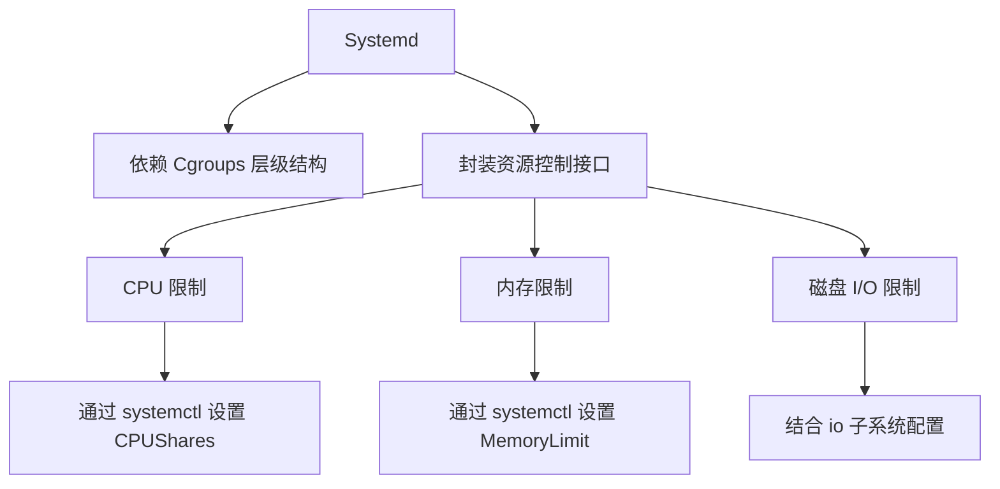

# 容器存储
## 一、脏数据对容器读写性能的影响
### 1. 用户进程写文件的完整流程

1. **用户空间调用**
   用户进程通过 `f.write()` 发起写操作，触发系统调用 `sys_write()`。
2. **虚拟文件系统（VFS）**
   `sys_write()` 进入 VFS 层，提供统一的文件操作接口，屏蔽不同文件系统的差异。
3. **文件系统层**
   根据文件类型（如 ext4、xfs）处理具体逻辑，包括权限检查、元数据更新等。
4. **Page Cache 层**  （可选，选：buffer I/O，不选：direct I/O）
   - 数据首先写入 **Page Cache**（内核管理的缓存页），而非直接写入磁盘。
   - 此时数据标记为 **脏页（Dirty Page）**，需后续刷盘。
5. **Block I/O 层**
   将缓存中的脏页转换为块设备请求（I/O 请求队列），合并相邻请求以提高效率。
6. **设备驱动层**
   处理块设备驱动逻辑，将 I/O 请求转换为硬件指令。
7. **硬件设备**
   数据最终写入磁盘、USB 等存储设备。
### 2. 文件的 I/O 模式

- **Buffer I/O（缓冲 I/O、异步 I/O）**
  - **流程**：数据先写入 Page Cache，由内核异步刷盘。
  - **优点**：
    - 读写效率高（尤其适合频繁读操作）。
  - **缺点**：
    - 写操作存在数据丢失风险（如系统崩溃前脏页未落盘）。
    - 可能因脏页累积导致 I/O 拥塞（如刷盘速度跟不上写入速度时，系统切换为同步写入，阻塞进程）。
- **Direct I/O（直接 I/O）**
  - **流程**：绕过 Page Cache，直接读写磁盘。
  - **优点**：避免数据一致性问题，适用于数据库等对数据安全要求高的场景。
  - **缺点**：频繁 I/O 时性能较差。
- **对比**：
  - **Buffer I/O** 默认用于大多数场景，但需根据业务需求调整内核参数。
  - **Direct I/O** 适用于对数据一致性要求极高的场景，但需谨慎评估性能影响。
### 3. 脏数据（Dirty Pages）详解
**定义**：已写入 Page Cache 但未同步到磁盘的数据。
#### 3.1 **落盘机制**
- **负责主体**：内核线程 `kworker/flush`（每个磁盘设备对应一个）。
- **触发条件**：
  - 定期刷盘（由 `dirty_writeback_centisecs` 控制）。
  - 脏页驻留超时（由 `dirty_expire_centisecs` 控制）。
  - 脏页比例超过阈值（由 `dirty_background_ratio` 后台刷新阈值和 `dirty_ratio` 进程阻塞阈值控制）。
#### 3.2 脏数据落盘相关内核参数

通过 `sysctl -a | grep dirty` 查看参数：
| 参数                           | 单位    | 默认值 | 作用                                                         |
| ------------------------------ | ------- | ------ | ------------------------------------------------------------ |
| `vm.dirty_background_ratio`    | 百分比  | 10     | 当**脏页占用可用内存比例**超过此值，触发 **异步刷盘**（后台线程处理，不阻塞进程）。 |
| `vm.dirty_ratio`               | 百分比  | 30     | 当脏页比例超过此值，触发 **同步刷盘**（阻塞进程直至脏页**全部**落盘），防止内存中脏页过量。 |
| `vm.dirty_expire_centisecs`    | 1/100秒 | 3000   | 脏页在内存中驻留超过 30 秒后，强制刷盘。                     |
| `vm.dirty_writeback_centisecs` | 1/100秒 | 500    | 每隔 5 秒唤醒 `kworker/flush` 线程检查脏页。                 |
#### 3.3 内核参数优化场景
##### **方式一：减少缓存，加快落盘**
- **适用场景**：
  磁盘子系统性能优异（如配备电池保护的NVRAM缓存），需降低因缓存数据未及时落盘导致的内存压力或数据丢失风险。
- **配置方法**：
  通过降低脏数据触发刷盘的阈值，强制内核更频繁地异步刷盘。
  ```sh
  # 修改/etc/sysctl.conf，添加以下参数：
  vm.dirty_background_ratio = 5  # 后台异步刷盘的脏数据占比阈值（默认10%）
  vm.dirty_ratio = 10            # 同步阻塞刷盘的脏数据最大占比阈值（默认20%）
  # 应用配置
  sysctl -p
  ```
##### **方式二：增加缓存，提升写入性能**
- **适用场景**：
  数据重要性低（如多副本备份、临时文件写入），允许通过增加缓存提升I/O效率。
- **配置方法**：
  调高脏数据阈值并延长脏数据驻留时间：
  ```sh
  # 修改/etc/sysctl.conf，添加以下参数：
  vm.dirty_background_ratio = 40  # 调高后台异步刷盘阈值（默认10%）
  vm.dirty_ratio = 60             # 调高同步阻塞刷盘阈值（默认20%）
  vm.dirty_expire_centisecs = 6000  # 脏数据最长驻留时间（默认3000，即30秒）
  # 应用配置
  sysctl -p
  ```
##### **方式三：动态调整，应对突发高峰**
- **适用场景**：
  系统周期性面临突发写入高峰（如定时批处理作业、嵌入式设备写入SD卡）。
- **配置方法**：
  结合低后台阈值与高同步阈值，平衡日常与高峰期的性能需求：
  ```sh
  # 修改/etc/sysctl.conf，添加以下参数：
  vm.dirty_background_ratio = 5  # 日常低阈值，提前异步刷盘
  vm.dirty_ratio = 80            # 高峰高阈值，允许缓存更多突发数据
  # 应用配置
  sysctl -p
  ```
- **原理与效果**：
  - **日常低负载**：脏数据达**5%**即触发后台刷盘，保持缓存**清爽**。
  - **突发高峰期**：允许脏数据累积至**80%**再强制同步刷盘，避免频繁阻塞I/O。
  - **优点**：兼顾日常稳定性和高峰期吞吐量。
  - **缺点**：
    - 高峰期可能因缓存大量脏数据导致数据一致性风险。
    - 需根据实际内存大小调整阈值，避免`dirty_ratio`过高耗尽内存。
### 4. 为何内存不足会导致容器I/O性能波动
#### 4.1 **问题现象**
当容器内存被严格限制（如1GB）且内部进程需频繁读写大文件（如10GB）时，**写入速度波动显著**，表现为时而正常时而急剧下降。这种性能波动在内存受限的容器中尤为常见，尤其在处理远超出内存容量的数据时。
#### 4.2 **问题解析**
核心矛盾在于**容器内存限制与Buffer I/O对Page Cache的需求冲突**，具体机制如下：
- **Page Cache计入容器内存配额**
  - 容器内进程通过Buffer I/O写入文件时，数据先缓存在内核的Page Cache中，**Page Cache占用容器的内存配额**（由`memory.limit_in_bytes`限制）。
  - 当容器内存配额较小（如1GB）时，Page Cache空间远低于待写入文件大小（如10GB），导致缓存快速耗尽。
- **内存回收与同步刷盘的连锁反应**
  - **内存压力触发回收**：Page Cache占满容器内存后，内核启动**直接内存回收**（Direct Reclaim），强制释放旧缓存页。若旧页包含脏数据（未落盘），需先刷盘再释放，引发额外I/O延迟。
  - **同步刷盘阻塞**：容器内脏数据达到`dirty_ratio`阈值（如1GB的20%，即200MB）时，触发**同步刷盘**，阻塞所有新I/O请求直至数据落盘，导致写入速度骤降。
- **频繁的缓存替换开销**
  - 写入大文件时，容器需不断申请新Page Cache，同时淘汰旧缓存页。若旧页为脏数据，需先刷盘，导致**“抖动”（Thrashing）**现象：系统资源大量消耗于缓存替换而非实际I/O操作。
- **结论**：
  - **容器内存限制过小导致Page Cache空间不足，引发频繁内存回收与同步刷盘阻塞**，是I/O性能波动的根本原因。
#### 4.3 **解决思路**
1. **增加容器内存配额**
   - 预留足够内存用于Page Cache，减少内存回收频率。
   - 例如：将容器内存限制调整为10GB，使Page Cache可缓存更多数据，降低同步刷盘频率。
2. **改用Direct I/O绕过Page Cache**
   - 通过`O_DIRECT`标志直接写磁盘，避免Page Cache占用容器内存。
   - 牺牲吞吐量换取稳定性，适用于对延迟敏感且能容忍较低I/O速度的场景。
3. **调整容器内刷盘策略（需特权容器）**
   - 在容器内修改`/proc/sys/vm/dirty_*`参数（需`--privileged`权限），降低脏数据阈值以强制更早刷盘。
   - 示例：
     ```bash
     echo 5 > /proc/sys/vm/dirty_background_ratio  # 后台刷盘阈值降为5%
     echo 10 > /proc/sys/vm/dirty_ratio           # 同步刷盘阈值降为10%
     ```
4. **使用Cgroup v2限制I/O缓存（Linux 4.x+）**
   - **原理**：Cgroup v2支持对Buffer I/O缓存进行隔离和限速，避免容器间干扰。
     
   - **操作**：通过`io.max`限制容器的I/O带宽或缓存使用量。
## 二、容器I/O性能测试与分析工具
> **容器共享宿主机内核的影响及性能问题定位方法**
> **影响：**
>
> * 容器进程本质上是宿主机进程，宿主机性能问题会直接波及所有容器。
>
> - 宿主机内核升级可能导致容器性能变化，如磁盘I/O性能显著下降。
>
> **原因：**
>
> * 容器共享宿主机内核，没有独立的bootfs。
>
> - 容器间相互影响，宿主机内核问题会直接传导至容器。
>
> **性能问题定位方法：**
>
> * 使用fio测试宿主机或容器内的I/O性能。
> * 利用perf+flameGraph制作火焰图，深入分析性能问题。
### 1. 硬盘I/O基础知识
#### 1.1 机械磁盘结构

##### 物理结构
- **盘片**：存储数据的圆形磁性介质层。
- **磁头**：读写数据的组件，通过以下两种运动定位数据：
  - **主轴马达**：旋转盘片（转速：7200/10000/15000 RPM）。
  - **机械臂**：移动磁头到指定磁道（寻道时间）。
##### 逻辑结构
- **磁道**：盘片上的同心圆轨道。
- **扇区**：磁道的分段（默认512字节）。
- **柱面**：多个盘片同一位置的磁道集合。
#### 1.2 MB VS MiB

#### 1.3 机械磁盘一次I/O操作耗费的时间
总时间 = **平均延迟时间**（转半圈） + **平均寻道时间**
**示例：7200 RPM硬盘**（RPM：转/分钟）
- **每秒转数**：7200/60 = 120转 → 每圈时间8ms（1/120）。
- **平均延迟**：8ms/2 = 4ms。
- **平均寻道时间**：9ms。
- **总I/O时间**：4ms + 9ms = **13ms**。
#### 1.4 性能指标
##### IOPS（磁盘每秒I/O操作数）
- **公式**（大概）：`IOPS = 1000ms / (寻道时间 + 平均延迟)`
- **常见硬盘IOPS**：
  - 7200 RPM：76 IOPS
  - 10000 RPM：111 IOPS
  - 15000 RPM：166 IOPS
##### BPS（吞吐量，带宽BW，每秒磁盘的I/O流量，MB/s）
- **公式**（大概）：`BPS = IOPS × 数据块大小`
- **意义**：衡量数据传输速率。
> 若想获取准确的IOPS和BPS，需要使用性能测试工具。
#### 1.5 I/O操作的基本单位
- **硬盘**：最小单位是扇区（512字节）。
  ```sh
  # 列出系统中的磁盘分区信息
  fdisk -l
  ```
- **操作系统**：最小单位是块（Block，默认4KB，即8个扇区）。
  ```bash
  stat /  # 查看块大小（IO Block字段）
  ```
#### 1.6 逻辑块地址和物理块地址
**LBA（逻辑块地址）**：
- **定义**：逻辑地址是**程序中识别**的块地址。
- **特点**：编号顺序递增。
- **关系**：通常与物理地址之间存在一定的对应关系。例如，在硬盘场景中，LBA与PBA往往是一一对应的。
**PBA（物理块地址）**：
- **定义**：物理地址是数据在磁盘上的实际存储地址。
**完整映射过程**：
1. 文件系统通过 inode 找到文件的逻辑块号（如第 5 块）。
   - inode本身不直接存储文件的完整逻辑块地址列表，但会通过指针结构（如直接指针、间接指针等）间接引用逻辑块地址。
2. 文件系统将逻辑块号转换为磁盘上的物理块地址（可能涉及分区偏移、块组计算等）。
3. 磁盘控制器将物理块地址转换为具体的磁头、柱面、扇区位置。

#### 1.7 文件分配方式
- **连续分配**：文件占据连续物理块。支持顺序访问和随机访问。
- **链接分配**：通过指针链接非连续块。仅支持顺序访问。
- **索引分配**：使用索引表记录块位置。支持随机访问和顺序访问。
#### 1.8 I/O访问方式
| **方式**     | **特点**                                                     |
| ------------ | ------------------------------------------------------------ |
| **顺序访问** | 连续读写相邻块（分配文件时使用的是连续/链接分配），仅首次需寻道+延迟，适合大文件操作（如视频流） |
| **随机访问** | 每次读写需寻道+延迟，性能较低（如数据库查询）                |
#### 1.9 机械硬盘（HDD） VS 固态硬盘（SSD）
|              |           **机械硬盘（HDD）**           |                     **固态硬盘（SSD）**                      |
| :----------: | :-------------------------------------: | :----------------------------------------------------------: |
| **存储介质** |          磁性盘片（扇区存储）           |                 闪存芯片（NAND Flash/DRAM）                  |
| **读写机制** |     磁头摆动寻址，依赖物理机械运动      |        电子信号读写，无机械运动，直接通过控制单元寻址        |
| **核心组件** |        磁头、盘片、马达、机械臂         |                   控制单元、闪存芯片、缓存                   |
| **顺序读写** |   性能高（依赖连续传输，无频繁寻道）    |           性能更高（无机械延迟，电子信号直接处理）           |
| **随机读写** |     性能低（需频繁寻道和旋转延迟）      |           性能显著优于HDD（直接寻址，无机械延迟）            |
| **典型数据** | - 顺序读：84MB/s <br />- 顺序写：79MB/s | - 顺序读：220.7MB/s <br />- 顺序写：77.2MB/s（持续大文件写入会使 SSD 的空白块快速耗尽，频繁触发 GC 和擦除操作。） |
| **随机性能** |  - 随机读：≈0.21MB/s（顺序读的1/400）   |       - 随机读：24.654MB/s <br />- 随机写：68.910MB/s        |
| **适用场景** |   顺序读写密集型<br />关键指标：IOPS    | 随机读写密集型<br />关键指标：BPS（每秒传输或处理的字节数量） |
### 2. I/O性能测试工具：`fio`
#### 2.1 实际读写硬盘的影响因素及其进行性能测试时涉及到的核心参数
##### **（1）应用程序层因素**
- **任务并发配置**
  - **线程与任务数**
    - `thread=1`：单线程执行任务。
    - `numjobs=3`：同时启动3个并行任务（多进程/线程并发）。
    - 意味着将有3个单线程的作业同时运行。
- **任务提交方式**
  |   **类型**   |                     **机制**                     |        **参数**         |
  | :----------: | :----------------------------------------------: | :---------------------: |
  | **同步提交** | 提交一个任务后，需等待其完成才能提交下一个任务。 | `ioengine=sync`（默认） |
  | **异步提交** |    提交任务后无需等待，可立即提交下一个任务。    |    `ioengine=libaio`    |
  通常与 `iodepth` I/O深度配合使用，如：
  - **`iodepth=16`** ：指定IO深度为16，允许最多有16个IO请求在**等待**处理，用于模拟真实环境中的IO负载。
##### **（2）操作系统层因素**
- **I/O模式**
  |     **模式**     |                           **特点**                           |       **参数**       |
  | :--------------: | :----------------------------------------------------------: | :------------------: |
  | **Buffered I/O** | - 默认模式，使用操作系统的Page Cache缓存数据。 <br />- 减少直接访问硬盘的次数，提升小文件高频访问性能。 | 无需参数（默认启用） |
  |  **Direct I/O**  | - 绕过Page Cache，直接读写硬盘。 <br />- 避免缓存影响，适合大文件或需精确控制缓存的场景。 |     `-direct=1`      |
##### **（3）硬盘访问方式**
1. **随机访问**
   - **随机读**：`-rw=randread`
   - **随机写**：`-rw=randwrite`
2. **顺序访问**
   - **顺序读**：`-rw=read`
   - **顺序写**：`-rw=write`
3. **混合访问模式**
   |     **类型**     |                 **参数**                  |       **说明**        |
   | :--------------: | :---------------------------------------: | :-------------------: |
   | **随机混合读写** | `-rw=randrw -rwmixread=70 -rwmixwrite=30` | 70%随机读 + 30%随机写 |
   | **顺序混合读写** |   `-rw=rw -rwmixread=70 -rwmixwrite=30`   | 70%顺序读 + 30%顺序写 |
##### 总结：
|   **层级**   |      **核心配置项**       |                         **性能影响**                         |
| :----------: | :-----------------------: | :----------------------------------------------------------: |
| **应用程序** | 并发任务数、同步/异步提交 |       异步+多任务可显著提升吞吐量，但需避免资源争用。        |
| **操作系统** |    Buffered/Direct I/O    | Buffered I/O依赖缓存，延迟低但占用内存；Direct I/O更稳定，适合大数据场景。 |
| **硬盘访问** |    随机/顺序/混合模式     | 随机访问性能依赖硬盘类型（SSD远优于HDD），顺序访问吞吐量受接口带宽限制。 |
##### 补充：安装及其他基本参数
```bash
yum install fio libaio-devel -y
```
**基础参数**：
- `-bs`：单次I/O操作的数据块大小（如4k）。
- `-size`：测试读写的总数据量（如5G）。
- `-runtime`：测试时长（秒）。
- `-name`：自定义测试任务名称。
**指定测试目标的方式**
- `-filename`：测试直接设备文件。
  - ❗ **禁止用于写测试**：直接写入可能破坏设备数据（如系统盘损坏）。
- `-directory`：测试目录（避免直接写设备）。
#### 2.2 测试示例
##### 顺序读测试
```bash
# /dev/sda 是直接被读取的物理设备
fio -thread=1 -numjobs=3 -ioengine=libaio -iodepth=16 -direct=1 \
-rw=read -bs=4k -size=5G -runtime=60 -name "Read Test" -filename=/dev/sda
```
##### 顺序写测试
```bash
# 不要直接指定设备！！！
mkdir /aaa
fio -thread=1 -numjobs=3 -ioengine=libaio -iodepth=16 -direct=1 \
-rw=write -bs=4k -size=5G -runtime=60 -name "Write Test" -directory=/aaa
```
##### 结果指标：
- **BW**（BandWidth）：吞吐量/带宽（MB/s）。
- **IOPS**：每秒I/O操作数。
- **lat**：总延迟/响应时间（slat + clat）。
  - **slat**：提交延迟。提交IO请求到kernel所花的时间。
  - **clat**：完成延迟。提交IO请求到kernel后，kernel处理所花的时间。
### 3. 性能分析工具：`perf`与火焰图
`perf` 工具可以用于捕获一个任务在系统中的完整调度栈信息，或者系统整体的情况，以便分析到底是那个环节拖慢了整体的性能。
#### 1. 安装
```bash
yum install perf -y  # CentOS/RHEL系统安装
```
#### 2. `perf`核心操作
##### 2.1 采集性能数据
```bash
perf record -a -e cycles -o cycle.perf -g -- sleep 10
```
- **参数说明**：
  - `-a`：监控整个系统（所有CPU）。
  - `-e `：指定要记录的性能事件类型（如`cycles`：CPU周期，记录CPU执行指令所消耗的周期数、`cache-misses`、`instructions`等）。
  - `-o cycle.perf`：输出到指定文件（默认`perf.data`）。
  - `-g`：记录函数调用链（生成堆栈信息）。
  - `sleep 10`：采集时长10秒。
##### 2.2 查看分析结果
```bash
perf report -i cycle.perf | less  # 交互式查看报告
```
- **输出解读**：
  - **Overhead**：事件占比（性能瓶颈定位）。
  - **Command**：触发事件的进程。
  - **Symbol**：对应的函数或模块。
#### 3. 火焰图生成流程
##### 3.1 捕获进程堆栈
```bash
perf record -F max -p <PID> -g -- sleep 60
```
- **参数说明**：
  - `-F max`：以最大频率采样（可替换为具体值，如`99`Hz）。
  - `-p <PID>`：指定目标进程（省略`-a`时默认监控单个进程）。
  - 输出文件：`perf.data`（二进制格式）。
##### 3.2 转换数据为文本格式
```bash
perf script -i perf.data > perf.unfold
```
- **作用**：将二进制数据转换为可读的调用栈文本。
##### 3.3 折叠堆栈信息
```bash
git clone https://github.com/brendangregg/FlameGraph  # 下载工具库
./FlameGraph/stackcollapse-perf.pl perf.unfold > perf.folded
```
- **关键步骤**：合并相同调用路径，压缩数据维度。
##### 3.4 生成火焰图
```bash
./FlameGraph/flamegraph.pl perf.folded > perf.svg
```
- **输出文件**：`perf.svg`（矢量图形，浏览器可直接打开）。
##### 3.5 查看与分析
```bash
firefox perf.svg  # 浏览器中打开火焰图
```

- **火焰图解读**：
  - **X轴**：时间消耗比例（宽度越大，耗时越长）。
  - **Y轴**：调用栈深度（从底部到顶部表示函数调用层级）。
  - **颜色**：随机区分不同函数（无特殊含义）。
  - **交互**：鼠标悬停显示函数名和耗时占比，点击放大局部。
- **火焰图优化方向**
  - **平顶山结构**：顶部宽且平的函数是性能热点。
  - **频繁调用链**：长而密集的调用链需重点关注。
## 三、控制容器磁盘读写性能
### **1. 为何要限制容器的磁盘读写性能？**
- **资源共享问题**
  同一宿主机上的所有容器共享宿主机的物理资源（如磁盘I/O）。若未限制，高I/O操作的容器可能抢占磁盘带宽，导致其他容器性能下降。
- **公平性与稳定性**
  通过限制每个容器的I/O速率，确保关键业务容器获得稳定性能，避免资源争抢。
### **2. 容器文件系统为何不适合频繁写入？**
- **OverlayFS的写入机制**
  容器默认使用OverlayFS联合文件系统，其写入流程如下：
  - 写操作首先进入容器的可写层（upperdir）。
  - 若修改已存在的文件，需触发`copy-up`操作，将文件从只读层（lowerdir）复制到可写层后再修改。
  - 最终由宿主机文件系统（如ext4、xfs或网络存储）处理实际写入。
- **性能开销**
  频繁写入会导致大量`copy-up`和元数据操作，显著增加I/O延迟。
  **解决方案**：对高频写入场景（如日志、数据库），应挂载独立 Volume（如Docker Volume），绕过OverlayFS直接写入宿主机文件系统。
### **3. 限制容器磁盘I/O性能的方法**
#### **方法1：**基于Cgroup v1
- **Cgroup v1的blkio子系统**
  - **作用**：限制**磁盘I**/O性能（Direct I/O模式）。
  - **关键参数**：
    - **读/写IOPS**：
      `blkio.throttle.read_iops_device`
      `blkio.throttle.write_iops_device`
    - **读/写带宽（bps）**：
      `blkio.throttle.read_bps_device`
      `blkio.throttle.write_bps_device`
  - **路径**：`/sys/fs/cgroup/blkio/`
- **Docker原生启动参数（推荐）**
  - 启动容器时直接指定I/O限制：
    ```bash
    docker run -d \
      --name my_container \
      --device-read-bps /dev/sda:10mb \
      --device-write-bps /dev/sda:10mb \
      my_image
    ```
    **优势**：配置持久化，无需手动操作 Cgroup 文件。
- **手动配置Cgroup v1路径**
  容器重启后失效
  1. **查找容器ID与Cgroup路径**
     ```bash
     # 根据容器名称获取容器ID
     CONTAINER_NAME="test2"
     CONTAINER_ID=$(docker ps --format "{{.ID}}\t{{.Names}}" | grep -i $CONTAINER_NAME | awk '{print $1}')
     # 查找容器对应的Cgroup路径（假设使用cgroups v1）
     CGROUP_CONTAINER_PATH=$(find /sys/fs/cgroup/blkio/ -name "*$CONTAINER_ID*")
     ```
  2. **设置读写速率限制**
     ```sh
     # 限制读速率（10MB/s），设备号需根据实际磁盘确认（通过`lsblk -d`查看）
     echo "8:0 10485760" > $CGROUP_CONTAINER_PATH/blkio.throttle.read_bps_device
     # 限制写速率（10MB/s）
     echo "8:0 10485760" > $CGROUP_CONTAINER_PATH/blkio.throttle.write_bps_device
     ```
     **参数说明**：
     1. `8:0`：磁盘设备号（主设备号:次设备号），可通过 `lsblk -d` 查看。
     2. `10485760`：速率限制（单位：字节/秒），此处为10MB/s（10\*1024*1024）。
#### 方法2：基于Cgroup v2
容器重启后失效
> ##### **Cgroup v2的必要性**
>
> - **Cgroup v1的缺陷**：
>   无法限制Buffered I/O，导致大多数应用（如MySQL、日志服务）的I/O无法被控制。
> - **Cgroup v2的改进**：
>   支持同时控制`io`与`memory`子系统，可限制Buffered I/O的磁盘带宽。
- **前提条件：启用Cgroup v2**
  **检查内核支持**：
  ```bash
  grep cgroup /proc/filesystems
  # 输出应包含`nodev  cgroup2`
  ```
  如果发现不支持cgroup2，需升级内核（具体内容可参考博客）
  ```
  # cgroup v2支持的系统与内核有：
  建议 systemd ≥ v226 with kernel ≥ v4.2
  Fedora 31 （默认启用 cgroups v2）
  CentOS 8 kernel 4.18
  Ubuntu 18.04 kernel 4.15
  Ubuntu 20.04 kernel 5.4
  ```
- **配置Cgroup v2限制Buffered I/O**
  1. **创建控制组**
     ```bash
     mkdir -p /sys/fs/cgroup/unified/iotest
     # 启用io和memory子系统
     echo "+io +memory" > /sys/fs/cgroup/unified/cgroup.subtree_control
     ```
  2. **设置磁盘带宽限制**
     ```bash
     # 限制/dev/sda写带宽为10MB/s
     echo "8:0 wbps=10485760" > /sys/fs/cgroup/unified/iotest/io.max
     ```
  3. **将进程加入控制组**
     ```bash
     # 获取容器PID
     CONTAINER_PID=$(docker inspect -f '{{.State.Pid}}' $CONTAINER_NAME)
     # 将PID写入控制组
     echo $CONTAINER_PID > /sys/fs/cgroup/unified/iotest/cgroup.procs
     ```
### 4. Cgroup Driver 之 systemd

## 四、容器磁盘配额
### 1. 必要性
#### 1.1 默认情况
- 容器内文件系统由`lowerdir`（只读镜像层）和`upperdir`（可写层）组成（OverlayFS结构）
- 容器内未挂载外部存储卷时，所有写入操作均保存到`upperdir`（宿主机磁盘）
- 若无限制（容器默认无限制），容器可能写满宿主机磁盘空间
#### 1.2 解决方案
| 方案                       | 描述                            | 适用场景         |
| :------------------------- | :------------------------------ | :--------------- |
| 容器磁盘配额（了解）       | 限制容器可用的 `upperdir`数据量 | 临时/简单场景    |
| **挂载外部存储卷**（推荐） | 将数据写入专用存储设备          | 生产环境推荐方案 |
### 2. 配置容器磁盘配额 (上限)
此方案使用 Docker 提供的选项 (`--storage-opt size=`或全局配置 `overlay2.size=`)，主要依赖于底层文件系统的 **项目配额 (prjquota)** 功能来实现。
#### 2.1 单容器限制
```sh
docker run -d --name test1 \
  --storage-opt size=100M \  # 设置容器磁盘上限为100MB
  centos:7 tail -f /dev/null
# 验证
docker exec my_container df -h /  # 查看容器内磁盘使用
```
#### 2.2 全局默认配置
修改`/etc/docker/daemon.json`，所有**新创建**的容器将默认使用此磁盘限制：
```json
{
    ...
  "data-root": "/data/docker",
  "storage-driver": "overlay2",
  "storage-opts": [
    "overlay2.override_kernel_check=true",
    "overlay2.size=1G"  // 每个容器默认1G磁盘空间
  ]
    ...
}
```
生效配置：
```sh
sudo systemctl daemon-reload
sudo systemctl restart docker
```
#### 2.3 配额类型说明（底层机制）
| **类型**   | **工作方式**         | **适用场景**    | **限制条件**             |
| :--------- | :------------------- | :-------------- | :----------------------- |
| `prjquota` | 基于项目ID的目录配额 | Docker 默认方案 | 需 XFS/ext4 文件系统支持 |
| `quota`    | 基于用户ID的配额     | 传统Linux系统   | 不能与 prjquota 同时使用 |
| `grpquota` | 基于用户组ID的配额   | 多用户共享环境  | 不能与 prjquota 同时使用 |
## 五、控制容器日志大小
目的也是为了避免容器写满宿主机磁盘空间。
推荐做法仍是——**挂载外部存储卷**。
以下内容作为了解即可：
#### 1. 日志存储路径
```sh
docker inspect <容器名/ID> | grep -i logpath
```
容器内输出到/dev/stdout、/dev/stderr的日志（即`docker logs`显示的内容），实际上都是写到了容器指定的宿主机上的 LogPath 路径的日志文件（.json）。
#### 2. 运行时日志控制
```sh
docker run -it \
  --log-opt max-size=10m \  # 单个日志文件最大10MB
  --log-opt max-file=3 \    # 最多保留3个日志文件
  redis
```
#### 3. 全局日志配置
修改`/etc/docker/daemon.json`：
```json
{
  "log-driver": "json-file",
  "log-opts": {
    "max-size": "50m",  // 单个文件上限50MB
    "max-file": "3"      // 最多保留3个历史文件
  }
}
```
生效配置：
```sh
sudo systemctl daemon-reload
sudo systemctl restart docker
```
**注意事项**
- 默认日志配置：保留5个历史文件（max-file未设置时）
- 已存在的容器需重建（停止并删除现有容器，然后使用新配置重新创建一个新容器）才能应用新配置
  - 容器核心设计理念是**不可变基础设施**
  - 运行时配置（资源限制、挂载点等）在创建时确定后无法修改
- 日志轮转机制：当达到max-size时创建新文件，超过max-file数时删除最旧文件
## 六、修改内核参数
#### 1. **问题背景**
- **默认行为**：容器启动时，`/proc/sys` 以**只读**方式挂载，无法直接修改容器内的内核参数（如 TCP/IP 协议栈参数）。
- **示例错误**：尝试修改 `/proc/sys/net/ipv4/ip_forward` 会提示 `Read-only file system`。
#### 2. **核心原理**
1. **网络命名空间隔离**：
   - 容器拥有独立的网络命名空间，隔离以下资源：
     - 网络设备（如 `eth0`）
     - IPv4/IPv6 协议栈（参数位于 `/proc/sys/net/`）
     - IP 路由表
     - 防火墙规则（iptables）
     - 网络状态信息（`/proc/net` 和 `/sys/class/net`）
2. **Namespace 化的内核参数**：
   - 部分参数（如 `net.*`、`kernel.shm*`、`kernel.msg*`、`kernel.sem`、`fs.mqueue.*` 等）被 namespace 化，修改仅影响当前容器。
   - 非 namespace 化的参数（如 `vm.*` 等）修改会影响宿主机和其他容器。
#### 3. **修改方法**
无论什么方法，都要注意内核参数是否有 namespace 化。
##### **（1） 特权模式启动容器**
- **操作**：使用 `--privileged` 参数启动容器。
- **特点**：
  - `/proc/sys` 权限在容器内变为可读可写，允许容器内直接修改 `/proc/sys` 下的参数。
  - **风险**：提升安全风险，部分参数可能影响宿主机（如 `vm.swappiness`）。
- **示例**：
  ```bash
  docker run -it --rm --privileged --name test centos:7 sh
  sh-4.2# echo 1 > /proc/sys/net/ipv4/ip_forward  # 仅影响容器
  sh-4.2# echo 10 > /proc/sys/vm/swappiness       # 影响宿主机
  ```
##### **（2） 使用 `nsenter` 进入容器命名空间**
- **操作**：通过宿主机的 root 权限进入容器的网络命名空间修改参数。
- **特点**：
  - 无需特权模式。
  - 需获取容器 PID（通过 `docker inspect` 或 `ps`）。
- **示例**：
  ```bash
  # 获取容器 PID
  pid=$(docker inspect -f '{{.State.Pid}}' <容器名>)
  # 进入网络命名空间修改参数
  nsenter -t $pid -n bash -c "echo 600 > /proc/sys/net/ipv4/tcp_keepalive_time"
  ```
##### **（3） Bind Mount `/proc/sys`**
- **操作**：将宿主机的 `/proc/sys` 绑定挂载到容器内可写目录。
- **特点**：
  - 效果类似特权模式，但需手动指定挂载路径。
- **示例**：
  ```bash
  docker run -v /proc/sys:/writable-sys -it centos:7 bash
  sh-4.2# echo 62 > /writable-sys/net/ipv4/ip_default_ttl
  ```
##### 小总结：
以上三种方法都不推荐使用，因为它们都是在容器启动后再进入容器修改参数，这对之前建立的网络连接无效。
##### **（4） 启动时指定 `--sysctl` 参数（推荐）**
- **操作**：通过 Docker 的 `--sysctl` 参数在**容器启动时**设置内核参数。
- **特点**：
  - 仅允许修改白名单参数（`kernel.*`, `net.*`, `fs.mqueue.*`）。
  - 修改在容器初始化时生效，运行时 `/proc/sys` 仍为只读。
  - 安全风险较特权模式低，`/proc/sys` 权限在容器内仍为 `read-only`。
- **示例**：
  ```bash
  docker run -d --name test --sysctl net.ipv4.tcp_keepalive_time=10 centos:7 sleep 1000
  docker exec test cat /proc/sys/net/ipv4/tcp_keepalive_time  # 输出 10
  ```
- **限制**：非白名单参数会报错（如 `vm.swappiness`）。
## 七、Cgroup限制cpu/内存/磁盘IO
Docker通过基于cgroups的机制，提供了灵活的**CPU资源限制选项**。如果需要用到具体内容的话，可以查阅博客。