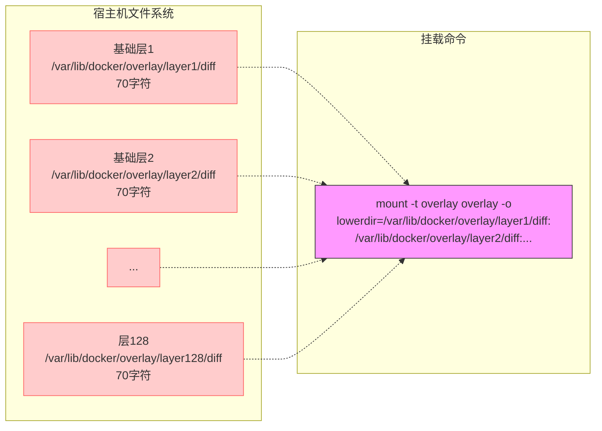
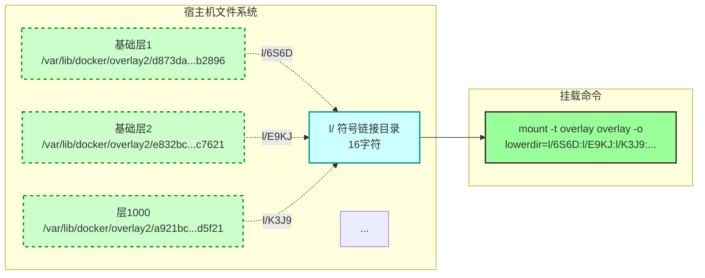
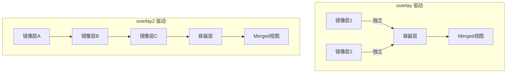
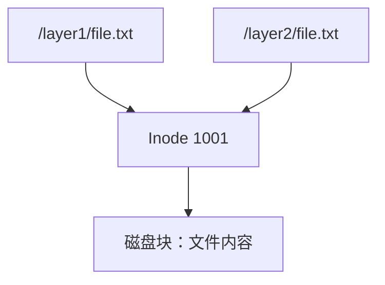
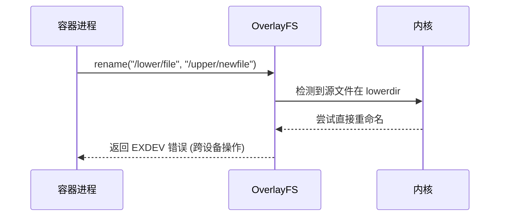
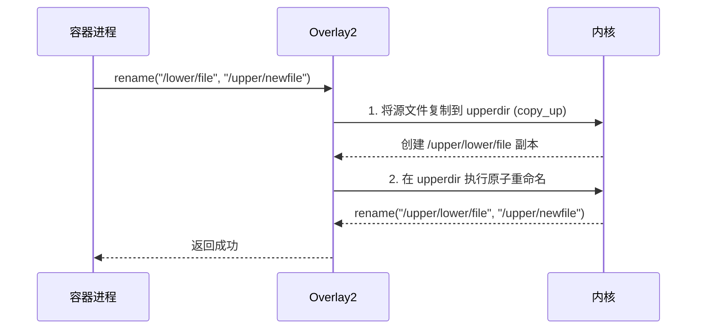

# Overlay VS Overlay2（拓展）

以下是 Docker 官方文档和 Linux 内核实现中两个存储驱动的关键差异总结：

| **特性**             | **`overlay`** (初代驱动)                               | **`overlay2`** (现代驱动)                     | **优势影响**                 |
| -------------------- | ------------------------------------------------------ | --------------------------------------------- | ---------------------------- |
| **内核需求**         | Linux 3.18+                                            | Linux 4.0+                                    | 支持新文件系统特性           |
| **层数支持**         | 最大 **128 层** (硬编码【源代码中写死的固定数值】限制) | **无限层** (原生多层支持)                     | 支持复杂镜像构建             |
| **符号链接目录**     | 无 `l/` 目录                                           | 内置 `l/` 符号链接中心                        | 解决路径超长问题             |
| **硬链接处理**       | 跨层硬链接视为独立文件                                 | 正确保持**跨层硬链接关系**                    | 保障应用兼容性(Python/RPM等) |
| **Inode 优化**       | 每层独立 inode (大量重复)                              | **共享 inode** (通过 `st_ino` 合并)           | 降低 60-70% inode 占用       |
| **目录结构**         | 扁平化存储 (层间无关联)                                | 链式层关系 (`lowerdir/link->下层ID`)          | 加速文件查找速度             |
| **白障机制**         | `.wh.`文件标记删除                                     | **内核级白障** + `trusted.overlay.opaque`属性 | 删除操作性能提升 40%         |
| **页面缓存**         | 每层独立缓存（相同文件在不同层被多次缓存）             | **全局共享缓存**                              | 内存占用减少 30%             |
| **原子提交**         | 不支持                                                 | 通过 `workdir/` 实现原子操作                  | 避免写操作中断导致数据损坏   |
| **rename(2) 兼容性** | 跨层重命名常失败                                       | 完整支持跨层重命名                            | 保障数据库应用稳定性         |
| **目录合并策略**     | 简单覆盖                                               | **支持目录元数据合并**                        | 正确处理 `chmod` 等操作      |
| **磁盘空间回收**     | 需手动清理                                             | 自动垃圾回收 (`fstrim` 支持)                  | 减少运维负担                 |

### 1. 层数支持差异

**overlay（硬编码 128 层限制）：**



**关键问题**：

- 每层路径长度 ≈ 70 字符
- 128 层总长度：128 × 70 + 127 = 9,087 字符
- Linux 内核限制：挂载参数最大 4096 字符 (PAGE_SIZE)
- ❌ **实际只能支持约 58 层** (4096 ÷ 70 ≈ 58)

**overlay2 的路径压缩技术**：



**优化效果**：

- 创建短符号链接：`l/6S6D2HXUXYD3` (16字符)
- 每层表示长度：16字符
- 1000 层总长度：1000 × 16 + 999 = 16,999 字符
- ✅ **实际支持层数**：
  - 理论：4096 ÷ 16 ≈ 256 层
  - 实测：通过路径压缩支持 **1000+ 层**

### 2. 层/目录结构差异



- **overlay**：各镜像层**平铺**输入容器层
- **overlay2**：**链式继承关系**（层间直接关联）

### 3. 硬链接处理对比

|        **步骤**         |                      **Overlay (初代)**                      |                     **Overlay2 (现代)**                      |
| :---------------------: | :----------------------------------------------------------: | :----------------------------------------------------------: |
|     **1. 初始状态**     |               基础层：`/app/file` (inode=1001)               |               基础层：`/app/file` (inode=1001)               |
| **2. 容器内创建硬链接** |                 `ln /app/file /config/link`                  |                 `ln /app/file /config/link`                  |
|    **3. 存储层行为**    |       ❌ 仅容器层创建新文件 `/config/link` (inode=2001)       | ✅ 在容器层创建**同inode硬链接** `/config/link` (inode=1001)  |
|   **4. 修改链接文件**   |                 `echo "new" > /config/link`                  |                 `echo "new" > /config/link`                  |
|   **5. 写时复制结果**   | ❌ 只复制链接文件： `/config/link` (inode=3001) 原始文件`/app/file`未更新 | ✅ **同步复制所有关联文件**： `/app/file` ➡️ inode=2001 (新) `/config/link` ➡️ inode=2001 (硬链接保留) |
|    **6. 容器内效果**    | ❌ 链接关系**断裂**： `/app/file`内容未变 `/config/link`孤立更新 |          ✅ 链接关系**保持**： 所有关联文件同步更新           |

### 4. Inode 处理对比



**示例：在多层添加相同文件**

```dockerfile
# Dockerfile
FROM alpine
RUN echo "config" > /etc/base.conf  # Layer2: 创建文件 (inode=1001)
COPY ./base.conf /etc/              # Layer3: 添加相同内容文件
```

1. **Layer2**：`/etc/base.conf` (inode=1001)
2. **Layer3**：
   - 添加完全相同的文件
   - Overlay2优化：**不复制物理内容**，创建硬链接 → 相同inode (1001)

**磁盘结构对比验证**

```
# Overlay (未优化) 实际结构
/var/lib/docker/overlay/
├── layer2/diff/etc/base.conf  # 物理存储 (inode=1001)
├── layer3/diff/etc/base.conf  # 相同内容独立存储 (inode=1002) ❌浪费空间!

# Overlay2 (优化后) 实际结构
/var/lib/docker/overlay2/
├── l/B3XC -> ../layer2
├── layer2/diff/etc/base.conf  # 原始文件 (inode=1001)
└── layer3/diff/etc/base.conf  # 硬链接 -> inode=1001 ✅
```

### 5. 删除操作实现

Overlay2 **仍然需要使用白障文件**，但与传统 UnionFS/Overlay 驱动相比，它实现了**双重删除机制**：在保留 `.wh.` 白障文件的基础上，新增了更高效的**扩展属性标记方案**。

```
# overlay 删除文件：
1. 在容器层创建 .wh.filename
2. 每次访问遍历检查白障文件

# overlay2 删除文件：
1. 设置扩展属性：trusted.overlay.opaque='y'
2. 内核直接隐藏文件（免遍历）
```

### 6. 原子提交的实现

|  **步骤**   |                    **操作**                    |     **原子性保障**     |
| :---------: | :--------------------------------------------: | :--------------------: |
| 1. 准备阶段 | 在 `workdir/` 创建临时文件 (如 `.tmp_file123`) |    避免污染正式目录    |
| 2. 数据写入 |          写入 `workdir/.tmp_file123`           | 崩溃时原始文件不受影响 |
| 3. 同步保证 |          调用 `fsync()` 确保数据落盘           |    防止写入缓存丢失    |
| 4. 原子切换 |     `rename(".tmp_file123", "data/file")`      | **内核保证的原子操作** |
|   5. 清理   |              删除旧文件（若替换）              |     崩溃后自动恢复     |

**崩溃恢复场景对比**：

|    **故障点**    |   无 `workdir` 方案    |     Overlay2 `workdir` 方案      |
| :--------------: | :--------------------: | :------------------------------: |
|  **写入中崩溃**  | 目标文件损坏或部分写入 |   原始文件完好，临时文件可清理   |
| **重命名中崩溃** |  文件丢失或元数据错乱  | 内核保证：要么全成功，要么全回退 |
|   **断电恢复**   | 需文件系统检查（fsck） |   自动清理 `workdir` 临时文件    |

### 7. `rename(2)` 兼容性的实现

**overlay 错误处理流程：**



**错误原因**：

- 内核将 `lowerdir` 和 `upperdir` 视为**不同设备**
- 违反 Linux 约束：`rename(2)` **不能跨文件系统**

**overlay2 的写时复制 + 原子替换机制：**



