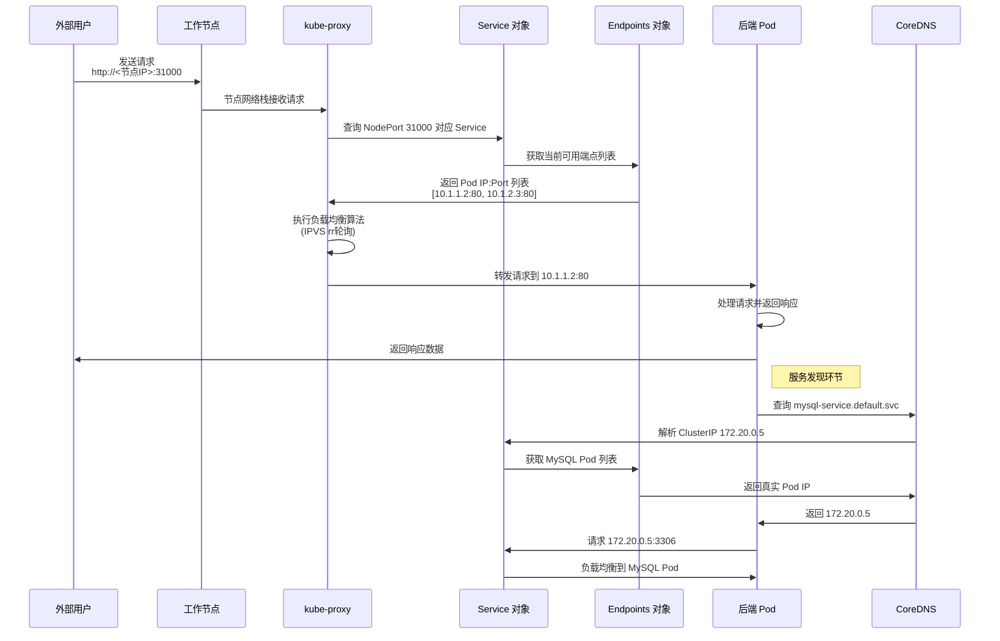
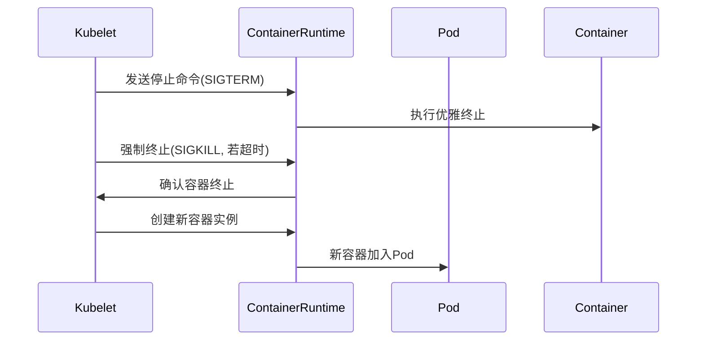

## 一、kubectl 命令

### 1. kubectl 基本语法

```bash
kubectl [command] [TYPE] [NAME] [flags]
# 默认命名空间是default
```

- **command**：子命令，用于操作资源对象（create/get/describe/delete等）
- **TYPE**：资源类型（可简写，不区分大小写）
  
  ```bash
  kubectl get pods xxx
  kubectl get pod xxx  # 等效
  kubectl get po xxx   # 等效
  ```
- **NAME**：资源名称（区分大小写）
  
  ```bash
  kubectl get pod pod1 pod2 pod3  # 同时操作多个资源
  kubectl get pod/pod1 deployment/deploy1  # 混合资源类型
  ```
- **flags**：可选参数
  ```bash
  kubectl get pods -o wide # 显示pod更加详细的信息（相较于不加这个参数，会显示更多的信息列）
  kubectl get pods -o yaml # 指定以yaml格式显示所有pod
  kubectl get pods -A # 显示所有命名空间的pod
  kubectl get pods -n namespace # 指定具体的命名空间
  kubectl get pods -w # 实时监控pods的状态变化
  kubectl logs -c c2 -f my-pod # 指定具体的容器
  ```

> **K8s 三层资源结构**
>
> 1. **核心组件层** (Control Plane)
>    - 包括 API Server、Scheduler、Controller Manager 等
>    - 提供集群基础管理能力
> 2. **资源类型层** (Resource Types)
>    - 相当于数据库中的"表"
>    - 例如：Pods、Deployments、Services 等
>    - 每种资源类型都有对应的控制器管理
>      - 控制器工作原理（调谐循环）
>        - 持续观察资源实际状态
>        - 与期望状态进行对比
>        - 执行必要操作使实际状态符合期望
> 3. **资源实例层** (Resources)
>    - 相当于表中的"记录"
>    - 例如：名为"web"的 Pod、名为"nginx"的 Deployment

### 2. 常用操作命令

#### 2.1 查看资源
```bash
# 查看帮助
kubectl --help
kubectl apply --help  # 二级帮助
kubectl api-resources # 所有资源类型

# 查看资源
kubectl get deploy,pods -o wide -n namespace # 指定具体的命名空间
kubectl get deploy,pods -o wide -A  # 查看所有命名空间

# 查看详细信息
kubectl get deploy my-deploy -o yaml
kubectl describe node node01
kubectl describe pod mypod # 可以利用显示信息的Events字段（列出了与该pod相关的事件列表）排错；Controlled BY指明该pod的控制器/管理者是谁
```

#### 2.2 创建资源
```bash
# 通过YAML文件
kubectl create -f deployment.yaml # 只能用于创建新资源，若资源已存在，create -f会报错
kubectl apply -f deployment.yaml # 创建或更新
kubectl apply -f 1.yaml -f 2.yaml # 创建多个资源

# 命令直接创建
kubectl run -it --image busybox:1.27 test --restart=Never --rm sh # 启动临时容器用于测试，exit退出后就删除
# 在k8s集群中的某个节点上临时创建一个pod，并在该pod中运行一个容器
```

#### 2.3 修改资源
```bash
# 直接修改yaml文件，然后apply -f提交
vi a.yaml

# 使用命令行进行修改
kubectl scale deployment my-deploy --replicas=3 # 扩缩容

# 不知道yaml文件在哪
# 在线编辑
kubectl edit deployment my-deploy
```

#### 2.4 删除资源
```bash
# 删除指定资源（受控制器调谐，即使删除对应资源，控制器会重新启动一个新的）
kubectl delete deployment my-deploy

# 通过标签删除
kubectl delete pods,services -l app=nginx

# 通过配置文件删除
kubectl delete -f config.yaml # 配置文件不会被删除
```

#### 2.5 Pod操作
```bash
# 进入Pod的主（默认）容器
kubectl exec -it my-pod -- bash
# 可以用 -c 指定要进入的具体容器
kubectl exec -it my-pod -c c2 -- bash

# 如果构建容器的镜像不含sh等启动交互式shell的命令，可以通过nsenter命令来测试该容器
crictl ps # 找到容器ID
crictl inspect <容器ID> | grep -i pid # 找到容器的进程ID
nsenter -t <pid> -n ifconfig

# 查看日志
kubectl logs -f my-pod

# 文件拷贝
kubectl cp my-pod:/etc/fstab /tmp/fstab.txt  # Pod到主机
kubectl cp /tmp/file.txt my-pod:/tmp/        # 主机到Pod
```

### 3. kubectl 插件

扩展 `kubectl` 功能的一种方式，允许用户自定义命令或添加新的功能。

#### 3.1 插件创建

1. 创建可执行文件（必须以 `kubectl-` 开头）

   ```bash
   #!/bin/bash
   echo "hello world"
   ```

2. 添加执行权限并安装

   ```bash
   chmod +x kubectl-hello
   mv kubectl-hello /usr/local/bin/
   ```

3. 使用插件

   ```bash
   kubectl hello
   ```

#### 3.2 实用插件示例

```bash
#!/bin/bash

# 显示当前 Kubernetes 上下文（context）中的用户信息
kubectl config view --template='{{ range .contexts }}{{ if eq .name "'$(kubectl config current-context)'" }}Current user: {{ printf "%s\n" .context.user }}{{ end }}{{ end }}'
```

安装后使用：

```bash
kubectl whoami
```

#### 3.3 插件管理

```bash
# 列出所有插件
kubectl plugin list

# 删除插件
rm /usr/local/bin/kubectl-hello
```

## 二、资源的创建

### 1. 两种创建方式
1. **命令直接创建**（适合测试）
   ```bash
   kubectl run pod-test --image=nginx:1.8.1
   # 创建出一个裸pod（没有管理者），可以直接删除，不会被调谐
   ```

2. **YAML文件创建**（生产推荐）
   
   ```bash
   kubectl create deployment web --image=nginx:1.14 --dry-run=client -o yaml > web.yaml # 不会真的在集群中创建资源，而是模拟创建过程，并输出将要创建的资源定义。(可以快速生成一个yaml模板)
   
   kubectl apply -f nginx-deployment.yaml
   ```

### 2. YAML文件示例
```yaml
apiVersion: apps/v1 # K8s API 版本（版本不同，同种资源类型的特性可能不同）
kind: Deployment # 资源类型
metadata: # 元数据部分，用于定义资源的名称和标签等
  name: nginx-deployment # Deployment 名称
  labels: # 标签，用于组织和管理资源
    app: nginx # 应用标签
  namespace: defalut # 默认值，如果没有的话
spec: # 规格，定义 Deployment 的期望状态
  replicas: 3 # Pod 副本数量
  selector: # 选择器，用于确定哪些 Pod 属于这个 Deployment
    matchLabels: # 匹配标签，用于选择具有特定标签的 Pod
      app: nginx # 选择器匹配标签
  template: # 模板，定义 Pod 的模板
    metadata:
      labels:
        app: nginx # Pod 模板标签
    spec:
      containers: # 容器列表，定义 Pod 中运行的容器
      - name: nginx # 容器名称
        image: nginx:1.18 # 容器镜像
        ports: # 容器需要暴露的端口列表
        - containerPort: 80 # 容器端口
status: {} # Deployment 当前状态（调谐依靠status VS spec）
```

##### **查看k8s资源的详细信息**

包含了yaml中各个字段的详情

```sh
kubectl explain deployment
kubectl explain deployment.spec
kubectl explain deployment.spec.template
```

##### **注意**：

- 一个 yaml 文件可以创建多种类型的资源只需用 `---` 分隔开来。

  ```yaml
  apiVersion: v1
  # ...
apiVersion: v1
  # ...
  ```

- `kind: Pod` ：裸pod

## 三、水平扩缩容

**三种方式**：

1. 直接修改yaml文件中的副本数，然后apply -f提交

2. 不知道yaml文件在哪，可以在线编辑

   ```sh
   kubectl edit deployment my-deploy
   ```

3. 使用命令行进行修改

   ```sh
   kubectl scale deployment my-deploy --replicas=3
   ```

```bash
# 创建Deployment
kubectl create deployment web --image=nginx:1.14 --dry-run=client -o yaml > web.yaml
kubectl apply -f web.yaml

# 查看资源
kubectl get deploy,pods -o wide

# 扩缩容
kubectl scale deploy web --replicas=5  # 扩容
kubectl scale deploy web --replicas=2  # 缩容
```

## 四、节点污点管理

### 1. 污点类型
| **污点类型**     | **说明**                                                     |
| ---------------- | ------------------------------------------------------------ |
| NoSchedule       | 一定不被调度                                                 |
| PreferNoSchedule | 尽量不被调度（可能被调度）                                   |
| NoExecute        | 不调度且驱逐已有Pod<br />不会在调度阶段过滤新 Pod（它影响节点上已经运行的 Pod）<br />（静态pod不受控制器调度，故不会被驱逐） |

### 2. 污点操作
```bash
# 查看节点污点
kubectl describe node node01 | grep Taints

# 添加污点
# kubectl taint nodes <node-name>/<node-ip>  <key>=[<value>]:<effect>
# key是用户自定义的字符串，用于表示节点的特定属性或状态
kubectl taint nodes node01 key=value:NoSchedule

# 删除污点
kubectl taint nodes node01 key=value:NoSchedule-
```

## 五、Pod调度策略

决定了Pod应该被分配到哪些物理节点上运行。在K8s中，污点(Taint)的优先级高于其他调度策略。

### 1. 基于资源的调度

Pod可以通过声明`requests`和`limits`来指定资源需求：
- `requests`: Pod需要的最小资源量
- `limits`: Pod可以使用的最大资源量
- `limits`必须大于等于`requests`

示例配置：
```yaml
# 在container下
resources:
  requests:
    memory: "3Gi"  # 声明需要3G内存，Gi二进制，G十进制
  limits:
    memory: "4Gi"  # 声明最大4G内存
```

**注意**：如果声明的资源需求(`requests`)超过集群中任何节点的可用资源，Pod将一直处于Pending状态。

### 2. 节点标签选择器(NodeSelector)

通过给节点打标签，然后在Pod配置中指定`nodeSelector`来选择符合特定标签的节点。（预选）

**操作步骤**：

1. **给节点打标签**：
```bash
kubectl label node <node-name>/<node-ip> xxx=yyy
```

2. **在Pod配置中指定节点选择器**：
```yaml
spec:
  containers:
    - image: nginx:1.14
      name: nginx
  nodeSelector:
    xxx: yyy  # 注意缩进，xxx:后有一个空格
```

**补充**：

在`spec.template.spec`下添加`nodename`字段可以指定pod调度到特定的节点上，适用于调试和测试等。

### 3. 节点亲和性(Node Affinity)

节点亲和性比节点选择器更灵活，支持多种操作符：`In`、`NotIn`、`Exists`、`Gt`、`Lt`、`DoesNotExists`。

#### 类型
- **硬亲和**(requiredDuringSchedulingIgnoredDuringExecution): 必须满足，否则Pod会保持Pending状态
- **软亲和**(preferredDuringSchedulingIgnoredDuringExecution): 尽量满足，即使不满足也会调度

#### 示例配置
```yaml
spec:
  containers:
    - image: nginx:1.14
      name: nginx
  affinity:
    nodeAffinity:
      requiredDuringSchedulingIgnoredDuringExecution:  # 硬策略
        nodeSelectorTerms:
        - matchExpressions:
          - key: xxx
            operator: In
            values:
            - yyy
            - zzz
            # 要有xxx并且其值必须为yyy或zzz
      preferredDuringSchedulingIgnoredDuringExecution:  # 软策略
      - weight: 1
        preference:
          matchExpressions:
          - key: com
            operator: In
            values:
            - wolegequ
```

> #### 重要说明
>
> 1. `IgnoredDuringExecution`表示**Pod调度到节点后，如果节点标签发生变化，调度器不会将Pod从该节点移除**。这些规则仅对新建或更新的Pod有效。
>
> 2. K8s提供多种调度策略(节点污点、节点标签、Pod调度策略等)的目的是提供最大的灵活性，最终提高整体资源利用率，实现"自动装箱"。
>
> 3. ① nodeSelector（基础匹配）
>    ② nodeAffinity（灵活规则）
>    ③ Taints污点（最高优先级！）
>    ⚠记重点：污点＞亲和性＞节点标签选择器
>

## 六、Secret 和配置管理

### 1. Secret 概述

Secret 是 k8s 中用于存储和管理**敏感信息**的对象，如密码、OAuth 令牌和 SSH 密钥等。与 ConfigMap 类似，但专门用于保存需要保密的配置数据。

通过合理使用 Secret，可以在不暴露敏感信息的情况下，安全地将配置传递给应用程序容器。

#### 主要特点：
- 存储在 **etcd** 中且经过 **Base64 编码**
- 可以通过**卷挂载**或**环境变量**的方式供 Pod 使用
- 提供比直接在 Pod 定义或容器镜像中更安全的敏感数据管理方式
- 无需重新构建镜像即可更新 Secret 内容

### 2. 创建 Secret

#### 2.1 准备 Base64 编码的敏感数据

```bash
# 将明文转换为 base64 编码(不算加密算法，因为很容易转换)
echo -n '123456' | base64  # 输出: MTIzNDU2

# 解码验证
echo 'MTIzNDU2' | base64 -d  # 输出: 123456
```

#### 2.2 创建 Secret YAML 文件

```yaml
apiVersion: v1
kind: Secret
metadata:
  name: test-secret
data:
  username: ZWdvbg==
  password: MTIzNDU2
```

#### 2.3 应用 Secret

```bash
kubectl apply -f secret.yaml
```

#### 2.4 查看 Secret

```bash
kubectl get secret
kubectl get secret test-secret
kubectl describe secret test-secret
```

### 3. 在 Pod 中使用 Secret

#### 3.1 通过卷挂载方式使用 Secret

##### 3.1.1 创建 Deployment YAML

```yaml
apiVersion: apps/v1
kind: Deployment
metadata:
  labels:
    app: test
  name: test
spec:
  replicas: 3
  selector:
    matchLabels:
      app: test
  template:
    metadata:
      labels:
        app: test
    spec:
      containers:
      - image: alpine
        name: alpine
        args: ["sleep","36000"]  # 保持容器运行
        volumeMounts:
        - name: secret-volume
          mountPath: /etc/secret-volume # 作为一个目录，其下会有username和password两个文件
      # 卷声明
      volumes:
      - name: secret-volume
        secret:
          secretName: test-secret
```

##### 3.1.2 验证挂载结果

```bash
# 应用 Deployment
kubectl apply -f test.yaml

# 进入任意 Pod 容器
kubectl exec -it <pod-name> -- sh

# 查看挂载的 Secret 内容
cat /etc/secret-volume/password  # 显示: 123456
```

#### 3.2 通过环境变量方式使用 Secret

##### 3.2.1 创建 Deployment YAML

```yaml
apiVersion: apps/v1
kind: Deployment
metadata:
  labels:
    app: test
  name: test
spec:
  replicas: 3
  selector:
    matchLabels:
      app: test
  template:
    metadata:
      labels:
        app: test
    spec:
      containers:
      - image: alpine
        name: alpine
        args: ["sleep","36000"]  # 保持容器运行
        env:
        - name: SECRET_USERNAME  # 自定义环境变量名
          valueFrom:
            secretKeyRef:
              name: test-secret  # Secret 名称
              key: username      # Secret 中的键
        - name: SECRET_PASSWORD  # 自定义环境变量名
          valueFrom:
            secretKeyRef:
              name: test-secret  # Secret 名称
              key: password      # Secret 中的键
```

##### 3.2.2 验证环境变量

```bash
# 应用 Deployment
kubectl apply -f test.yaml

# 进入任意 Pod 容器
kubectl exec -it <pod-name> -- sh

# 查看环境变量
echo $SECRET_PASSWORD  # 显示: 123456
```

### 4. Secret 使用注意事项

1. **编码不是加密**：Base64 只是编码不是加密，敏感信息仍可能被解码获取
2. **etcd 中存储**：Secret 数据存储在 etcd 中，应考虑启用 etcd 加密
3. **访问控制**：通过 RBAC 限制对 Secret 的访问
4. **大小限制**：单个 Secret 最大为 1MB
5. **更新机制**：
   - 更新 Secret 后，挂载该 Secret 的 Pod 需要重建/让应用重新加载文件才能获取新值
   
     - > 原理： **文件系统动态更新**
       >
       > 1. **Secret 作为文件挂载**
       >    - Kubernetes 将 Secret **以文件形式** 注入容器的指定目录（如 `/etc/secrets/password`）
       >    - Secret 文件实际存储在 **Pod 所在节点的磁盘上**（通过 tmpfs 挂载）
       > 2. **更新机制： kubelet 主动更新文件**
       >    - 当 Secret 被更新时，Kubernetes 控制平面（API Server）会通知节点上的 **kubelet**
       >    - kubelet 会**异步更新节点磁盘上的 Secret 文件内容**（通常 1-2 分钟内完成）
       > 3. **容器读取文件的特性**
       >    - 容器内进程读取文件时 **总是访问磁盘上的最新内容**（Linux 文件系统特性）
       >    - *无需重启容器，应用下次读取文件时自动获得新值*
   
       > ✅ **只需让应用重新加载文件**
       >
       > - 如果应用**支持动态重载配置**（如 Nginx `nginx -s reload`），无需任何操作
       > - 否则需要 **重启容器进程**（触发应用重新读取文件）
   - 使用环境变量方式的 Pod 必须重建才能获取更新
   
     - > 原理： **进程环境变量不可变性**
       >
       > 1. **环境变量的注入时机**
       >    - 环境变量在 **容器启动时** 由 `kubelet`**一次性注入**到进程内存中
       >    - 注入后环境变量会被写入容器的 `/proc/[pid]/environ`文件
       > 2. **操作系统的限制**
       >    - Linux 进程的环境变量**一旦设定，运行时无法被外部修改**
       >    - k8s 无法像更新文件那样直接修改已运行进程的环境变量
       > 3. **Kubernetes 的设计约束**
       >    - Pod 是 Kubernetes 的最小部署单元，其**配置在创建时即固定**（声明式 API）
       >    - 环境变量作为 Pod 规格的一部分，遵循**不可变（Immutable）原则**
   
       > ⚠️ **重建是唯一方案**
       >
       > - 必须删除旧 Pod 并创建新 Pod
       > - 新 Pod 启动时才会重新从 API Server 获取最新的 Secret 值
   
   - |     **特性**     |    Volume 挂载方式     |        环境变量方式        |
     | :--------------: | :--------------------: | :------------------------: |
     | **配置存储位置** |      节点磁盘文件      |        容器进程内存        |
     |  **更新触发方**  |  kubelet 更新磁盘文件  |       无自动更新机制       |
     | **修改是否可能** |    是（文件可修改）    | 否（进程内存不可外部修改） |
     |   **K8s 操作**   |      无需重建 Pod      |     必须删除并重建 Pod     |
     | **应用生效要求** |    应用重新读取文件    |     无解，必须重启进程     |
     |  **合规性建议**  | 更安全（文件权限可控） | 不推荐（环境变量可能泄露） |

## 六、ConfigMap

### 1. ConfigMap概述
ConfigMap可以看作是不需要加密、不需要安全属性的Secret，用于存储非敏感配置数据。

### 2. 创建ConfigMap
（1）首先创建一个配置文件`redis.conf`，内容如下：

```
redis.host=127.0.0.1
redis.port=6379
redis.password=123456
```

（2）从文件创建ConfigMap：

```bash
kubectl create configmap redis-config --from-file=redis.conf
```

（3）查看创建的ConfigMap：

```bash
kubectl get cm redis-config -o yaml
```
输出示例：
```yaml
apiVersion: v1
data:
  aaa.conf: |
    redis.host=127.0.0.1
    redis.port=6379
    redis.password=123456
  bbb.conf: |
    redis.host=127.0.0.1
    redis.port=6379
    redis.password=123456
kind: ConfigMap
...
```

### 3. ConfigMap的使用方式
#### 3.1 挂载为卷
```yaml
apiVersion: v1
kind: Pod
metadata:
  name: app-pod
spec:
  containers:
    - name: app-container
      image: your-image
      volumeMounts:
        - name: config-volume
          mountPath: /etc/redis.conf	# 最终指向单个文件
          subPath: aaa.conf 			# 只挂载 aaa.conf
  volumes:
    - name: config-volume
      configMap:  
        name: redis-config # cm的名字
```

> **结果：**
>
> 1. 容器中会创建单个文件：`/etc/redis.conf`
> 2. 文件内容是ConfigMap中`aaa.conf`的数据
> 3. **不会创建**`bbb.conf`文件（即使ConfigMap中有这个键）
>
> **省略 subPath**：
>
> ```yaml
> volumeMounts:
>   - name: config-volume
>     mountPath: /etc/redis/  # 注意这里是目录路径
>     # 没有 subPath 参数
> ```
>
> - `/etc/redis/`中包含ConfigMap的**所有键值对作为文件**：
>
>   ```
>   /etc/redis/
>   ├── aaa.conf  # 包含redis.host等数据
>   └── bbb.conf  # 包含redis.host等数据
>   ```

#### 3.2 设置为环境变量
```yaml
envFrom:
  - configMapRef:
      name: redis-config
```

### 4. Secret VS ConfigMap

| 特性     | Secret             | ConfigMap              |
| -------- | ------------------ | ---------------------- |
| 数据类型 | 敏感信息           | 非敏感配置             |
| 存储编码 | Base64             | 明文                   |
| 典型用途 | 密码、令牌、密钥等 | 配置文件、命令行参数等 |
| 安全特性 | 提供基本安全保护   | 无特殊安全保护         |
| 大小限制 | 1MB                | 1MB                    |

## 七、存储编排

### 1. PV和PVC
- **PV(PersistentVolume)**: 持久化卷，声明底层存储类型，关联**底层存储**（屏蔽底层不同存储设备的差异）
- **PVC(PersistentVolumeClaim)**: 持久化卷声明，上层Pod对存储的**需求参数**（如大小），不关心底层存储
- PV 和 PVC 之间是**一对一绑定**（绑定后两者的`STATUS`为`Bound`）的关系
  - 当一个Pod需要持久化存储时，可以在其定义中指定一个PVC。K8s会确保Pod能够访问到PVC所绑定的PV提供的存储空间


<figure class="half">
    
    ......
    
</figure>

### 2. 本地存储(hostPath)示例（不常用）

```yaml
# 创建PV
apiVersion: v1
kind: PersistentVolume
metadata:
  name: my-pv
  labels:
    type: local
spec:
  storageClassName: manual
  capacity: # 存储能力
    storage: 1Gi
  accessModes:
    - ReadWriteMany
    # ReadWriteOnce（RWO）：读写权限，但是只能被单个节点挂载  
    # ReadOnlyMany（ROX）：只读权限，可以被多个节点挂载
    # ReadWriteMany（RWX）：读写权限，可以被多个节点挂载
  hostPath:  # 声明本地存储，无需事先创建，某个应用该pv的pod调度到目标主机后，宿主机会默认自动创建该路径
    path: /data/hostpath # 挂载点是/
# 创建PVC
apiVersion: v1
kind: PersistentVolumeClaim
metadata:
  name: my-pvc
spec:
  storageClassName: manual
  accessModes:
    - ReadWriteMany
  resources:
    requests:
      storage: 1Gi
# 使用PVC的Deployment
apiVersion: apps/v1
kind: Deployment
metadata:
  labels:
    app: web-test
  name: web-test
spec:
  replicas: 1
  selector:
    matchLabels:
      app: web-test
  template:
    metadata:
      labels:
        app: web-test
    spec:
      containers:
        - image: nginx:1.14
          name: nginx
          volumeMounts:
            - name: wwwroot
              mountPath: /usr/share/nginx/html # 容器里hostPath对应的路径
      volumes:
        - name: wwwroot
          persistentVolumeClaim:
            claimName: my-pvc
```

- **缺点**：pod一旦被调度到其他节点，原来的数据会丢失
- **优点**：因为数据直接在节点上存储和访问，减少了网络延迟，读写速度快

### 3. 网络存储(NFS)示例

**优点**：无数据丢失的风险

#### 3.1 NFS服务器配置
```bash
# 服务端安装
yum install -y nfs-utils rpcbind

# 客户端安装(所有node节点)
yum install -y nfs-utils

# 创建共享目录
mkdir -p /data/nfs

# 配置共享目录
cat > /etc/exports <<EOF
/data/nfs *(rw,no_root_squash)
EOF

# 启动服务
systemctl start nfs
# 设置自启（可选）
systemctl enable nfs
```

#### 3.2 NFS类型的PV
```yaml
apiVersion: v1
kind: PersistentVolume
metadata:
  name: my-pv
  labels:
    type: remote
spec:
  storageClassName: manual
  capacity:
    storage: 1Gi
  accessModes:
    - ReadWriteMany
  nfs:  # 声明nfs存储
    path: /data/nfs
    server: 10.1.1.106 # nfs服务端物理机的ip地址
```

pvc和pod的yaml不用修改

## 八、服务发现与负载均衡



### 1. Service 概述

- **是什么**：Service 是 K8s 中用于解决以下问题的核心组件：
- **动态 Pod 访问**：Pod IP 地址会随着 Pod 重建而变化
  
- **负载均衡**：为多个 Pod 副本提供流量分发
  
- **服务发现**：提供稳定的访问端点


- **核心特性**

  - **四层负载均衡**：基于 IP 和端口的流量转发

  - **智能端点管理**：自动感知 Pod 变化并更新转发规则

  - **多种暴露方式**：支持集群内、集群外不同访问需求


- **工作原理**

  - **核心组件协作**

    ```
    kube-proxy 组件 → Service (智能负载均衡) → Endpoints (Pod IP+端口) → 具体 Pod
    ```

  - **流量转发机制**

    - **IPVS 模式**：高效流量 转发（默认推荐）

    - **动态端点更新**：自动感知 Pod 变化并更新转发规则

### 2. Service 类型详解

#### 2.1 ClusterIP（默认）

一个虚拟 IP，它代表了一个 Service，并将请求转发到后端的 Pod

- **特点**：仅在**集群内部**可访问
- **典型场景**：微服务间内部通信
- **示例配置**：
  ```yaml
  apiVersion: v1
  kind: Service
  metadata:
    name: my-service
  spec:
    selector:
      app: my-app
    ports:
      - protocol: TCP
        port: 80
        targetPort: 9376
  ```

#### 2.2 NodePort
- **特点**：
  - 为 Service 分配一个**静态端口**（默认范围 30000-32767）
  
    - **修改默认范围**：通过修改K8s的 `API Server` 配置来实现：
  
      - 在master节点，找到 `API Server` 的配置文件 `kube-apiserver.yaml`
  
      - 在文件中添加或修改以下参数：
  
        ```yaml
        --service-node-port-range=<new-range>
        
        # 例如：
        --service-node-port-range=20000-25000
        ```
  
      - 随后 `kubelet` 会自动重启 `API Server` 以使更改生效
  
  - **外部**流量通过 `NodeIP:NodePort` 进入k8s集群，kube-proxy 根据 Service 配置将请求转发到后端 Pod，实现负载均衡
  
  - 较高版本的 k8s 的 **NodePort 并不真实占用物理机的物理端口**。其流量通过 `kube-proxy` 的 **iptables/IPVS 规则** 转发到后端 Pod，物理机的端口本身并未被监听或占用
  
- **示例配置**：
  
  ```yaml
  apiVersion: v1
  kind: Service
  metadata:
    name: my-nodeport-service
  spec:
    type: NodePort
    selector:
      app: my-app
    ports:
      - port: 8080
        targetPort: 80
        nodePort: 31000
  ```

#### 2.3 LoadBalancer
- **特点**：
  - 需要云提供商支持
  - 自动创建外部负载均衡器
- **典型场景**：公有云环境对外暴露服务

#### 2.4 ExternalName
- **特点**：
  
  - 当集群内部的Pod通过服务名称访问ExternalName类型的Service时，实际上会被重定向到指定的外部域名
  - 无负载均衡、健康检查，依赖外部服务稳定性
  
- **示例**：
  
  ```yaml
  apiVersion: v1
  kind: Service
  metadata:
    name: my-external-service
  spec:
    type: ExternalName
    externalName: my.database.example.com
  ```

> #### 实践案例
>
> **创建 Deployment**
>
> ```bash
> kubectl create deployment nginx-deploy --image=nginx:1.14-alpine --replicas=3
> ```
>
> **验证 Pod 动态性**
>
> ```bash
> # 查看 Pod IP
> kubectl get pods -o wide
> 
> # 删除 Pod 观察新 IP
> kubectl delete pod <pod-name>
> ```
>
> **创建 NodePort Service**
>
> ```bash
> kubectl expose deployment nginx-deploy --name=nginx-svc \
>   --port=8080 --target-port=80 --type=NodePort # 后期也可以通过命令kubectl edit nginx-svc修改配置
>   
> # 若想生成一个yaml文件，可以：
> kubectl expose deployment nginx-deploy --name=nginx-svc \
>   --port=8080 --target-port=80 --type=NodePort --dry-run -o yaml > service.yaml # 该svc并没有真正应用，只是一个为了生成yaml文件的试运行
> ```
>
> **验证服务访问**
>
> ```bash
> # 集群内部访问
> curl <cluster-ip>:8080
> 
> # 集群外部访问
> curl <node-ip>:<node-port>
> ```
>

### 3. 服务发现机制

#### 3.1 DNS 解析规则

- **同一命名空间**：`<service-name>`
- **不同命名空间**：
  - `<service-name>.<namespace>`
  - `<service-name>.<namespace>.svc`
  - `<service-name>.<namespace>.svc.cluster.local`

> **原因**：
>
> ```sh
> cat /etc/resolv.conf
> 输出：search default.svc.cluster.local svc.cluster.local cluster.local
> nameserver <CoreDNS 的 Service 的 ClusterIP>  # CoreDNS 也运行在 Kubernetes 集群中，通常部署为一个或多个 Pod。
> ...
> ```
>
> 例如，如果在容器内执行 `ping myservice`，DNS 解析器会按照以下顺序尝试解析：
>
> 1. **从具体到通用原则**
>
>    - `default.svc.cluster.local`：限定到**特定命名空间**（此处是 `default`）
>    - `svc.cluster.local`：限定到**服务类型**（Service）
>    - `cluster.local`：限定到**集群范围**
> 2. **命名空间隔离优先**
>
>    Kubernetes 强调命名空间隔离，优先查找同命名空间服务符合最小权限原则。
>
> 3. **性能优化考虑**
>
>    按命中概率排序：同命名空间服务访问频率 > 跨命名空间 > 集群全局服务。
>
> 目的是为了方便容器内应用程序通过服务名称来访问同一集群内的其他服务，而无需指定完整的域名。

#### 3.2 跨 Pod 通信示例

```bash
# 在 Pod 内通过 Service 名称访问
curl http://nginx-svc.default.svc.cluster.local:8080
```

### 4. kube-proxy 工作模式

#### 4.1 userspace 模式（已淘汰）
- 用户空间转发，效率低
- 每个 Service 创建监听端口

#### 4.2 iptables 模式（默认）
- 直接通过 iptables 规则转发
- 效率高但缺乏灵活的重试机制

#### 4.3 ipvs 模式（推荐）
- 基于内核的 IPVS 实现
- 支持更多负载均衡算法：
  - rr (round-robin，轮询)
  - lc (least connection，最少连接)
  - dh (destination hashing，目标地址散列)
  - sh (source hashing，源地址散列)
  - sed (shortest expected delay，最短期望延迟)
    - 根据服务器当前的活跃连接数和权重，计算最短期望延迟，将请求分配给延迟最小的服务器
  - nq (never queue，无需队列)
    - 如果有服务器的连接数为0，就直接将请求分配过去，不需要进行SED运算

#### 4.4 检查当前模式

```bash
# 方法1：检查进程参数
ps -ef | grep kube-proxy | grep -- --proxy-mode

# 方法2：查看日志
kubectl logs <kube-proxy-pod> -n kube-system
```

### 5. 最佳实践

1. **生产环境推荐使用 ipvs 模式**
   ```bash
   # 修改 kube-proxy 配置
   kubectl edit configmap kube-proxy -n kube-system
   # 设置 mode: "ipvs"
   ```

2. **合理设置 NodePort 范围**
   ```bash
   # 修改 kube-apiserver 配置
   - --service-node-port-range=1024-32767
   ```

3. **使用 Ingress 替代大量 NodePort**
   - 减少节点端口占用
   - 提供更灵活的路由规则

4. **监控 Service 和 Endpoints**
   
   ```bash
   # 查看 Service 详情
   kubectl describe svc <service-name>
   
   # 查看 Endpoints
   kubectl get endpoints <service-name>
   ```

> 3-5属于补充说明

## 九、自我修复

### **1. 故障分类与应对机制**
| 故障类型                                    | 解决方案                  | 核心组件/机制                |
| ------------------------------------------- | ------------------------- | ---------------------------- |
| **副本数不足**（Pod挂掉导致副本数低于预期） | 自动调谐副本数            | Deployment控制器             |
| **容器异常退出**（副本数未变）              | 触发Pod重启机制           | Pod重启策略                  |
| **容器运行但无法提供服务**                  | 健康检查（存活/就绪检查） | LivenessProbe/ReadinessProbe |
### **2. Pod重启机制**

#### 基础知识：

|        **维度**         |      **容器重启**      |                 **Pod 重建**                 |
| :---------------------: | :--------------------: | :------------------------------------------: |
|      **操作本质**       | 容器进程重启（进程级） |      删除旧 Pod + 创建新 Pod（资源级）       |
|    **K8s 对象变化**     | 无（原 Pod 对象保留）  |        产生新 Pod 对象（旧对象销毁）         |
| **IP/名称/PID是否变化** |         ❌ 不变         |                    ✅ 必变                    |
|      **存储数据**       |      ✅ 保留卷数据      |          ⚠️ `emptyDir`丢失，PVC 保留          |
|    **解决何种问题**     |     应用配置热更新     |     镜像更新、配置绑定更新、节点故障迁移     |
|      **服务中断**       | 无（应用支持热加载时） |         短暂中断（依赖就绪探针恢复）         |
|     **控制器行为**      |         无感知         | Deployment: 滚动重建； StatefulSet: 顺序重建 |
##### **不同控制器对重建的支持**

###### **（1） Deployment**

**重建触发方式**：

| 方式              | 命令/操作                                                    | 特点                                                         |
| ----------------- | ------------------------------------------------------------ | ------------------------------------------------------------ |
| **滚动更新**      | `kubectl rollout restart deployment/<name>`                  | ✅ 推荐！逐个替换 Pod（可控批次）                             |
| **修改 Pod 模板** | `kubectl edit deployment/<name>` → 修改 `.spec.template`     | 本质与 `rollout restart` 相同，触发滚动更新                  |
| **直接删除 Pod**  | `kubectl delete pod <pod-name>`                              | 控制器自动补充新 Pod（但**非重建所有 Pod**，仅替换被删实例） |
| **扩缩容重建**    | `kubectl scale deployment/<name> --replicas=0`  `kubectl scale --replicas=N` | 强制全量重建（中断服务）                                     |

**核心机制**：
 通过创建​**​新 ReplicaSet​**​ 并逐步替换旧 Pod 实现重建（旧 ReplicaSet 保留用于回滚）。
###### **（2）StatefulSet**

**重建触发方式**：

| 方式              | 命令/操作                                                 | 特点                                                         |
| ----------------- | --------------------------------------------------------- | ------------------------------------------------------------ |
| **删除单个 Pod**  | `kubectl delete pod <pod-name>`（如 `web-1`）             | ✅ 推荐！控制器按索引顺序重建**同名 Pod**（保留网络标识和存储） |
| **修改 Pod 模板** | `kubectl edit statefulset/<name>` → 修改 `.spec.template` | 触发**顺序重建**（从最大索引开始倒序重建）                   |
| **强制全量重建**  | 删除 StatefulSet 后重建（**危险！破坏有状态服务**）       | ❌ 绝对避免！导致服务中断和数据不一致                         |
| **扩缩容重建**    | `kubectl scale statefulset/<name> --replicas=0` → 再恢复  | 触发顺序删除和重建（中断服务）                               |

**核心机制**：
 维护 ​**​Pod 名称标识（如 `web-0, web-1`）​**​ 和 ​**​稳定存储绑定​**​，确保重建后网络标识和存储卷不变。
###### **（3）DaemonSet**

**重建触发方式**：

| 方式               | 命令/操作                                                 | 特点                                               |
| ------------------ | --------------------------------------------------------- | -------------------------------------------------- |
| **修改 Pod 模板**  | `kubectl edit daemonset/<name>` → 修改 `.spec.template`   | ✅ 主要方式！触发**全节点重建**（并行或按策略分批） |
| **删除单节点 Pod** | `kubectl delete pod <pod-name>`（如 `fluentd-xyz-node1`） | 仅重建被删节点上的 Pod                             |
| **滚动更新策略**   | 配置 `.spec.updateStrategy.type: RollingUpdate`           | 支持分批重建（需设置 `maxUnavailable`）            |
| **节点驱逐重建**   | 节点维护时自动重建（如 `kubectl drain <node>`）           | 节点恢复后自动重新部署                             |

**核心机制**：
 确保​**​每个节点运行一个 Pod 实例​**​，模板变更时强制全节点重建以保持一致性。
###### **（4）Job / CronJob**

**重建触发方式**：

| 方式                   | 命令/操作                                                    | 特点                               |
| ---------------------- | ------------------------------------------------------------ | ---------------------------------- |
| **重新创建 Job**       | 删除旧 Job → `kubectl create -f new-job.yaml`                | ✅ 标准方式！Job 不支持原地更新     |
| **CronJob 调度新实例** | 等待下一次调度周期                                           | 自动创建新 Pod（旧 Pod 保留日志）  |
| **手动触发立即运行**   | `kubectl create job --from=cronjob/<name> <manual-job-name>` | 生成一次性 Job（不影响原 CronJob） |

**核心机制**：
 Job 设计为​**​一次性任务​**​，完成即终止；CronJob 通过周期调度创建新 Job。
###### **（5）裸 Pod（无控制器）**

**重建触发方式**：

| 方式             | 命令/操作                                                  | 特点                                 |
| ---------------- | ---------------------------------------------------------- | ------------------------------------ |
| **手动删除重建** | `kubectl delete pod <name>` → `kubectl create -f pod.yaml` | ❌ 无自动重建！需人工干预             |
| **替换式更新**   | `kubectl replace --force -f pod.yaml`                      | 等效于删除+重建（但需提供完整 YAML） |

**核心机制**：
 无控制器跟踪状态，Kubernetes ​**​不会自动恢复​**​被删除的裸 Pod。
###### **重建方式选择建议**

| **场景**               | **推荐方式**                                              |
| ---------------------- | --------------------------------------------------------- |
| 无状态服务更新         | `kubectl rollout restart deployment/<name>`（Deployment） |
| 有状态服务单实例修复   | `kubectl delete pod <pod-name>`（StatefulSet）            |
| 节点级守护进程更新     | 修改 `.spec.template`（DaemonSet）                        |
| 定时任务更新           | 修改 CronJob 模板 → 等待调度或手动触发                    |
| 紧急修复（任何控制器） | `kubectl delete pod <pod-name>`（利用控制器自愈能力）     |
| 裸 Pod 更新            | `kubectl replace --force -f pod.yaml`                     |

> 💡 **黄金法则**：
>  ​**​永远通过控制器管理 Pod​**​！直接操作 Pod 是运维反模式（裸 Pod 仅用于临时调试）。

#### **2.1 重启策略**

控制**容器进程**的重启行为

```
```




| 策略          | 触发条件                            | 适用场景                           |
| ------------- | ----------------------------------- | ---------------------------------- |
| **Always**    | 容器终止退出时**总是重启**          | **默认**策略，适用于需高可用的服务 |
| **OnFailure** | 容器**异常退出**（状态码非0）时重启 | 用于需处理临时错误的场景           |
| **Never**     | 容器终止退出时**从不重启**          | 需手动干预的特殊场景               |

> **注意**：与Deployment搭配使用时，**重启策略必须为Always**，否则会报错。

#### **2.2 实战验证**（了解）

**目标**：验证Pod重启对Service的影响

##### **步骤1：部署资源**
```yaml
# nginx-balance.yaml
apiVersion: apps/v1
kind: Deployment
metadata:
  name: nginx-ba
  labels: {app: nginx-ba}
spec:
  replicas: 5
  selector: {matchLabels: {app: nginx-ba}}
  template:
    metadata: {labels: {app: nginx-ba}}
    spec:
      restartPolicy: Always
      containers:
      - name: nginx
        image: nginx:1.14

# service.yaml
apiVersion: v1
kind: Service
metadata:
  name: nginx-ba
spec:
  type: NodePort
  selector: {app: nginx-ba}
  ports:
  - port: 8080
    targetPort: 80
    nodePort: 30714
```

##### **步骤2：区分Pod响应内容**
```bash
kubectl exec -it <pod1> -- bash -c 'echo 1 > /usr/share/nginx/html/index.html'
kubectl exec -it <pod2> -- bash -c 'echo 2 > /usr/share/nginx/html/index.html'
# ...其他Pod同理...
```

##### **步骤3：持续访问Service**
```bash
while true; do curl node01:30714; sleep 1; done
# 输出示例：1、3、5、2、4...
```

##### **步骤4：模拟容器故障**
```bash
# 在节点上停止容器（根据实际ID）
docker container stop <container_id>
```

##### **结果观察**
- **Pod状态变化**：`kubectl get pods` 显示故障Pod的 `RESTARTS` 计数增加。
- **服务影响**：短暂出现 `Connection refused`，容器重启后恢复访问。

### **3. 健康检查机制**

#### **3.1 检查类型**
| 类型               | 作用                                   | 失败后果                                                     |
| ------------------ | -------------------------------------- | ------------------------------------------------------------ |
| **LivenessProbe**  | 检测容器是否存活（如死锁、服务卡死）   | 杀死容器，按**重启**策略处理                                 |
| **ReadinessProbe** | 检测容器是否就绪（如服务未初始化完成） | 从Service Endpoints中**移除**该Pod，不会触发pod的重新创建（不等于重启，当然也不会触发重启） |

> - `LivenessProbe` 确保异常容器被重启。
> - `ReadinessProbe` 保证流量仅分发到就绪Pod。

#### **3.2 检查方式**
| 方式           | 说明            | 成功条件           |
| -------------- | --------------- | ------------------ |
| **HTTP Get**   | 发送HTTP请求    | 返回状态码 200-400 |
| **Exec**       | 执行Shell命令   | 返回状态码 0       |
| **TCP Socket** | 尝试建立TCP连接 | 连接成功建立       |

#### **3.3 实战验证**
**目标**：验证健康检查对服务流量的影响

##### **步骤1：部署资源**
```yaml
# health-test.yaml
apiVersion: apps/v1
kind: Deployment
metadata:
  name: health-test
  labels: {app: health-test}
spec:
  replicas: 3
  selector: {matchLabels: {app: health-test}}
  template:
    metadata: {labels: {app: health-test}}
    spec:
      containers:
      - name: nginx
        image: nginx:1.14
        # 两个检查不能同时存在
        # 就绪检查
        readinessProbe:
          exec: {command: [cat, /tmp/healthy1]}
          # 初始化检查延迟时间
          initialDelaySeconds: 90
          # 隔多少秒检查一次
          periodSeconds: 5
        # 存活检查
        livenessProbe:
          exec: {command: [cat, /tmp/healthy2]}
          initialDelaySeconds: 95
          periodSeconds: 5
      restartPolicy: Always

# SVC.yaml
apiVersion: v1
kind: Service
metadata:
  name: health-test
spec:
  type: NodePort
  selector: {app: health-test}
  ports:
  - port: 8081
    targetPort: 80
    nodePort: 28227
```

##### **步骤2：设置健康状态**
```bash
# 健康Pod
kubectl exec -it <pod1> -- bash -c 'echo 1 > /usr/share/nginx/html/index.html && touch /tmp/healthy'
kubectl exec -it <pod3> -- bash -c 'echo 3 > ... && touch /tmp/healthy'

# 不健康Pod（不创建/tmp/healthy文件）
kubectl exec -it <pod2> -- bash -c 'echo 2 > ...'
```

##### **步骤3：观察结果**
- **Service访问**：`curl node01:28227` 仅返回健康Pod的响应（1和3）。

- **Pod状态**：

  ```bash
  kubectl describe pod <unhealthy_pod>
  ```
  输出显示：
  - `Readiness probe failed`: 从Service Endpoints移除。
  - `Liveness probe failed`: 触发重启，`RESTARTS` 计数增加。

  ```sh
  kubectl get pods
  ```

  输出显示：

  - <unhealthy_pod> 的 READY 项为0/1

### **4. 关键配置参数**
| 参数                  | 作用                                                   |
| --------------------- | ------------------------------------------------------ |
| `initialDelaySeconds` | 容器启动后**延迟多久开始检查**（避免过早检测导致误判） |
| `periodSeconds`       | 检查间隔时间                                           |
| `failureThreshold`    | 连续失败多少次标记为不健康                             |
| `successThreshold`    | 连续成功多少次标记为健康                               |

## 十、自动上线与回滚

### **1. 核心概念**
- **滚动更新（Rolling Update）**：逐步替换旧版本Pod，确保**服务不中断**。
- **回滚（Rollback）**：当新版本出现问题时，快速恢复到之前的稳定版本。
- **版本历史（Revision History）**：记录每次变更，支持按需回滚到指定版本。

### **2. 滚动更新实战**

在实际生产环境中，更新Pod镜像版本的最常用方法是通过修改YAML文件来实现，尽管通常情况下YAML文件并不经常被修改。

#### **2.1 部署初始资源**
```yaml
# nginx-balance.yaml（初始版本：nginx:1.14）
apiVersion: apps/v1
kind: Deployment
metadata:
  name: nginx-ba
  labels: {app: nginx-ba}
spec:
  replicas: 5
  selector: {matchLabels: {app: nginx-ba}}
  template:
    metadata: {labels: {app: nginx-ba}}
    spec:
      containers:
      - name: nginx
        image: nginx:1.14

# service.yaml
apiVersion: v1
kind: Service
metadata:
  name: nginx-ba
spec:
  type: NodePort
  selector: {app: nginx-ba}
  ports:
  - port: 8080
    targetPort: 80
    nodePort: 27028  # 确保端口不冲突
```

**应用配置**：

```bash
kubectl apply -f nginx-balance.yaml,service.yaml
```

#### **2.2 验证服务可用性**
持续访问Service以观察服务状态：
```bash
while true; do curl node01:27028; sleep 1; done
# 预期输出：不同Pod的响应交替出现
# 服务不会中断
```

#### **2.3 触发滚动更新**
修改 `nginx-balance.yaml` 中镜像版本为 `nginx:1.15`，重新应用配置：
```bash
kubectl apply -f nginx-balance.yaml
```

**观察更新过程**：

```bash
kubectl rollout status deployment nginx-ba
# 输出示例：
# Waiting for deployment "nginx-ba" rollout to finish: 4 of 5 updated replicas are available...
# deployment "nginx-ba" successfully rolled out
```

**验证Pod状态**：
```bash
kubectl get pods -o wide
# 输出示例：
# 新旧Pod共存，旧Pod处于Terminating（终止），新Pod逐步进入Running
```

#### **2.4 验证镜像版本**
```bash
# 查看新Pod的Nginx版本
kubectl exec -it <new-pod-name> -- nginx -v
# 预期输出：nginx/1.15.12
```

### **3. 版本回滚实战**

```sh
# 查看版本历史
kubectl rollout history deployment nginx-ba
# 输出示例：
# REVISION  CHANGE-CAUSE
# 1         <none>        # 初始版本（nginx:1.14）
# 2         <none>        # 更新后的版本（nginx:1.15）
# 可指定具体版本
kubectl rollout history deployment nginx-ba --revision=2

# 回滚到上一版本
kubectl rollout undo deployment nginx-ba
# 回滚到指定版本
kubectl rollout undo deployment nginx-ba --to-revision=1

# 观察回滚过程
kubectl rollout status deployment nginx-ba
# 输出示例：
# Waiting for deployment "nginx-ba" rollout to finish: 1 old replicas pending termination...
# deployment "nginx-ba" successfully rolled out

# 验证回滚结果
# 查看Pod的Nginx版本
kubectl exec -it <reverted-pod-name> -- nginx -v
# 预期输出：nginx/1.14.2
```

### **4. 其他操作命令**

#### **4.1 直接通过命令更新镜像（不推荐）**
```bash
kubectl set image deployment/nginx-ba nginx=nginx:1.15
```

#### **4.2 查看详细更新历史**
```bash
kubectl rollout history deployment nginx-ba --revision=2
```

#### **4.3 查看Pod事件（调试用）**
```bash
kubectl describe pod <pod-name>
```

### **5. 关键机制解析**

| 机制             | 说明                                                         |
| ---------------- | ------------------------------------------------------------ |
| **滚动更新策略** | 逐步替换旧Pod，默认策略为 `RollingUpdate`，支持配置 `maxSurge` 和 `maxUnavailable` |
| **版本历史保留** | 默认保留10个历史版本，可通过 `revisionHistoryLimit` 调整     |
| **健康检查配合** | 若配置 `ReadinessProbe`，K8S仅在Pod就绪后继续更新后续实例    |

### **6. 最佳实践**
1. **版本控制**：始终通过YAML文件管理配置，避免直接使用命令修改。
2. **预发验证**：在非生产环境测试新版本，确保兼容性。
3. **监控告警**：结合监控系统观察更新过程中的资源状态和业务指标。
4. **健康检查**：配置 `LivenessProbe` 和 `ReadinessProbe` 提高自愈能力。

### **7. 故障排查**
- **更新卡顿**：检查资源配额、镜像拉取权限或应用启动耗时。
- **回滚失败**：确认历史版本未被清理，或手动指定有效版本号。
- **服务中断**：验证 `ReadinessProbe` 配置，确保流量仅路由到就绪Pod。
