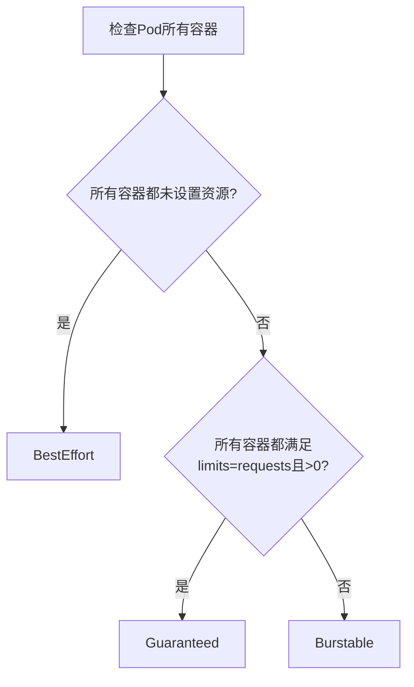

### 1. 资源类型与调度基础
#### 1.1 资源分类
| 资源类型         | 典型代表 | 超限处理方式         | 管理机制          |
| ---------------- | -------- | -------------------- | ----------------- |
| **可压缩资源**   | CPU      | 限流(Throttling)     | Cgroups CPU子系统 |
| **不可压缩资源** | 内存     | 强制终止(OOM Killer) | Cgroups内存子系统 |

#### 1.2 资源申请与调度逻辑
- **调度依据**：基于Pod的`requests`值进行资源分配
- **资源分配计算**：
  $$
  节点已分配资源 = Σ(所有Pod的requests值)
  $$
- **关键特性**：
  
  - 节点资源视图通过`kubectl describe node`显示的是requests总量
  - 真实使用量不影响调度决策（允许超配）
  - 资源超配风险通过驱逐机制控制

> **最佳实践**：推荐使用Validate Admission Webhook强制校验所有Pod必须设置requests
### 2. 服务质量等级(QoS)详解

#### 2.1 等级分类标准
##### Guaranteed（最高优先级）
- **必要条件**：
  
  - 所有容器同时设置`limits`和`requests`
  - 每个资源类型满足：`limits = requests > 0`
- **典型配置**：
  ```yaml
  resources:
    limits:
      cpu: "1"
      memory: "2Gi"
    requests:
      cpu: "1"
      memory: "2Gi"
  ```

##### Burstable（中等优先级）
- **适用场景**（满足任一）：
  1. 部分容器设置资源但`requests < limits`
  2. 部分容器未设置资源参数
- **配置示例**：
  ```yaml
  # 容器1
  resources:
    limits:
      memory: "2Gi"
    requests:
      memory: "1Gi"
  # 容器2（未设置资源）
  ```

##### BestEffort（最低优先级）
- **判断标准**：所有容器均未设置`limits`和`requests`
- **配置特征**：
  ```yaml
  containers:
    - name: app
      image: nginx
      # 无resources字段
  ```

#### 2.2 QoS等级判定流程

### 3. 驱逐机制与QoS的关联

#### 3.1 驱逐触发条件
某种资源的真实使用量超过了 kubelet 预设的阈值

#### 3.2 驱逐优先级顺序
1. **第一优先级**：BestEffort Pods
2. **第二优先级**：Burstable Pods中资源使用超过requests值的
3. **最后考虑**：Guaranteed Pods（仅在所有其他Pod驱逐后仍不足时）

> **保护机制**：资源使用未超过requests的Burstable Pod不会被优先驱逐
### 4. 关键运维实践

#### 4.1 资源监控建议
```bash
# 查看节点资源分配情况
kubectl describe node <node-name>

# 输出示例
Allocated resources:
  (Total limits may be over 100 percent, i.e., overcommitted.)
  Resource           Requests     Limits
--------     ------
  cpu                3800m (95%)  7800m (195%)
  memory             4848Mi (61%) 6848Mi (86%)
```

#### 4.2 配置建议
1. **关键服务**：必须配置Guaranteed QoS
2. **普通应用**：至少配置Burstable并设置requests
3. **测试环境**：可适当使用BestEffort

#### 4.3 排障技巧
- **OOM事件查看**：
  ```bash
  kubectl get events --field-selector=reason=OOMKilled
  ```
- **驱逐日志定位**：
  ```bash
  journalctl -u kubelet | grep -i evict
  ```

### 5. 与优先级调度的区别
| 特性             | QoS等级            | 优先级调度            |
| ---------------- | ------------------ | --------------------- |
| **作用阶段**     | 节点级资源管理     | 集群级调度决策        |
| **决策依据**     | 容器资源配置       | PriorityClass数值     |
| **主要控制组件** | kubelet            | kube-scheduler        |
| **典型应用场景** | 节点压力驱逐       | Pod调度抢占           |
| **配置位置**     | Pod spec.resources | Pod priorityClassName |

> **重要结论**：高优先级Pod可能因QoS等级低而被驱逐，需同时考虑两种机制配置