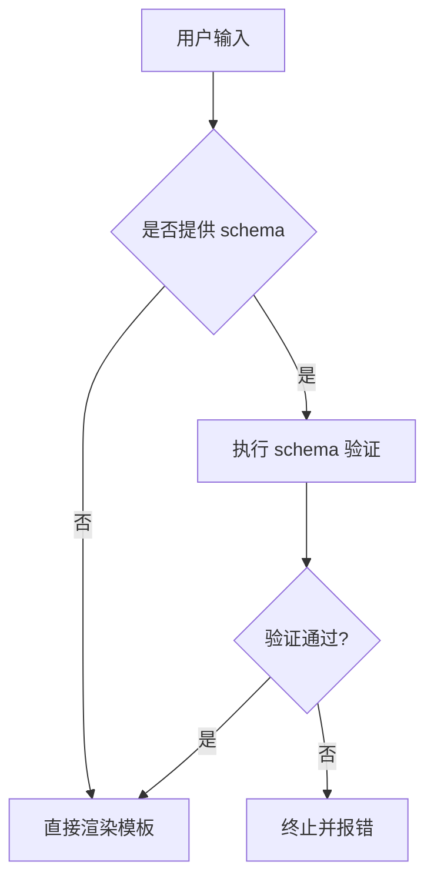

## 一、Chart 包结构
### 1.1 基本目录结构
```bash
wordpress/
├── Chart.yaml          # 必须：Chart 元数据文件
├── values.yaml         # 必须：默认配置值
├── templates/          # 必须：模板目录
│   ├── deployment.yaml
│   └── service.yaml
├── charts/             # 可选：子 Chart 目录
├── crds/               # 可选：CRD 定义文件
├── README.md           # 可选：说明文档
└── LICENSE             # 可选：许可证文件
```

### 1.2 保留目录说明
| 目录/文件                | 作用                                                         |
| ------------------------ | ------------------------------------------------------------ |
| `templates/`             | 存放 K8s 资源模板文件                                        |
| `charts/`                | 存放**依赖**的子 Chart                                       |
| `crds/`                  | 存放 Custom Resource Definitions (CRD) 文件（不可模板化）    |
| `templates/NOTES.txt`    | 安装完成后显示的提示信息                                     |
| `templates/_helpers.tpl` | 因为是`_`开头的，所以不会被当作资源清单解析，但可以为templates内的其他清单文件提供全局的命名（如`template "mysql.fullname"`） |
| `values.schma.json`      | 提供一种结构化的方式来验证用户提供的值是否符合 Chart 的要求  |
## 二、Chart.yaml 文件详解

### 1. 文件配置项总体说明

#### 1.1 核心字段
```yaml
apiVersion: v2        # Helm API 版本 (v1/v2)
name: myapp           # Chart 名称（必须）
version: 1.0.0        # Chart 版本（必须，遵循 SemVer2）
description: "My App" # 描述信息
type: application     # Chart 类型（application/library）
appVersion: "5.7.30"  # 应用版本（参考用）,不影响 Chart 版本计算
					  # 与 `version` 字段无直接关联
```

#### 1.2 扩展字段
```yaml
dependencies:         # 依赖列表
  - name: mysql
    version: "8.0"
    repository: "https://charts.bitnami.com/bitnami"

keywords:             # 搜索关键词，优化搜索，搜索带有关键词的chart
  - database
  - mysql

maintainers:          # 维护者信息

home: https://www.mysql.com/ #当前项目的 URL
icon: https://example.com/icon.png  # Chart 图标 URL

sources: # 当前项目源码 URL
- https://...
- https://...
```

#### 1.3 特殊字段说明
| 字段          | 说明                                |
| ------------- | ----------------------------------- |
| `deprecated`  | 标记 Chart 是否已弃用（true/false） |
| `kubeVersion` | 兼容的 K8s 版本（如 ">=1.19.0"）    |
| `annotations` | 自定义元数据                        |
### 2. 各配置项详细说明
#### 2.1 `version` 字段
##### 2.1.1 版本规范
- **必须遵循 SemVer2 标准**：`主版本号.次版本号.修订号`
- **版本号作用**：
  - **主版本号**：不兼容的 API 变更时递增（例如 `1.x.x` → `2.x.x`）
  - **次版本号**：向下兼容的功能新增时递增（例如 `1.1.x` → `1.2.x`）
  - **修订号**：向下兼容的问题修复时递增（例如 `1.0.0` → `1.0.1`）

##### 2.1.2 示例与作用
```yaml
# mysql/Chart.yaml
version: 1.6.9
```
- **Release 中的显示**：
  ```bash
  helm -n default list
  NAME    NAMESPACE  REVISION  STATUS    CHART
  mysql   default    3         deployed  mysql-1.6.9
  ```
#### 2.2 `apiVersion` 字段
##### 定义与版本兼容性
- **作用**：标识 Helm Chart 的 API 版本格式
- **版本规则**：
  - **Helm 2**：使用 `apiVersion: v1`
  - **Helm 3+**：推荐 `apiVersion: v2`（支持新特性如 `charts/` 目录）
  - **向后兼容性**：Helm 3 仍支持 `apiVersion: v1`
#### 2.3 `type` 字段
##### 2.3.1 两种类型说明
| 类型          | 作用                                                         | 默认值 |
| ------------- | ------------------------------------------------------------ | ------ |
| `application` | 部署实际应用（如 Web 服务、数据库，可以单独部署，也可以被其他 Chart 依赖） | 是     |
| `library`     | 提供可复用的、标准化的模板（不可单独部署，需被其他 Chart 依赖） | 否     |

##### 2.3.2 应用类型 (`application`)
- **默认类型**：无需显式指定 `type`
- **示例**：
  ```yaml
  apiVersion: v2
  name: myapp
  version: 1.0.0
  type: application  # 可省略
  ```

##### 2.3.3 库类型 (`library`)

**目录结构**

```python
.
├── common-template-lib
│ ├── Chart.yaml
│ └── templates
│ 	  └── _common.tpl
└── myapp # myapp不一定与common-template-lib同级
	├── Chart.yaml
	├── values.yaml
	└── templates
	    └── configmap.yaml
```

**创建库 Chart**

```yaml
# common-template-lib/Chart.yaml (元数据)
apiVersion: v2
name: common-template-lib
description: A Helm chart library for common templates
version: 1.0.0
type: library
```

**定义通用模板**

```yaml 
# common-template-lib/templates/_common.tpl
{{- define "common-template-lib.configMap" -}} # 这个模板的名称，可以在其他地方通过该名称引用这个模板。
apiVersion: v1
kind: ConfigMap
metadata:
  name: {{ .Values.configMap.name }}
data:
  myvalue: "{{ .Values.configMap.value }}"
{{- end -}}
```

**应用 Chart 依赖库**

```yaml
# myapp/Chart.yaml
apiVersion: v2
name: myapp
version: 1.0.0
dependencies:
  - name: common-template-lib
    version: 1.0.0
    repository: "file://../common-template-lib"  # 本地路径依赖
```

**使用库模板**

```yaml
# myapp/values.yaml
configMap:
  name: myapp-config
  value: "This is a value from myapp"
```

```yaml
# myapp/templates/configmap.yaml
{{ include "common-template-lib.configMap" . }} # 引用通用模板
```

**操作流程**

```bash
# 1. 更新 charts/ 下的文件：下载并打包依赖 Charts
helm dep update myapp

# 2. 渲染模板
helm template myapp
# 实际应用场景：
# 避免某些公司自制的 helm 版本太低，无法识别新的 Chart 语法或者特性，可以先渲染成 yaml 文件，然后将这些文件应用到公司的 K8s 集群中。

# 输出结果示例：
# Source: myapp/templates/configmap.yaml
apiVersion: v1
kind: ConfigMap
metadata:
  name: myapp-config
data:
  myvalue: "This is a value from myapp"
```
## 三、Chart 依赖管理与 alias 字段使用
### 1. 依赖管理基础
#### 1.1 依赖声明方式
```yaml
# Chart.yaml 中声明依赖
dependencies:
  - name: apache # 依赖的 Chart 名称
    version: 1.2.3 # 依赖的 Chart 版本（必须精确匹配）
    repository: https://example.com/charts # Chart 仓库 URL（需已通过 `helm repo add` 添加）
  - name: mysql
    version: 3.2.1
    repository: https://another.example.com/charts
```

#### 1.2 依赖更新操作
```bash
# 更新依赖到 charts/ 目录
helm dep update <chart-directory>

# 示例输出
Hang tight while we grab the latest...
Saving 2 charts
Downloading apache from repo https://example.com/charts
Downloading mysql from repo https://another.example.com/charts
```

#### 1.3 生成的目录结构
```bash
charts/
├── apache-1.2.3.tgz
└── mysql-3.2.1.tgz
```
### 2. alias 字段高级用法
#### 2.1 使用场景
| 场景       | 说明                                           |
| ---------- | ---------------------------------------------- |
| 多实例部署 | 同一 Chart 部署多个实例（如日志收集器+处理器） |
| 多环境配置 | 开发/测试/生产环境使用相同 Chart 不同配置      |
| 多租户支持 | 为不同客户部署独立实例                         |

#### 2.2 具体实现示例
##### 子 Chart 定义
```yaml
# log-component/Chart.yaml
apiVersion: v2
name: log-component
description: A Helm chart for a log component
version: 0.1.0
```

```yaml
# log-component/templates/deployment.yaml
apiVersion: apps/v1
kind: Deployment
metadata:
  name: {{ .Release.Name }}-{{ .Chart.Name }}
spec:
  replicas: {{ .Values.replicaCount }}
  template:
    spec:
      containers:
      - name: {{ .Chart.Name }}
        image: busybox
        args: ["/bin/sh", "-c", "while true; do echo hello; sleep 10; done"]
```

##### 父 Chart 配置
```yaml
# logapp/Chart.yaml
apiVersion: v2
name: logapp
version: 1.0.0
dependencies:
  - name: log-component
    version: "0.1.0"
    repository: "file://../log-component"
    alias: log-collector  # 第一个实例别名
  - name: log-component
    version: "0.1.0"
    repository: "file://../log-component"
    alias: log-processor  # 第二个实例别名
```

```yaml
# logapp/values.yaml
log-collector:
  replicaCount: 2  # 收集器实例配置
log-processor:
  replicaCount: 1  # 处理器实例配置
```

#### 2.3 操作流程
```bash
# 1. 更新依赖
helm dep update logapp

# 2. 查看生成的依赖
tree logapp/charts
logapp/charts/
├── log-collector
│   └── log-component-0.1.0.tgz
└── log-processor
    └── log-component-0.1.0.tgz

# 3. 渲染模板
helm template logapp
```

#### 2.4 生成结果
```yaml
# Source: logapp/charts/log-collector/templates/deployment.yaml
apiVersion: apps/v1
kind: Deployment
metadata:
  name: logapp-log-collector
spec:
  replicas: 2
  template:
    spec:
      containers:
      - name: log-component
        image: busybox
        args: ["..."]
# Source: logapp/charts/log-processor/templates/deployment.yaml
apiVersion: apps/v1
kind: Deployment
metadata:
  name: logapp-log-processor
spec:
  replicas: 1
  template:
    spec:
      containers:
      - name: log-component
        image: busybox
        args: ["..."]
```
## 四、Helm 模板与 Values 作用域
### 1. 模板系统基础
#### 1.1 templates 目录结构
```bash
templates/
├── deployment.yaml      # 核心部署模板
├── service.yaml         # 服务定义模板
├── configmap.yaml       # 配置映射模板
├── _helpers.tpl         # 辅助模板函数
└── NOTES.txt            # 安装后提示信息
```

#### 1.2 模板语法示例
```yaml
# templates/pvc.yaml
{{- if and .Values.persistence.enabled (not .Values.persistence.existingClaim) }}
apiVersion: v1
kind: PersistentVolumeClaim
metadata:
  name: {{ template "mysql.fullname" . }}
  labels:
    app: {{ template "mysql.fullname" . }}
spec:
  accessModes:
    - {{ .Values.persistence.accessMode | quote }}
{{- end }}
```
### 2. Values 系统
#### 2.1 Values 来源优先级
| 来源               | 优先级 | 示例命令                              |
| ------------------ | ------ | ------------------------------------- |
| `--set` 参数       | 最高   | `helm install --set image.tag=latest` |
| 自定义 Values 文件 | 中     | `helm install -f custom-values.yaml`  |
| Chart 默认 Values  | 最低   | `values.yaml`                         |

#### 2.2 常见预定义变量（了解）
| 变量                 | 说明           | 示例用法                              |
| -------------------- | -------------- | ------------------------------------- |
| `.Release.Name`      | Release 名称   | `{{ .Release.Name }}-svc`             |
| `.Release.Namespace` | 部署的命名空间 | `namespace: {{ .Release.Namespace }}` |
| `.Chart.Version`     | Chart 版本     | `version: {{ .Chart.Version }}`       |
### 3. Values 作用域管理
#### 3.1 父子 Chart 传值
##### 父 Chart 配置 (wordpress/values.yaml)
```yaml
# 全局配置
global:
  appName: MyWordPress

# 子 Chart 专属配置
mysql:
  maxConnections: 100
  password: "secret"

apache:
  port: 8080
```

##### 子 Chart 访问方式 (mysql/templates/deployment.yaml)
```yaml
env:
- name: MYSQL_ROOT_PASSWORD
  value: {{ .Values.password }}          # 直接访问子 Chart 配置
- name: APP_NAME
  value: {{ .Values.global.appName }}    # 访问全局配置
```

#### 3.2 作用域规则
| 配置位置             | 访问方式                     | 作用范围       |
| -------------------- | ---------------------------- | -------------- |
| 父 Chart values.yaml | `.Values.<子chart名>.<字段>` | 指定子 Chart   |
| 全局配置             | `.Values.global.<字段>`      | 所有 Chart     |
| 子 Chart values.yaml | `.Values.<字段>`             | 仅当前子 Chart |
### 4. 高级技巧
#### 4.1 全局变量穿透
```yaml
# 父 values.yaml
global:
  loggingLevel: debug

# 子模板中使用
{{ .Values.global.loggingLevel }}
```

#### 4.2 动态配置继承
```yaml
# 父 values.yaml
components:
  apache:
    resources:
      limits:
        cpu: 500m
```

```yaml
# 子模板中使用
resources: {{ toYaml .Values.components.apache.resources | indent 4 }} # indent 4：缩进4个空格
```
## 五、values.schema.json 文件
### 1. 核心作用
#### 1.1 功能定位
- **配置验证**：对最终合并后的 `values` 进行结构化验证
- **数据类型控制**：确保配置值符合预期的类型和格式
- **完整性检查**：强制要求必需字段的存在性

#### 1.2 验证范围
| 配置来源                | 是否验证 |
| ----------------------- | -------- |
| `values.yaml`           | ✅        |
| `-f custom-values.yaml` | ✅        |
| `--set key=value`       | ✅        |
### 2. 文件结构规范
#### 2.1 基础模板
```json
{
  "$schema": "http://json-schema.org/draft-07/schema#", // 当前文档遵循的JSON Schema规范版本
  "type": "object",
  "properties": {
    "字段名": {
      "type": "数据类型",
      "约束条件": "具体规则"
    }
  },
  "required": ["必需字段列表"]
}

// 格式验证`"format": "email"`校验邮箱/IP等特殊格式
```

#### 2.2 典型配置示例
```json
{
  "$schema": "http://json-schema.org/draft-07/schema#",
  "type": "object",
  "properties": {
    "replicaCount": {
      "type": "integer",
      "minimum": 1,
      "default": 1,
      "description": "副本数量（必须≥1）"
    },
    "image": {
      "type": "object",
      "properties": {
        "repository": {"type": "string"},
        "tag": {"type": "string"},
        "pullPolicy": {
          "type": "string",
          "enum": ["Always", "IfNotPresent", "Never"]
        }
      },
      "required": ["repository"]
    }
  },
  "required": ["replicaCount", "image"]
}
```
### 3. 验证场景演示
#### 3.1 错误配置示例
```yaml
# incorrect-values.yaml
replicaCount: -1   # 违反最小值约束
image:
  repository: nginx
  tag: 1.21.1
  pullPolicy: InvalidPolicy  # 不在枚举范围内
```

**验证命令与报错**：

```bash
helm install my-nginx ./nginx -f incorrect-values.yaml

# 错误输出
Error: values don't meet the schema specifications:
- image.pullPolicy: must be one of [Always, IfNotPresent, Never]
- replicaCount: must be >= 1
```
### 4. 验证流程图示


## 六、Chart 仓库

### 1. 部署私有 Chart 仓库
**原理**：Chart 仓库是一个提供 `index.yaml` 和 Chart 压缩包的 HTTP 服务器，通过 `index.yaml` 维护 Chart 元数据。

##### 服务端部署步骤
1. **启动 HTTP 服务**（以 Nginx 为例）：
   ```bash
   # 部署 Nginx
   kubectl create deployment nginx --image=nginx
   kubectl expose deployment nginx --port=8888 --type=NodePort
   ```

2. **创建并打包 Chart**：
   ```bash
   cd /usr/share/nginx/html  # Nginx 默认根目录
   helm create mychart       # 创建示例 Chart
   helm package mychart      # 压缩 Chart，生成 .tgz 包
   ```

3. **生成仓库索引**：
   ```bash
   helm repo index . --url http://<服务器IP>:8888  # 生成 index.yaml
   ```

##### 客户端使用步骤
1. **添加私有仓库**：
   
   ```bash
   helm repo add myprivaterepo http://<服务器IP>:8888
   ```
   
2. **更新仓库缓存**：
   ```bash
   helm repo update
   ```

3. **搜索并安装 Chart**：
   ```bash
   helm search repo myprivaterepo
   helm install myrelease myprivaterepo/mychart
   ```
### 2. 安装 Harbor
**Harbor 功能**：支持 Helm Chart 的 OCI 格式存储及镜像仓库管理。

##### 前置条件：配置 NFS 存储类
1. **安装 NFS Provisioner**：
   ```bash
   helm repo add nfs-subdir-external-provisioner https://kubernetes-sigs.github.io/nfs-subdir-external-provisioner/
   
   # 发布不存在：执行 helm install，创建一个新的发布
   # 发布存在：执行 helm upgrade，将发布升级到新版本
   helm upgrade --install nfs-subdir-external-provisioner \
     nfs-subdir-external-provisioner/nfs-subdir-external-provisioner \
     --set nfs.server=192.168.71.12 \
     --set nfs.path=/data/nfs \
     --set storageClass.defaultClass=true \
     -n kube-system
   ```

##### Harbor 安装步骤
1. **添加 Helm 仓库并下载 Chart**：
   ```bash
   helm repo add harbor https://helm.goharbor.io
   helm pull harbor/harbor
   tar zxvf harbor-1.14.2.tgz
   ```

2. **修改 `values.yaml`**：
   ```yaml
   expose:
     type: nodePort
     tls:
       enabled: false  # 关闭 TLS
     nodePort:
       ports:
         http:
           nodePort: 30002  # NodePort 端口
   externalURL: http://192.168.71.12:30002  # 外部访问地址
   
   persistence:
     persistentVolumeClaim:
       registry:
         storageClass: "nfs-client"  # 使用 NFS 存储类
         accessMode: ReadWriteMany # 允许多个节点上的组件同时读写数据
       # 其他组件（database、redis 等）同理配置
   ```

3. **安装 Harbor**：
   ```bash
   kubectl create namespace harbor
   helm install harbor . -n harbor
   ```

4. **验证部署**：
   
   ```bash
   kubectl -n harbor get pods,svc  # 检查 Pod 状态及 Service 端口，确保全部正常
   ```
   - 访问 `http://<节点IP>:30002`，使用 `admin/Harbor12345` 登录。
### 3. Harbor 作为 Chart 仓库使用
##### 上传 Chart
1. **登录 Harbor**：
   ```bash
   helm registry login -u admin -p Harbor12345 --insecure 192.168.71.12:30002
   ```

2. **打包并推送 Chart**：
   ```bash
   helm create zzz
   helm package zzz  # 生成 zzz-0.1.0.tgz
   helm push zzz-0.1.0.tgz --plain-http oci://192.168.71.12:30002/chart-public
   ```

##### 安装 Chart
```bash
helm install zzz-release1 --plain-http oci://192.168.71.12:30002/chart-public/zzz --version 0.1.0
```
### 4. Harbor 作为镜像仓库
1. **登录镜像仓库**：
   ```bash
   nerdctl login -u admin -p Harbor12345 --insecure-registry http://192.168.71.12:30002
   ```

2. **打标签并推送镜像**：
   ```bash
   nerdctl -n k8s.io tag pause:3.9 192.168.71.12:30002/library/pause:3.9
   nerdctl -n k8s.io push --insecure-registry 192.168.71.12:30002/library/pause:3.9
   # nerdctl 会解析镜像名称，识别出仓库地址是 192.168.71.12:30002，然后将本地的镜像层数据打包并推送到该地址的 library/pause 仓库下，标签为 3.9 
   
   # 也可以拉取镜像
   ```
