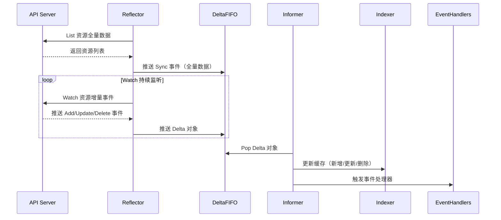
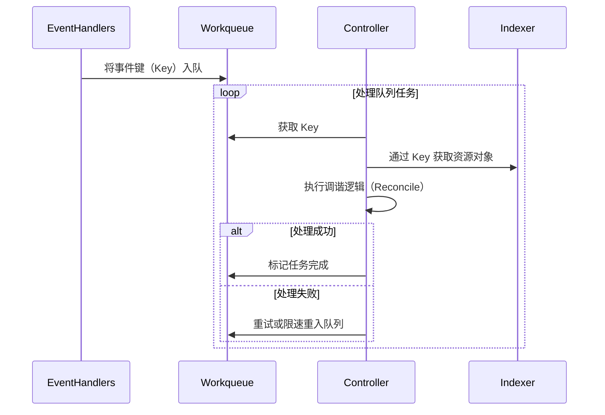
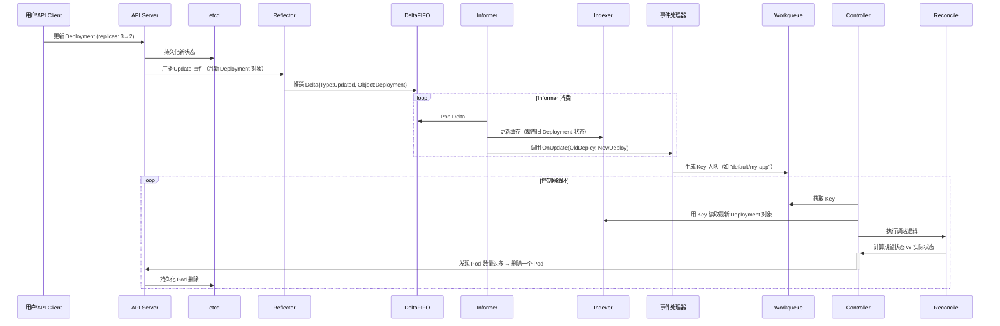

## 一、CRD
### **1. 介绍**

- **CRD（Custom Resource Definition）定义**  
  - 用于**扩展 Kubernetes API**，允许**用户定义新的资源类型**。  
  - **类比**：  
    - **CRD**：相当于在 K8s 中创建一张新的数据库表结构（定义资源类型）。  
    - **CR（Custom Resource）**：向该表中插入的具体记录（资源实例）。  

- **基本概念**：  
  - **自定义资源类型（CRD）**：定义资源的 Schema（如字段、类型、验证规则）。  
  - **自定义资源（CR）**：基于 CRD 创建的实例（如 `kind: MyApp`）。  
  - **自定义控制器**：监听 CR 变化并执行业务逻辑，确保实际状态与期望状态一致。  

- **为何需要 CRD？**

  - **内置资源不足**：  

    k8s 内置资源（如 Deployment、Service）无法满足特定业务需求（如复杂应用配置、自定义监控策略）。  

  - **场景示例**：  
    - 定义 `Database` 资源管理数据库实例的生命周期。  
    - 创建 `MonitoringPolicy` 资源实现定制化监控规则。  
    - 实现 `CronJob` 的高级调度策略。  

  - **优势**：  
    - **扩展性**：无缝集成到 Kubernetes 生态，复用 RBAC、Helm 等工具链。  
    - **统一接口**：通过 `kubectl` 或 API 管理自定义资源。  
### **2. CRD 使用流程**

##### **步骤 1：定义 CRD（创建资源类型）**

- **YAML 示例**：  

  ```yaml
  apiVersion: apiextensions.k8s.io/v1
  kind: CustomResourceDefinition
  metadata:
    name: myapps.example.com  # 格式：<spec.names.plural>.<spec.group>
  spec:
    group: example.com        # API 组名
    versions:
      - name: v1              # 版本号
        served: true          # 是否启用该版本
        storage: true         # 是否持久化存储
        schema:               # OpenAPI 校验规则
          openAPIV3Schema:
            type: object
            properties:
              spec: # 资源规格字段定义
                type: object # 规格字段类型为对象
                properties:
                  replicas: # 该资源有replicas字段，且该字段为整数类型，最小值为1
                    type: integer
                    minimum: 1
                  # ...其他字段
    scope: Namespaced         # 资源作用域（Namespaced 或 Cluster）
    names:
      plural: myapps          # 资源的复数形式（kubectl get myapps）
      singular: myapp         # 单数形式
      kind: MyApp             # 资源类型名（yaml 中的 kind）
      shortNames:             # 资源缩写（如 po 代表 Pod）
      - ma
  ```

- **关键字段**：  

  - **group**：API 分组（如 `example.com`）。  
  - **versions**：支持多版本，通过 `storage` 标记当前存储版本。  
  - **schema**：定义资源字段的校验规则（必填字段、类型、取值范围）。  
  - **scope**：资源是否属于命名空间（`Namespaced`）或集群级别（`Cluster`）。  

##### **步骤 2：创建 CR（资源实例）**

- **YAML 示例**：  

  ```yaml
  apiVersion: example.com/v1
  kind: MyApp
  metadata:
    name: myapp-demo
    namespace: default
  spec:
    replicas: 3
  ```

- **操作验证**：  

  ```bash
  kubectl get myapps  # 查看自定义资源
  kubectl describe myapp myapp-demo  # 查看详情
  ```

##### **步骤 3：开发自定义控制器**

- **核心功能**：  
  - **监听 CR 变化**：通过 `Informer` 监听资源的创建、更新、删除事件。  
  - **调和循环（Reconcile Loop）**：比较实际状态与期望状态，执行逻辑（如创建 Pod、调用外部 API）。  
- **工具支持**：  
  - **client-go**：Kubernetes 官方 Go 库，提供与 API Server 交互的客户端（Lister、Watcher）。  
  - **Kubebuilder/Operator SDK**：框架简化控制器开发（生成脚手架代码）。  
## 二、开发自定义控制器
### **1. 自定义控制器开发框架**

分为三个层次，适用于不同场景的开发者需求：

| 框架层级               | 核心特点                                                     | 适用场景                                                     |
| ---------------------- | ------------------------------------------------------------ | ------------------------------------------------------------ |
| **Client-Go**          | 提供底层 K8s API 操作库，支持原生资源监听与操作。<br />官方示例：https://github.com/kubernetes/sample-controller | 需要高度自定义控制逻辑，对性能或扩展性有特殊要求的场景。     |
| **Controller-Runtime** | 基于 Client-Go 封装的高层抽象，简化控制器开发（如事件处理、调和循环）。 | 大多数通用控制器开发需求，快速实现资源监听与状态调和。       |
| **Kubebuilder**        | 基于 Controller-Runtime 的完整开发工具链，提供脚手架、代码生成和测试支持。 | 快速构建生产级 Operator，适合需要标准化流程和最佳实践的项目。 |
### **2. Client-Go Informer 机制原理**

Informer 是 K8s 控制器的核心组件，通过缓存和事件驱动机制高效管理资源状态。其核心目标：**减少对 API Server 的直接访问，降低集群压力**。
#### **2.1 Informer 核心组件**

| 组件           | 作用                                                         | 协作关系                                                     |
| -------------- | ------------------------------------------------------------ | ------------------------------------------------------------ |
| **Reflector**  | 通过 **List-Watch** 机制监听 API Server 的资源变更事件（Add/Update/Delete）。 | 将事件对象封装为 `Delta` 并推入 `Delta FIFO` 队列。          |
| **Delta FIFO** | 有序队列，存储资源事件的增量变更（Delta）。                  | 作为 Reflector 与 Informer 之间的缓冲区，确保事件顺序性。    |
| **Informer**   | 核心桥梁，负责：<br>- 从 Delta FIFO 消费事件，更新缓存。<br>- 触发事件处理器（Handler）。 | 调用 `Indexer` 更新缓存，并通过 `Workqueue` 分发事件给控制器。 |
| **Indexer**    | 本地缓存（内存存储），基于键值对和索引加速资源查询。         | 提供快速查询能力（如通过名称或标签查找资源），减少 API Server 访问。 |
| **Workqueue**  | 任务队列，管理待处理的事件键（Key）。                        | 解耦事件接收与处理逻辑，支持重试、限速等机制。               |

> ##### **Delta FIFO 队列**
>
> **存储内容**：
>
> - **资源对象的增量变更**（Delta）
>
>   每个 `Delta` 包含两项核心信息：
>
>   - **操作类型**：`Added`（新增）、`Updated`（更新）、`Deleted`（删除）或 `Sync`（全量同步）。
>   - **资源对象**：事件关联的 **完整 Kubernetes 资源对象**（例如一个 Pod、Deployment 等）。
>
> **数据结构**：
>
> ```go
> type Delta struct {
>     Type   DeltaType     // 操作类型（Add/Update/Delete/Sync）
>     Object interface{}  // Kubernetes 资源对象（如 *v1.Pod）
> }
> 
> type DeltaFIFO struct {
>     items   map[string]Deltas  // Key: 资源对象的唯一键（Namespace/Name）
>     queue   []string           // 保证事件顺序的队列
> }
> ```
>
> - 同一资源的多个事件按发生顺序存储为 `Deltas`（Delta 数组）。
>
> **核心用途**:
>
> 1. **缓存事件顺序**：确保事件按 `Add -> Update -> Delete` 的顺序被消费。
> 2. **事件合并**：同一资源的连续更新会被合并为最新状态的单个事件（避免冗余处理）。
> 3. **全量同步**：`Sync` 事件强制刷新缓存 Indexer（for 处理异常情况如 Watch 断开）。
>
> > ✅ **总结**：Delta FIFO 存储 **增量事件流**，保证时序性和去重，是事件驱动的源头。
>
> ------
>
> ##### Indexer 缓存
>
> **存储内容**:
>
> - **资源对象的完整最新状态**（数据同步，与 etcd 状态一致）
>
>   以键值对形式存储：
>
>   - **Key**：资源唯一标识符 `Namespace/Name`（如 `default/nginx-pod`）。
>   - **Value**：资源对象的 **深拷贝**（如 `*v1.Pod` 对象）。
>
> **数据结构**：
>
> ```go
> type Indexer struct {
>     cache  cache.Store         // 实际存储（线程安全的 Map）
>     indexers Indexers          // 索引函数（如按标签过滤）
> }
> 
> // 存储结构示例
> map[string]interface{}{
>     "default/nginx-pod": &v1.Pod{...},
>     "kube-system/coredns": &v1.Pod{...},
> }
> ```
>
> - 支持自定义索引（如按标签查询）：
>
>   ```go
>   // 创建按标签 "app" 索引的 Indexer
>   indexer.AddIndexers(Indexers{"byApp": func(obj interface{}) ([]string, error) {
>       pod := obj.(*v1.Pod)
>       return []string{pod.Labels["app"]}, nil
>   }})
>   ```
>
> **核心用途**:
>
> 1. **本地快速查询**：通过 `Namespace/Name` 直接获取对象（无需访问 API Server）。
> 2. **复杂过滤**：支持基于索引的批量查询（如 `GetByLabel("app=nginx")`）。
> 3. **状态一致性**：存储资源在集群中的 **最新状态**（最终与 API Server 一致）。
>
> > ✅ **总结**：Indexer 存储资源的 **全量状态快照**，提供高效本地查询能力。
#### **2.2 Informer 工作流程🌟**


##### **上半部分（数据同步与缓存更新）**



**描述**：

- Reflector 先向 API Server 发送 List 请求获取资源全量数据并推送到 DeltaFIFO，接着进入 Watch 循环，持续监听资源增量事件并推送到 DeltaFIFO。Informer 从 DeltaFIFO 中弹出 Delta 对象，根据对象中的信息更新 Indexer 缓存，并触发事件处理器。

##### **下半部分（控制器逻辑处理）**



**描述**：

- 事件处理器将事件键（Key）入队到 Workqueue，随后控制器进入处理队列任务的循环，从 Workqueue 中获取 Key 并通过 Indexer 依据该 Key 获取对应的资源对象，执行调谐逻辑（Reconcile），若处理成功则标记任务完成，若处理失败则选择重试或限速重入队列。
  - 事件键（Key）是 Informer  给的

##### **以 Deployment 的 replicas 从 3→2 为例**


#### **2.3 关键机制详解**

- **List-Watch 机制**  
  - **List**：首次全量同步资源数据。  
  - **Watch**：持续监听资源变更，基于 HTTP 长连接接收事件流。  
  - **Resync 机制**：周期性全量同步，确保缓存与集群状态一致（默认关闭或按需配置）。  

- **Delta FIFO 队列**  
  - **Delta 类型**：包含操作类型（Add/Update/Delete）和资源对象。  
  - **去重逻辑**：同一资源的多次变更合并为最新状态，避免重复处理。  

- **Indexer 缓存与索引**  
  - **本地存储**：资源对象以键值对形式存储在内存中。  
  - **索引类型**：  
    - **主键索引**：默认通过资源 `Namespace/Name` 查询。  
    - **自定义索引**：如按标签（Labels）或注解（Annotations）快速过滤。  

- **Workqueue 任务队列**  
  - **限速队列**：支持指数退避、固定间隔等重试策略。  
  - **去重机制**：同一 Key 的任务在队列中唯一，避免重复处理。  
#### **2.4 优势**

1. **降低 API Server 负载**  
   - 通过缓存减少直接查询 API Server 的次数。  
   - 事件驱动的增量更新避免全量拉取。  

2. **保证事件顺序性**  
   - Delta FIFO 确保事件按发生顺序处理。  

3. **高效资源访问**  
   - Indexer 提供本地快速查询，支持复杂过滤条件。  

4. **异步处理与容错**  
   - Workqueue 解耦事件接收与处理，支持失败重试。  
## 三、Operator
### **1. 核心概念**

- **定义**：  
  
  Operator 是 K8s 的**扩展开发模型**，通过结合 **自定义资源（CRD）** 和 **自定义控制器（Controller）**，将运维知识编码到 K8s 中，实现复杂应用的自动化管理。  
  
- **组成**：  
  
  - **CRD**：定义新的资源类型（如 `MySQLCluster`）。  
  - **Controller**：监听 CR 实例的变化，执行调谐逻辑（如创建 Pod、配置备份）。  
  
- **类比**：  
  
  - 传统运维：人工执行脚本管理应用（如部署、升级、备份）。  
  - Operator：将运维操作抽象为 K8s 资源，由控制器自动执行。  
### **2. Operator 框架**

- **核心作用**：  
  
  Operator 框架（如 **Kubebuilder**、**Operator SDK**）提供了一套**工具链和脚手架**，简化 CRD 和控制器的开发流程。  
  
- **功能支持**：  

  - 自动生成 CRD YAML 文件（无需手动编写完整 Schema）。  
  - 生成控制器代码骨架，聚焦业务逻辑实现。  
  - 集成测试与部署工具（如生成 Dockerfile、部署清单）。  

- **主流框架**：  

  | 框架             | 特点                                                         |
  | ---------------- | ------------------------------------------------------------ |
  | **Kubebuilder**  | K8s 官方推荐，基于 Controller-Runtime，适合深度集成 K8s 生态。 |
  | **Operator SDK** | Red Hat 主导，支持 Ansible、Helm 等多种开发模式，适合快速原型开发。 |
### **3. Operator 开发步骤**

##### **步骤 1：环境准备**

**安装依赖工具**：  

- **kubebuilder**：  

  ```bash
  curl -L -o kubebuilder "https://go.kubebuilder.io/dl/latest/$(go env GOOS)/$(go env GOARCH)"
  chmod +x kubebuilder && mv kubebuilder /usr/local/bin/
  ```

- **operator-sdk**（可选）：  

  ```bash
  curl -LO https://github.com/operator-framework/operator-sdk/releases/download/v1.28.0/operator-sdk_linux_amd64
  chmod +x operator-sdk && mv operator-sdk /usr/local/bin/
  ```

##### **步骤 2：初始化项目**

```bash
# 使用 Kubebuilder 初始化项目
mkdir mysql-operator && cd mysql-operator
kubebuilder init --domain example.com --repo github.com/example/mysql-operator

# 创建 API（生成 CRD 和控制器骨架）
kubebuilder create api --group database --version v1alpha1 --kind MySQLCluster
```

##### **步骤 3：定义 CRD 字段**

编辑 `api/v1alpha1/mysqlcluster_types.go`，定义资源字段：  

```go
type MySQLClusterSpec struct {
    Replicas int32  `json:"replicas"`
    Version  string `json:"version"`
    Storage  string `json:"storage,omitempty"`
}

type MySQLClusterStatus struct {
    AvailableReplicas int32 `json:"availableReplicas"`
}
```

##### **步骤 4：实现控制器逻辑**

编辑 `controllers/mysqlcluster_controller.go`，填充调谐逻辑：  

```go
func (r *MySQLClusterReconciler) Reconcile(ctx context.Context, req ctrl.Request) (ctrl.Result, error) {
    // 获取 CR 实例
    cluster := &databasev1alpha1.MySQLCluster{}
    if err := r.Get(ctx, req.NamespacedName, cluster); err != nil {
        return ctrl.Result{}, client.IgnoreNotFound(err)
    }

    // 创建 Deployment
    deploy := &appsv1.Deployment{}
    if err := r.Get(ctx, req.NamespacedName, deploy); err != nil {
        if errors.IsNotFound(err) {
            // 构建 Deployment 对象
            newDeploy := r.buildDeployment(cluster)
            if err := r.Create(ctx, newDeploy); err != nil {
                return ctrl.Result{}, err
            }
        } else {
            return ctrl.Result{}, err
        }
    }

    // 更新状态
    cluster.Status.AvailableReplicas = deploy.Status.AvailableReplicas
    if err := r.Status().Update(ctx, cluster); err != nil {
        return ctrl.Result{}, err
    }

    return ctrl.Result{}, nil
}
```

##### **步骤 5：生成 CRD 与部署控制器**

```bash
# 生成 CRD YAML 文件（输出到 config/crd/bases/）
make manifests

# 构建镜像并推送到仓库
make docker-build docker-push IMG=example/mysql-operator:v1.0.0

# 部署 Operator 到集群
make deploy IMG=example/mysql-operator:v1.0.0
```

##### **步骤 6：创建 CR 实例**

```yaml
# config/samples/database_v1alpha1_mysqlcluster.yaml
apiVersion: database.example.com/v1alpha1
kind: MySQLCluster
metadata:
  name: mysql-cluster-demo
spec:
  replicas: 3
  version: "8.0"
  storage: "10Gi"
```

##### **步骤 7：验证 Operator 行为**

```bash
kubectl get mysqlclusters  # 查看自定义资源
kubectl get pods           # 检查 Operator 创建的 Pod
kubectl describe mysqlcluster mysql-cluster-demo  # 查看状态
```
## 四、Admission Webhooks
### **1. 概述**
- **定义**：web 应用程序，API Server 处理请求的"关卡"，拦截请求进行定制处理。hook：拦截处理请求后还会返回。有两种：
  - **Mutating Webhook**：修改请求内容后返回原链路。
    - **应用场景**：
      - 自动注入 Sidecar 容器
      - 动态设置资源限制
      - 动态注入配置/标签
  - **Validating Webhook**：校验请求数据，非法则拒绝。
    - **应用场景**：
      - 强制标签/注解策略（如必须包含 `environment` 标签）
      - 安全策略检查（如禁止使用特权容器）
      - 镜像来源校验
- **准入（Admission）**：控制资源能否持久化到 etcd 的关键阶段。
### **2. Webhook的执行时机**


1. **总体时机**：API Server 接收请求 → 授权检查 → **触发 Webhook** → 持久化到 etcd。
2. **顺序**：Mutating Webhook 先于 Validating Webhook 执行，确保先修改后验证。
### **3. Webhook的运行流程**
```text
												┌──────────────────────────────────┐
				 ┌─────────────────┐            │                                  │
		apply    │                 │    read    │  validatingwebhookconfiguration  │
	────────────►│    api-server   │◄───────────┤                                  │
				 │                 │            │  mutatingwebhookconfiguration    │
				 └────────┬────────┘            │                                  │
						  │                     └──────────────────────────────────┘
						  │
						  │  回调
						  │
						  │
				 ┌────────▼────────┐
				 │                 │
				 │  webhookservice │
				 │                 │
				 └─────────────────┘
```
- **核心组件**：

  - `MutatingWebhookConfiguration` / `ValidatingWebhookConfiguration`：定义 Webhook 规则和目标服务。
  - Webhook Service：接收 API Server 的 HTTPS 回调，执行逻辑处理。

- > **回调**：
  >
  > - **定义**：在某个事件或条件触发时，系统主动调用预先定义好的函数或服务来处理特定逻辑
  >
  > - **核心思想**：由调用方定义，在特定时机被触发
  >
  > - **类比**：留个电话，有事找你
  >
  >   - **注册联系方式**：你告诉快递员：“到了之后打我这个电话”（相当于注册回调函数）。
  >   - **触发时机**：快递到达时（事件触发），快递员拨打电话（执行回调）。
  >   - **处理逻辑**：你接电话后决定如何取快递（回调函数的具体逻辑）。
  >
  > - **代码层面的回调**：
  >
  >   ```python
  >   def print_result(result):
  >       print("结果:", result)
  >     
  >   def calculate(x, y, callback):
  >       result = x + y
  >       callback(result)
  >     
  >   calculate(3, 4, print_result)
  >   ```
  >   
  >- **在 Webhook 中的回调**
  > 
  >  - **注册 Webhook（留联系方式）**
  >     - 管理员通过定义 `MutatingWebhookConfiguration` 或 `ValidatingWebhookConfiguration`，告诉 API Server：
  >       “当有用户创建/更新某种资源时，请调用我指定的 Webhook Service 来处理”
  >   - **触发回调（快递到了，打电话）**
  >     - 当用户执行 `kubectl apply` 提交资源时，API Server 在处理请求的**关键阶段**（如修改或验证资源前）暂停，主动向 Webhook Service 发送 HTTP 请求（即“回调”）
  >   - **处理回调逻辑（接电话，处理快递）**
  >     - **Mutating Webhook**：修改资源内容
  >     - **Validating Webhook**：验证资源合法性

### **4. Mutating Webhook 实战：自动添加 Pod 标签**

#### **4.1  准备Webhook 服务（Flask）**

**Flask框架**：可用于：

- 开发小型到中型的Web应用。
- 构建RESTful API。
- 作为微服务的组成部分。
- 快速原型设计和开发。

```python
# mutating_webhook.py
from flask import Flask, request, jsonify  # 导入 Flask 框架、请求处理和 JSON 响应模块
import json
import ssl
import base64

app = Flask(__name__)  # 创建一个 Flask 应用实例

# 相当于patch打补丁命令，给 pod 添加标签
def create_patch(metadata):
    """
    创建 JSON Patch 以添加 'mutate' 注释。
    如果 metadata.annotations 不存在，则首先创建该路径。
    """
    if 'labels' in metadata:
        dic = metadata['labels']
    else:
        dic = {}

    patch = [
        # 添加 'labels' 键，如果不存在
        # dic 防止原本的标签被覆盖，而非直接置空{}
        {'op': 'add', 'path': '/metadata/labels', 'value': dic},
        # 添加 'environment' 标签
        {'op': 'add', 'path': '/metadata/labels/environment', 'value': 'production'}
    ]

    patch_json = json.dumps(patch)
    patch_base64 = base64.b64encode(patch_json.encode('utf-8')).decode('utf-8')
    return patch_base64


@app.route('/mutate', methods=['POST'])  # https://webhook-service.default.svc:443/mutate
def mutate():
    """
    处理 Mutating Webhook 的请求，对 Pod 对象应用 JSON Patch。
    """
    admission_review = request.get_json()  # 从请求中提取 AdmissionReview 对象

    # 验证 AdmissionReview 格式是否正确
    # admission_review['request']['object']
    if 'request' not in admission_review or 'object' not in admission_review['request']:
        return jsonify({
            'kind': 'AdmissionReview',
            'apiVersion': 'admission.k8s.io/v1',
            'response': {
                'allowed': False,  # 如果格式无效，则禁止当前提交过来的资源请求
                'status': {'message': 'Invalid AdmissionReview format'}
            }
        })

    req = admission_review['request']  # 提取请求对象
    print('--->',req)
    # 生成 JSON Patch
    metata = req['object']['metadata']
    patch_json = create_patch(metata)

    # 准备 AdmissionResponse 响应
    admission_response = {
        'kind': 'AdmissionReview',
        'apiVersion': 'admission.k8s.io/v1',
        'response': {
            'uid': req['uid'],
            'allowed': True,
            'patchType': 'JSONPatch',
            'patch': patch_json  # 直接包含 Patch 数据作为 JSON 字符串
        }
    }

    print(admission_response)
    return jsonify(admission_response)


if __name__ == '__main__':
    # 加载 SSL 证书和私钥
    context = ssl.create_default_context(ssl.Purpose.CLIENT_AUTH)
    context.load_cert_chain('/certs/tls.crt', '/certs/tls.key')

    # Run the Flask application with SSL
    app.run(host='0.0.0.0', port=443, ssl_context=context)
```

#### 4.2 创建Dockerfile
```dockerfile
# 使用官方 Python 镜像作为基础镜像
FROM python:3.9-slim
# 设置工作目录
WORKDIR /app
# 将当前目录 webhook.py 复制到容器的 /app 目录
COPY webhook.py .
# 安装 Flask 及其依赖
RUN pip install Flask
# 启动 Flask 应用
CMD ["python", "webhook.py"]
```

#### 4.3 构建+推送镜像

```sh
# 构建镜像
		
# 打标签上传至 Docker Hub 或其他镜像仓库
# 因为 containerd 和 docker 的命名空间不同

```

**注意**：

- 在打标签上传镜像仓库之前，可以先进入pod的主容器中测试该镜像的py程序是否能够正确执行。
- 进入容器之前需要修改pod的配置文件，添加 `.spec.template.spec.containers.command: ["tail","-f","/dev/null"]`，使得yaml被应用后不会默认执行.py脚本。

#### 4.4 配置 Webhook 的 Secret

##### 步骤1：生成 CA 私钥和自签名 CA 证书

```sh
# 生成 CA 私钥和自签 CA 证书(相当于自己就是一个 CA 中心)
openssl genrsa -out ca.key 2048
openssl req -x509 -new -nodes -key ca.key -subj "/CN=webhook-service.default.svc" -days 3650 -out ca.crt
```

##### 步骤2：生成 Webhook 服务的私钥和 CSR 的配置文件

```
[req]
default_bits = 2048
prompt = no
default_md = sha256
req_extensions = req_ext
distinguished_name = dn

[ dn ]
C = CN
ST = Shanghai
L = Shanghai
# CN 用于标识证书的持有者(证书所保护的服务器的主机名或域名)
CN = webhook-service.default.svc # 固定的，k8s集群内部的服务发现和通信的域名，它映射到一组pod上

[ req_ext ]
subjectAltName = @alt_names

# 指定证书所保护的实体或服务的有效名称
[alt_names]
DNS.1 = webhook-service
DNS.2 = webhook-service.default
DNS.3 = webhook-service.default.svc
DNS.4 = webhook-service.default.svc.cluster.local


[req_distinguished_name]
CN = webhook-service.default.svc

[v3_req]
keyUsage = critical, digitalSignature, keyEncipherment
extendedKeyUsage = serverAuth
subjectAltName = @alt_names

[ v3_ext ]
authorityKeyIdentifier=keyid,issuer:always
basicConstraints=CA:FALSE
keyUsage=keyEncipherment,dataEncipherment
extendedKeyUsage=serverAuth,clientAuth
subjectAltName=@alt_names
```

##### 步骤3：生成 Webhook 服务的私钥和证书签名请求（CSR）

```sh
openssl genrsa -out webhook.key 2048
openssl req -new -key webhook.key -config webhook-openssl.cnf -out webhook.csr
```

##### 步骤4：使用 CA 证书签署 Webhook 服务证书

```sh
openssl x509 -req -in webhook.csr -CA ca.crt -CAkey ca.key -CAcreateserial -out webhook.crt -days 365 -extensions v3_ext -extfile webhook-openssl.cnf
```

##### 步骤5：将生成的证书和私钥存储在 k8s Secret 中

```sh
kubectl delete secrets webhook-certs

kubectl create secret tls webhook-certs \
  --cert=webhook.crt \
  --key=webhook.key \
  --namespace=default \
  --dry-run=client -o yaml | kubectl apply -f -
```

#### 4.5 创建 k8s 部署文件

**Deployment & Service**：

```yaml
apiVersion: apps/v1
kind: Deployment
metadata:
  name: webhook-deployment
  namespace: default
spec:
  replicas: 1
  selector:
    matchLabels:
      app: webhook
  template:
    metadata:
      labels:
        app: webhook
    spec:
      containers:
      - name: webhook

        volumeMounts:
        - name: webhook-certs
          mountPath: /certs
          readOnly: true
      volumes:
      - name: webhook-certs
        secret:
          secretName: webhook-certs # 存储 tls 证书的secret
apiVersion: v1
kind: Service
metadata:
  name: webhook-service
  namespace: default
spec:
  ports:
  - port: 443
    targetPort: 443
  selector:
    app: webhook
```

#### **4.6 创建 MutatingWebhookConfiguration**

声明把特定请求转给的目标 webhook 程序的api地址，相当于一道关卡

```yaml
apiVersion: admissionregistration.k8s.io/v1
kind: MutatingWebhookConfiguration
metadata:
  name: example-mutating-webhook
webhooks:
- name: example.webhook.com
  clientConfig:
  	# webhook 服务的 api
    service:
      name: webhook-service
      namespace: default
      path: "/mutate"
      
    # 即 cat ca.crt.base64 的内容
    caBundle: "<CA证书Base64>"
  rules: # 针对api版本为v1的pod资源的创建行为进行拦截
  - operations: ["CREATE"]
    apiGroups: [""]
    apiVersions: ["v1"]
    resources: ["pods"]
```

**脚本自动生成 m-w-c.yaml**：

目的：防止拷贝出错

```sh
#!/bin/bash

base64 -w 0 ca.crt > ca.crt.base64

# 定义文件路径
ca_base64_file="ca.crt.base64"
yaml_file="m-w-c.yaml"

# 读取 ca.crt.base64 的内容
ca_base64_content=$(cat "$ca_base64_file" | tr -d '\n')

# 生成替换后的 YAML 文件内容
# 将 base64 内容插入到 YAML 文件中
cat <<EOF > "$yaml_file"
apiVersion: admissionregistration.k8s.io/v1
kind: MutatingWebhookConfiguration
metadata:
name: example-mutating-webhook
webhooks:
- name: example.webhook.com
clientConfig:
  service:
    name: webhook-service
    namespace: default
    path: "/mutate"
  # 替换为 cat ca.crt | base64的内容
  caBundle: "$ca_base64_content"
rules:
  - operations: ["CREATE"]
    apiGroups: [""]
    apiVersions: ["v1"]
    resources: ["pods"]
admissionReviewVersions: ["v1"]
sideEffects: None
EOF

echo "YAML 文件已更新。"
```

#### 4.7 创建 Pod 进行测试

创建一个没有添加标签的 test.yaml

```yaml
apiVersion: v1
kind: Pod
metadata:
  name: test-pod
spec:
  containers:
  - name: nginx
    image: nginx:1.18
```

应用这个配置：

```sh
kubectl apply -f test.yaml
```

检查 Pod 是否有 `enviroment:production` 标签：

```sh
kubectl get pods --show-labels
```
### **5. Validating Webhook 实战：强制 Pod 标签校验**
##### **1. Webhook 程序**
```python
# validating-webhook.py
from flask import Flask, request, jsonify
import ssl
import logging

app = Flask(__name__)
logging.basicConfig(level=logging.INFO)

@app.route('', methods=['POST'])
def validate():
    admission_review = request.get_json()

    if 'request' not in admission_review or 'object' not in admission_review['request']:
        return jsonify({
            'kind': 'AdmissionReview',
            'apiVersion': 'admission.k8s.io/v1',
            'response': {
                'allowed': False,
                'status': {'message': 'Invalid AdmissionReview format'}
            }
        })

    req = admission_review['request']

    # 只处理 Pod
    if req['kind']['kind'] == 'Pod':
        pod = req['object']
        labels = pod.get('metadata', {}).get('labels', {})

        # 检查是否有 'environment' 标签
        if 'environment' not in labels:
            return jsonify({
                'kind': 'AdmissionReview',
                'apiVersion': 'admission.k8s.io/v1',
                'response': {
                    'uid': req['uid'],
                    'allowed': False,
                    'status': {
                        'metadata': {},
                        'code': 400,
                        'message': 'Pod must have an "environment" label'
                    }
                }
            })

        return jsonify({
            'kind': 'AdmissionReview',
            'apiVersion': 'admission.k8s.io/v1',
            'response': {
                'uid': req['uid'],
                'allowed': True,
                'status': {
                    'metadata': {},
                    'code': 200
                }
            }
        })

    return jsonify({
        'kind': 'AdmissionReview',
        'apiVersion': 'admission.k8s.io/v1',
        'response': {
            'allowed': True,
            'status': {
                'metadata': {},
                'code': 200
            }
        }
    })

if __name__ == '__main__':
    context = ssl.create_default_context(ssl.Purpose.CLIENT_AUTH)
    context.load_cert_chain('/certs/tls.crt', '/certs/tls.key')
    app.run(host='0.0.0.0', port=443, ssl_context=context)
```

##### **2. 配置 ValidatingWebhookConfiguration**
```yaml
apiVersion: admissionregistration.k8s.io/v1
kind: ValidatingWebhookConfiguration
metadata:
  name: example-validating-webhook
webhooks:
- name: validation.example.com
  clientConfig:
    service:
      name: webhook-service
      path: "/validate"
    caBundle: "<CA证书Base64>"
  rules:
  - operations: ["CREATE"]
    apiGroups: [""]
    apiVersions: ["v1"]
    resources: ["pods"]
```

其余步骤与上个实战相同
#### **八、请求完整调用流程**
1. **用户提交请求**：`kubectl apply -f pod.yaml`
2. **API Server 接收**：解析请求，匹配 Webhook 规则。
3. **触发 Webhook**：
   - 构造 `AdmissionReview` 请求，HTTPS 发送到 `webhook-service`。
4. **Webhook 处理**：
   - Mutating：修改资源（如添加标签）。
   - Validating：校验资源合法性。
5. **返回响应**：Webhook 返回 `AdmissionResponse`（允许/拒绝）。
6. **API Server 处理**：
   - 允许：继续流程，写入 etcd。
   - 拒绝：返回错误，阻止创建。
#### **九、常见问题**
- **证书错误**：确保 CA 证书与 `caBundle` 匹配，且服务端证书包含所有 DNS 名称（如 `webhook-service.default.svc`）。
- **网络连通性**：Webhook 服务需能被 API Server 访问（通常通过 ClusterIP Service）。
- **副作用控制**：设置 `sideEffects: None` 避免非必要修改。
通过以上步骤，可实现 Kubernetes 资源的动态修改和校验，满足定制化准入控制需求。