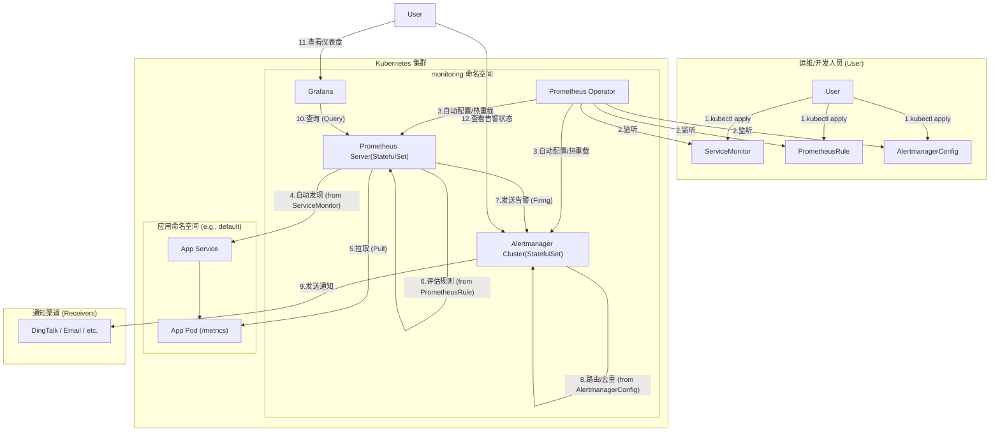
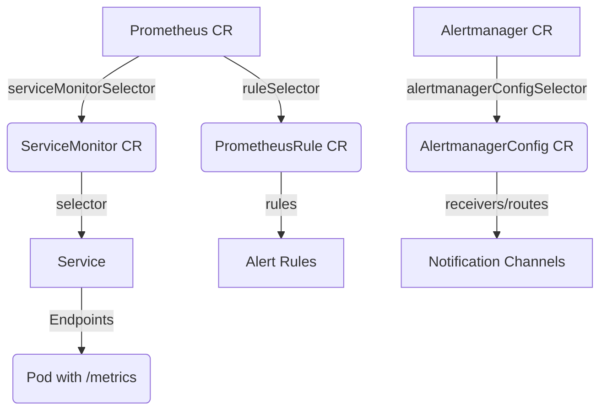
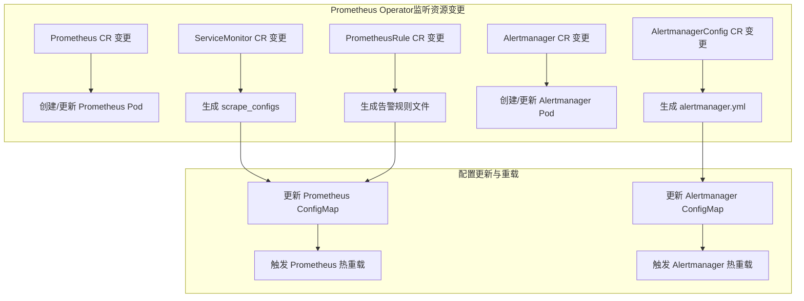

> | **痛点类别**       | **传统 Prometheus 方案问题**                                 | **Prometheus Operator 解决方案**                             |
> | :----------------- | :----------------------------------------------------------- | :----------------------------------------------------------- |
> | **配置管理复杂化** | • 需手动维护 `prometheus.yml` 中的监控目标（如静态 IP 列表） <br />• 服务扩缩容时配置易失效（需要手动添加相关配置） <br />• 多环境配置易漂移（开发/生产不一致） | • **动态发现**：通过 `ServiceMonitor`/`PodMonitor` CRD 基于 Kubernetes 标签自动发现监控目标 <br />• **配置即代码**：CRD 资源与应用部署同步，无需手动更新 IP 列表 |
> | **存储可靠性缺陷** | • 默认使用 `emptyDir` 存储，Pod 重启后历史数据丢失 <br />• 单机 TSDB 存储上限制约监控规模扩展 | • **PVC 持久化**：通过 `volumeClaimTemplate` 动态绑定分布式存储（如 Ceph、Longhorn） <br />• **集成 Thanos**：支持 Sidecar 自动上传数据到对象存储，实现长期存储与全局查询 |
> | **运维成本高昂**   | • 版本升级需手动重部署 <br />• 配置热更新可能触发服务中断 <br />• RBAC 权限需手工配置 | • **声明式管理**：通过 Helm/GitOps 一键升级 Operator 及组件 <br />• **自动协调配置**：Operator 监听 CRD 变化并实时应用，避免中断 <br />• **预置 RBAC 模板**：自动生成权限规则 |
> | **监控能力局限**   | • 缺乏开箱即用的黑盒监控（HTTP/TCP/SSL 探测） <br />• 告警规则与业务部署分离，维护困难 | • **Probe CRD**：声明式定义黑盒探测任务（如 `http_2xx` 检查） <br />• **告警规则版本化**：`PrometheusRule` CRD 与应用配置同仓库，变更可追踪 |
> | **高可用实现困难** | • 多副本 Prometheus 采集相同指标（存储翻倍）导致数据分裂（查询结果取决于访问哪个Prometheus） <br />• 需额外搭建联邦集群，架构复杂 | • **原生多副本**：通过 `replicas: 2` 配置高可用集群，自动去重数据 <br />• **无缝集成 Thanos**：Query 组件聚合多实例数据，提供全局视图 |

## 一、介绍 Prometheus Operator

### 1. Operator 概述
- **基本概念**  
   Operator 是一种基于 K8s 的扩展机制，通过用户自定义的**控制器（Controller）**和**自定义资源（Custom Resource, CR）**实现复杂应用的自动化管理。其核心思想是将运维经验编码为程序逻辑，使应用能够像 K8s 原生资源（如 Deployment、Service）一样被声明式管理。

- **核心作用**  
   - **管理自定义资源**：Operator 监听用户定义的自定义资源（CR）状态变化。
   - **自动化运维**：根据 CR 的声明自动完成应用部署、配置更新、故障恢复等操作。
### 2. Prometheus Operator 简介
- **定义**  
   Prometheus Operator 是专为 Prometheus 监控生态设计的 K8s Operator，提供了一套完整的自定义资源定义（CRDs）和控制器，用于自动化管理 Prometheus 监控体系的各个组件（如 Prometheus Server、Alertmanager）及其配置。
- **核心目标**  
   - 简化 Prometheus 在 K8s 中的部署、配置和维护。
   - 通过声明式 API 实现监控体系的动态管理，减少手动操作。
### 3. 为何使用 Prometheus Operator？

#### 核心优势  
1. **声明式管理**  
   - 通过 K8s YAML 定义所有组件（Prometheus、Alertmanager）和配置（监控目标、告警规则），与原生资源管理一致。  
   - 自动生成配置文件（如 `prometheus.yml`），无需手动维护。  

2. **自动化运维**  
   - **动态服务发现**：基于 `ServiceMonitor`/`PodMonitor` 自动发现监控目标，适配集群扩缩容。  
   - **配置热重载**：规则或监控目标变更后，自动更新配置并触发重载（无需重启服务）。  
   - **一键部署高可用**：支持 Prometheus 和 Alertmanager 多副本集群，保障稳定性。  

3. **深度集成 K8s**  
   - 原生支持监控 K8s 核心组件（API Server、kubelet 等）。  
   - 无缝对接 RBAC、持久化存储（PVC）、网络策略等特性。  

4. **灵活扩展**  
   - 自定义告警规则（`PrometheusRule`）、集成 Grafana/Thanos、黑盒监控（`Probe`）轻松实现。  
#### 总结  
Prometheus Operator 将监控体系的复杂运维抽象为 K8s 原生资源，实现 **配置即代码** 和 **全自动化管理**，是云原生场景下高效、可靠、易扩展的监控解决方案。
## 二、Prometheus Operator 的工作原理


> Alertmanager 的 svc 会被 Prometheus 服务发现注入对应字段
### 1. 核心原理
1. **基于 K8s 控制器模式**  

   Prometheus Operator 通过**自定义控制器（Controller）**持续**监听（Watch）**与 Prometheus 相关的**自定义资源（CR）**的状态变化。当检测到 CR 的创建、更新或删除事件时，控制器根据预定义的逻辑自动调整底层资源（如 Pod、ConfigMap）的部署与配置。

2. **声明式 API 驱动**  

   用户通过定义 CR（如 `Prometheus`、`ServiceMonitor`）声明期望的监控系统状态，Operator 负责将声明转化为实际运行资源，并确保系统状态与声明一致。
### 2. 核心自定义资源及其关联关系



> Prometheus CR 和 Alertmanager CR 都是定义 Server 部署的副本数/存储等
### 3. 控制器对资源变更的响应逻辑



> - **Prometheus 资源变更**  
>    - **创建/更新**：  
>      - 生成 Prometheus Server 的 StatefulSet 或 Deployment，创建对应的 Pod。  
>      - 生成 `prometheus.yml` 配置文件（基于关联的 `ServiceMonitor`/`PodMonitor` 和 `PrometheusRule`）。  
>      - 挂载配置至 ConfigMap 或 Secret，并挂载到 Pod 中。  
>    - **删除**：  
>      - 清理 Prometheus Server 实例及相关资源（如 PVC）。  
>
> - **ServiceMonitor/PodMonitor 资源变更**  
>    - **创建/更新**：  
>      - 控制器将**监控目标**转换为 Prometheus 的 `scrape_configs` 配置片段。  
>      - 更新 Prometheus 的 ConfigMap，触发配置热重载（通过向 Prometheus 发送 `SIGHUP` 信号或调用 `/-/reload` HTTP 接口）。  
>    - **删除**：  
>      - 从 Prometheus 配置中移除对应监控目标，触发重载。  
>
> - **PrometheusRule 资源变更**  
>    - **创建/更新**：  
>      - 将**告警规则**转换为 YAML 文件，挂载到 Prometheus Server 的 `/etc/prometheus/rules` 目录。  
>      - 触发 Prometheus 规则重载（自动检测文件变化或调用 `/-/reload`）。  
>    - **删除**：  
>      - 删除规则文件，Prometheus 自动移除对应规则。  
>
> - **Alertmanager 资源变更**  
>    - **创建/更新**：  
>      - 生成 Alertmanager 的 StatefulSet，创建 Pod。  
>      - 根据 `AlertmanagerConfig` 生成 `alertmanager.yml` 配置文件。  
>      - 挂载配置至 ConfigMap 或 Secret，并挂载到 Pod 中。 
>    - **配置热更新**：  
>      - 修改 `AlertmanagerConfig` 后，Operator 更新 ConfigMap 并触发 Alertmanager 重载（调用 `/-/reload`）。  
>
### 4. 典型场景示例  

**场景：新增一个微服务的监控**  

1. **暴露指标端点**  
   - 若微服务本身提供 `/metrics` 接口：  
     
     创建 K8s `Service`，关联到微服务的 Pod。  
     
   - 若微服务无指标接口：  
     
     部署对应的 **Exporter**（如 Node Exporter、自定义 Exporter），并通过 `Service` 暴露其端口。  
     
     - *Exporter 部署在集群外（裸机）时*：需手动创建 `Endpoints` 对象，明确指定外部 IP 和端口。  
     
       > 1. 你有一个服务（比如物理服务器上的某个应用）需要被监控。
       > 2. 你在集群外部的这台物理服务器上部署了对应的 Exporter（比如 `node_exporter` 来监控服务器本身，或 `mysqld_exporter` 来监控 MySQL）。
       > 3. 在 Kubernetes 集群内部，你创建了一个 `Service`（比如叫 `my-external-exporter`），这个 Service 的作用是让 Prometheus 知道有这么一个可抓取的目标。
       > 4. 但是，因为 Exporter 不在集群内，Kubernetes 无法自动知道这个 Service 应该指向哪个 Pod。所以，你需要**手动创建一个 `Endpoints` 对象**，并将其关联到刚才创建的 `Service` 上。
       > 5. 在这个手动创建的 `Endpoints` 对象中，你**明确指定**Exporter 所在机器的**外部 IP 地址**和它暴露指标的**端口号**。
       > 6. 现在，Prometheus 通过服务发现机制找到 `my-external-exporter` 这个 Service，Service 又通过你手动配置的 Endpoints 知道了具体的抓取地址（IP:Port），于是 Prometheus 就可以成功抓取到集群外部 Exporter 暴露的指标数据了。

2. **定义 ServiceMonitor**  

   创建 `ServiceMonitor` 资源，通过 `selector` 匹配上述 `Service` 的标签（如 `app: my-service`）。  

3. **自动配置生效**  

   Prometheus Operator 检测到 `ServiceMonitor` 变更后：  

   - 将监控目标（Service 对应的 Endpoints）注入 Prometheus 的 `scrape_configs` 配置。  
   - 触发 Prometheus 配置热重载。  

4. **完成监控接入**  

   Prometheus 开始自动抓取该微服务的指标，无需手动修改配置文件或重启服务。
   
   ```
   https://github.com/prometheus-operator/kube-prometheus/tree/main/manifests
   ```
## 三、各 CRD 详解

| **CRD 名称**       | **主要作用**                                                 | **Operator 响应行为**                                        |
| :----------------- | :----------------------------------------------------------- | :----------------------------------------------------------- |
| **Prometheus**     | 定义 Prometheus Server 实例的部署参数（副本数、存储、版本等）。 | 创建 StatefulSet/Deployment，动态生成配置文件并关联 `ServiceMonitor`/`PrometheusRule`。 |
| **ServiceMonitor** | 声明需要监控的 K8s Service 目标。                            | 生成 Prometheus 的 `scrape_configs` 配置，触发配置热重载。   |
| PodMonitor         | 直接监控 Pod 的指标（无需通过 Service）。                    | 类似 `ServiceMonitor`，生成针对 Pod 的抓取配置。             |
| **PrometheusRule** | 定义告警规则（Recording Rules 和 Alerting Rules）。          | 将规则文件挂载到 Prometheus Pod，触发自动加载。              |
| **Alertmanager**   | 定义 Alertmanager 集群的部署参数（副本数、持久化存储等）。   | 创建 Alertmanager StatefulSet，关联 `AlertmanagerConfig` 生成通知配置。 |
| AlertmanagerConfig | 配置 Alertmanager 的路由规则和通知渠道（如 Slack、Email）。  | 合并配置到 `alertmanager.yml`，触发热重载。                  |
| ThanosRuler        | 集成 Thanos 实现长期存储和联邦查询（可选）。                 | 部署 Thanos Ruler 实例，管理跨集群告警规则。                 |
| Probe              | 监控外部黑盒目标（HTTP、TCP、ICMP 等）。                     | 生成 Prometheus 的黑盒监控任务配置。                         |
## 四、Prometheus Operator 部署

### 1. 部署前准备  
- **项目地址**  

   - **Prometheus Operator**：<https://github.com/prometheus-operator/prometheus-operator>  
   - **kube-prometheus**（完整监控栈）：<https://github.com/prometheus-operator/kube-prometheus>  

- **克隆代码库**  
   ```bash
   git clone https://github.com/prometheus-operator/kube-prometheus.git
   cd kube-prometheus
   ```
### 2. 部署步骤

若已知当前网络无法拉取镜像，要先做第3点的操作。

分阶段部署核心组件：  

- **初始化 CRD 与命名空间**（建表）

   ```bash
   kubectl apply --server-side -f manifests/setup
   ```
   - 会创建 `monitoring` 命名空间及所有 CRD 资源声明。  

- **等待 CRD 就绪**  
   ```bash
   kubectl wait \
     --for condition=Established \
     --all CustomResourceDefinition \
     --namespace=monitoring
   ```
   - 输出 `condition met` 表示 CRD 可用。  
   - 确保 CRD 就绪后再部署组件。  

- **部署监控组件**（插入数据）  

   ```bash
   kubectl apply -f manifests/
   ```
   - 安装 Prometheus Operator、Prometheus、Alertmanager、Grafana 等组件。  
### 3. 镜像拉取问题处理  
若镜像拉取失败，需替换以下文件中的镜像地址，新地址可以根据具体的版本自己构建，此处作参考：  

- **替换 `prometheus-adapter` 镜像**  
   - 文件：`manifests/prometheusAdapter-deployment.yaml`  
   - 原地址：`registry.k8s.io/prometheus-adapter/prometheus-adapter:v0.12.0`  

- **替换 `kube-state-metrics` 镜像**  
   - 文件：`manifests/kubeStateMetrics-deployment.yaml`  
   - 原地址：`registry.k8s.io/kube-state-metrics/kube-state-metrics:v2.13.0`  

- **替换 `prometheus-operator` 镜像**  
   - 文件：`manifests/prometheusOperator-deployment.yaml`  
   - 原地址：`quay.io/prometheus-operator/prometheus-operator:v0.76.0`  

- **替换 `kube-rbac-proxy` 镜像**  
   - 同一文件：`manifests/prometheusOperator-deployment.yaml`  
   - 原地址：`quay.io/brancz/kube-rbac-proxy:v0.18.1`  
### 4. 暴露服务

##### 修改 Service 类型为 NodePort

提供这几个服务的访问窗口

```bash
# 将 Prometheus、Alertmanager、Grafana 的 Service 类型改为 NodePort
kubectl -n monitoring edit svc grafana
kubectl -n monitoring edit svc alertmanager-main
kubectl -n monitoring edit svc prometheus-k8s
```

- **验证 NodePort**：

  ```bash
  kubectl -n monitoring get svc grafana alertmanager-main prometheus-k8s
  ```

  输出示例：

  ```
  NAME                  TYPE       CLUSTER-IP      EXTERNAL-IP   PORT(S)          AGE
  grafana               NodePort   10.111.117.2    <none>        3000:31080/TCP   3h
  alertmanager-main     NodePort   10.99.23.138    <none>        9093:31081/TCP   3h
  prometheus-k8s        NodePort   10.100.39.42    <none>        9090:31084/TCP   3h
  ```
### 5. 查看配置  

Prometheus 和 Alertmanager 的配置以 Secret 形式存储，可通过以下方式查看：  

- **进入 Pod 查看明文**  

   ```bash
   kubectl -n monitoring exec -it prometheus-k8s-0 -- cat /etc/prometheus/config/prometheus.yaml
   ```

- **Web 界面查看**  
   - 访问 Prometheus Web UI（需暴露服务），在 `Status > Configuration` 中查看。  

- **解码 Secret**  
   ```bash
   kubectl -n monitoring get secrets prometheus-k8s -o json \
     | jq -r '.data."prometheus.yaml.gz"' | base64 -d | gzip -d
   # gizp -d 是为了解压缩配置文件，因为原始配置文件被压缩为.gz格式以符合K8s Secret的大小限制（必须小于1M）
   
   # 1. 获取 monitoring 命名空间下 prometheus-k8s Secret 的 JSON 格式内容。
   # 2. 使用 jq 提取其中名为 prometheus.yaml.gz 的 base64 编码数据。
   # 3. 将提取出的 base64 数据解码为二进制数据。
   # 4. 将解码后的二进制数据（实际上是 gzip 压缩的配置文件）解压，最终输出原始的 prometheus.yaml 文件内容。
   ```
   - 需安装 `jq`、`base64`、`gzip` 工具。  
### 6. 清理部署  
- **删除监控组件**  

   ```bash
   kubectl delete -f manifests/
   ```

- **删除 CRD 与命名空间**  
   ```bash
   kubectl delete -f manifests/setup/
   ```

- **强制删除阻塞的命名空间**  
   - 若 `monitoring` 命名空间卡在 `Terminating` 状态： 
     
     - 建议等一会儿
     
     - 或者（不推荐）
     
       ```bash
       kubectl edit ns monitoring
       ```
     
       删除 `spec.finalizers` 字段中的内容（移除 `kubernetes` 条目）。  
### 7. 补充：Prometheus 高可用与数据一致性设计 

- **副本部署**  

   - 通过 `kube-prometheus` 部署的 Prometheus 默认创建 **2 个副本**（`prometheus-k8s-0` 和 `prometheus-k8s-1），实现高可用。  
   - 每个副本独立抓取监控目标并存储数据，避免单点故障。  

- **Service 会话亲和性配置**  
   - Service `prometheus-k8s` 默认设置 `sessionAffinity: ClientIP`，确保来自同一客户端 IP 的请求始终路由到同一副本。  
   - **查看配置**：  
     ```bash
     kubectl -n monitoring get svc prometheus-k8s -o yaml | grep sessionAffinity
     ```

   > |     **特性**     |       Service会话亲和性        |         Pod调度亲和性         |
   > | :--------------: | :----------------------------: | :---------------------------: |
   > |   **决策时机**   |       请求到达时实时决策       |      Pod创建时一次性决策      |
   > |   **作用层级**   |      网络层（kube-proxy）      |     调度层（Controller）      |
   > |   **控制目标**   |   决定请求路由到哪个后端Pod    |     决定Pod在哪个Node运行     |
   > |   **影响范围**   | 临时会话（最长timeoutSeconds） |        Pod整个生命周期        |
   > |   **变更代价**   |       客户端IP变化即失效       |           需重建Pod           |
   > | **典型配置位置** |       Service的 `.spec`        | Deployment的 `.spec.template` |
   
- **为何需要会话亲和性？**  
   - **数据一致性保障**：  
     - **数据一致性问题根源**：Prometheus 采用主动拉取（Pull）模式，不同副本的**抓取时间点可能存在微小差异**（即使配置相同 `scrape_interval`）。
     
       ```mermaid
       graph LR
           T[监控目标] -->|10:00:00 抓取| P1[副本1]
           T -->|10:00:05 抓取| P2[副本2]
           P1 -->|存储值A| D1[数据分片1]
           P2 -->|存储值B| D2[数据分片2]
       ```
     
     - 若允许请求轮询到不同副本：  
       - **查询结果不一致**：相同时间范围的查询可能因副本数据差异返回不同结果。  
       - **告警评估波动**：Alertmanager 可能因不同副本触发的告警状态不一致，导致告警抖动。  
     
   - **设计权衡**：  
     
     - 牺牲负载均衡的流量分配，换取查询和告警的一致性体验。  
     - 适合监控数据展示（如 Grafana）和告警判定场景。  
   
- **多副本数据同步的局限性**  

  - **数据分片问题**  
     - 即使配置相同的抓取目标，不同副本的本地存储数据仍为独立分片，无自动同步机制。  
     - **影响场景**：  
       - 长期历史数据查询需手动聚合多副本数据（需配合 Thanos 或 Cortex 等全局存储方案）。  
  
  
    - **解决方案**  
  
       - **Thanos 集成**：  
         - 通过 `ThanosRuler` CRD 部署 Thanos 组件，实现多副本数据去重和全局查询。  
         
           ```mermaid
           graph LR
               P1[副本0] -->|上传| S3[(对象存储)]
               P2[副本1] -->|上传| S3
               S3 -->|存储| D0[副本0完整数据]
               S3 -->|存储| D1[副本1完整数据]
               Q[Thanos Query] -->|查询| S3
               Q -->|去重逻辑| R[返回唯一结果]
           ```
  
         - **配置示例**：  
           
           ```yaml
           apiVersion: monitoring.coreos.com/v1
           kind: ThanosRuler
           metadata:
             name: thanos-ruler
           spec:
             replicas: 2
             queryEndpoints: ["thanos-query:10901"]
           ```
         
         - **去重机制**：
         
           - **去重执行者**：Thanos Query 组件（查询网关）
         
           - **触发时机**：每次查询请求的处理过程中
         
           - **作用位置**：在合并来自多个数据源的结果后，返回给用户前
         
           - **核心技术原理**：
         
             - **副本标签识别**
         
               Thanos 依赖特殊的**副本标签**区分数据来源：
         
               ```yaml
               # Prometheus CRD 配置
               spec:
                 replicaExternalLabelName: "prometheus_replica" # 副本标识标签
               ```
         
               实际生成的时间序列会携带此标签：
         
               ```
               node_cpu_seconds_total{instance="node1", job="node", prometheus_replica="prometheus-0"} 1620000000 100
               node_cpu_seconds_total{instance="node1", job="node", prometheus_replica="prometheus-1"} 1620000000 102
               ```
         
             - **时间序列对齐**
         
               Thanos Query 按时间线合并数据：
         
               ```python
               # 原始数据（未去重）
               timestamps = [1620000000, 1620000600, 1620001200]
               replica0_values = [100, 105, 110]   # 副本0数据
               replica1_values = [102, 107, None]   # 副本1数据（部分缺失）
               ```
         
             - **去重决策树**
         
               ```mermaid
               graph LR
                   A[相同时间序列] --> B{是否包含副本标签?}
                   B -->|是| C{相同时间点<br>多个副本有数据?}
                   B -->|否| D[直接返回]
                   C -->|是| E[按策略选择副本]
                   C -->|否| D
                   E --> F[保留选中副本数据]
                   F --> G[移除副本标签]
               ```
         
             - **副本选择策略**
         
               当多个副本在相同时间点都有数据时，Thanos 提供两种策略：
         
               **(1) 默认策略：优先级排序**
         
               ```go
               func selectReplica(samples []Sample) Sample {
                   // 1. 按副本标识排序（字典序）
                   sort.Slice(samples, func(i, j int) bool {
                       return samples[i].Replica < samples[j].Replica
                   })
                   
                   // 2. 选择排序后第一个副本
                   return samples[0]
               }
               ```
         
               - **示例**：`prometheus-0` 优先级高于 `prometheus-1`
         
               **(2) 最新时间戳策略**
         
               ```bash
               # 启动参数
               thanos query --query.replica-label="prometheus_replica" \
                            --query.replica-selection-strategy="latest"
               ```
         
               - **逻辑**：选择时间戳最新的数据点
               - **适用场景**：副本间时钟不同步时
         
             - **最终结果**
         
               ```
               node_cpu_seconds_total{instance="node1", job="node"} 1620000000 100
               node_cpu_seconds_total{instance="node1", job="node"} 1620000600 105
               node_cpu_seconds_total{instance="node1", job="node"} 1620001200 110
               ```
## 五、配置

### 1. 问题背景  
- **现象**  
   - 部署 `kube-prometheus` 后，Prometheus 的 **Targets** 页面缺少 `kube-scheduler` 和 `kube-controller-manager` 的监控目标。  
   - 检查 `ServiceMonitor` 配置发现，其依赖的 k8s Service 未正确创建。  

- **原因分析**  
   - **ServiceMonitor 依赖缺失**：`kube-scheduler` 和 `kube-controller-manager` 默认未创建对应的 Service。  
   - **绑定地址限制**：控制平面组件默认绑定 `127.0.0.1`，导致集群内部无法访问。  
### 2. 配置步骤  
#### 2.1 创建 kube-scheduler 的 Service  
1. **确认 Pod 标签**：  
   ```bash
   kubectl -n kube-system get pods kube-scheduler-master01 -o yaml | grep -i -A 3 labels
   ```
   输出示例：  
   ```yaml
   labels:
     component: kube-scheduler
     tier: control-plane
   ```

2. **创建 Service**（`kube-scheduler-svc.yaml`）：  
   ```yaml
   apiVersion: v1
   kind: Service
   metadata:
     name: kube-scheduler
     namespace: kube-system
     labels:
       app.kubernetes.io/name: kube-scheduler  # 匹配 ServiceMonitor 的 selector
   spec:
     selector:
       component: kube-scheduler               # 匹配 Pod 的标签
     ports:
     - name: https-metrics                     # 与 ServiceMonitor 的 endpoints.port 一致
       port: 10259
       targetPort: 10259                       # Pod 暴露的端口
   ```
   ```bash
   kubectl apply -f kube-scheduler-svc.yaml
   ```

3. **验证 Service 端点**：  
   ```bash
   kubectl -n kube-system describe svc kube-scheduler
   ```
   - 正确输出应包含 `Endpoints` 列表（如 `192.168.71.101:10259`）。  
#### 2.2 修改 kube-scheduler 绑定地址  
1. **编辑静态 Pod 清单**：  
   ```bash
   # 修改所有 Master 节点的配置文件
   vim /etc/kubernetes/manifests/kube-scheduler.yaml
   ```
   - 将 `--bind-address=127.0.0.1` 改为 `--bind-address=0.0.0.0`。  

2. **重启组件**：  
   - 文件保存后，K8s 会自动重建 Pod。  
   - 检查绑定地址是否生效：  
     ```bash
     kubectl -n kube-system get pods kube-scheduler-master01 -o yaml | grep bind-address
     ```
#### 2.3 配置 kube-controller-manager  
**步骤与 kube-scheduler 完全相同**：  
1. 创建 Service（`kube-controller-manager-svc.yaml`）：  
   ```yaml
   apiVersion: v1
   kind: Service
   metadata:
     name: kube-controller-manager
     namespace: kube-system
     labels:
       app.kubernetes.io/name: kube-controller-manager
   spec:
     selector:
       component: kube-controller-manager
     ports:
     - name: https-metrics
       port: 10257
       targetPort: 10257
   ```

2. 修改静态 Pod 清单（`/etc/kubernetes/manifests/kube-controller-manager.yaml`）：  
   - 将 `--bind-address=127.0.0.1` 改为 `--bind-address=0.0.0.0`。  
### 3. 验证监控状态  
1. **访问 Prometheus Web UI**：  
   - URL：`http://<NodeIP>:31084`  
   - 导航至 **Status > Targets**，确认 `kube-scheduler` 和 `kube-controller-manager` 状态为 **UP**。  

2. **检查 ServiceMonitor 关联**：  
   ```bash
   kubectl -n monitoring get servicemonitors
   ```
   输出应包含：  
   ```text
   kube-scheduler             3h22m
   kube-controller-manager    3h22m
   ```
### 4. 关键配置解析  
1. **ServiceMonitor 工作机制**  
   - **`jobLabel` 字段**：  
     - 指定 Service 的标签作为 Prometheus 的 `job` 标签（用于指标分类）。  
     - 若未设置，默认使用 Service 名称作为 `job`。  

2. **端口一致性要求**  
   - Service 的 `ports.name` 必须与 `ServiceMonitor.spec.endpoints.port` 完全匹配。  

3. **绑定地址修改原理**  
   - 控制平面组件默认绑定 `127.0.0.1` 仅允许本地访问，改为 `0.0.0.0` 后允许集群内部访问。  
