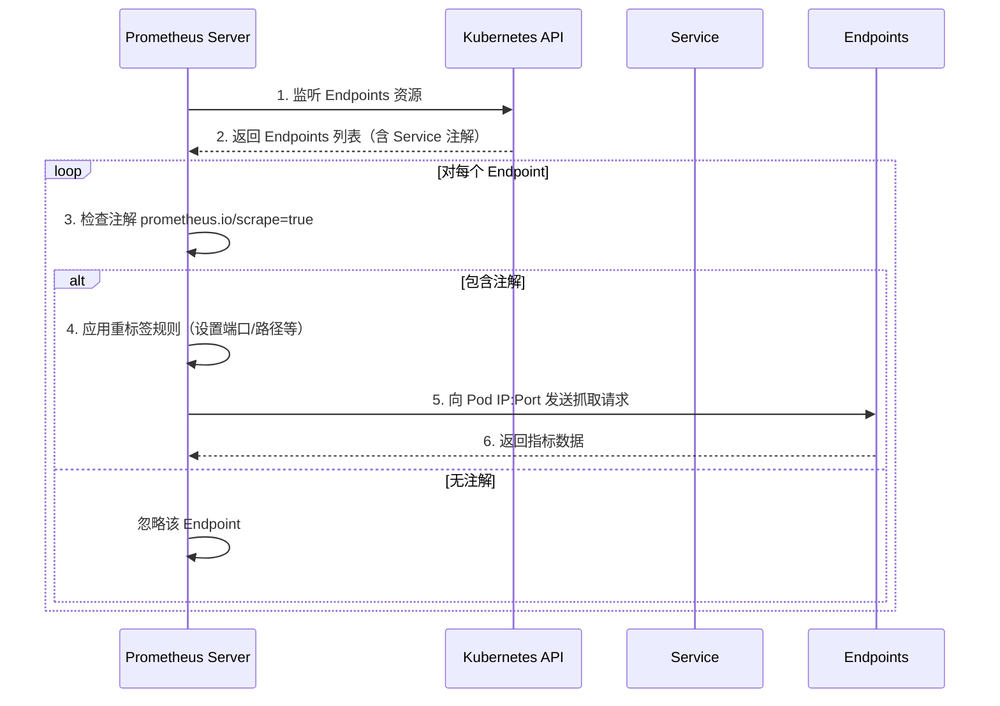

## 一、服务自动发现配置

### 1. 背景
使用 `ServiceMonitor` 虽然方便，但在面对大量监控项时，手动创建仍繁琐。通过 Prometheus 的自动发现机制，可动态监控符合条件的服务端点（Endpoints）。

**工作流程**：


### 2. 实现步骤

#### 2.1 配置 Prometheus 附加抓取规则

创建 `prometheus-additional.yaml` 文件，定义自动发现规则：

```yaml
- job_name: 'myendpoints'
  kubernetes_sd_configs:
    - role: endpoints  # 使用 endpoints 角色发现服务端点
  relabel_configs:
    # 保留包含注解 prometheus.io/scrape=true 的svc
    - source_labels: [__meta_kubernetes_service_annotation_prometheus_io_scrape]
      action: keep
      regex: true
    # 替换指标路径标签名（默认为 /metrics）
    - source_labels: [__meta_kubernetes_service_annotation_prometheus_io_path]
      action: replace
      target_label: __metrics_path__
      regex: (.+)
    # 组合地址和端口（格式：<service_address>:<annotation_port>）
    - source_labels: [__address__, __meta_kubernetes_service_annotation_prometheus_io_port]
      action: replace
      target_label: __address__
      regex: ([^:]+)(?::\d+)?;(\d+)
      replacement: $1:$2
    # 设置协议（HTTP/HTTPS）
    - source_labels: [__meta_kubernetes_service_annotation_prometheus_io_scheme]
      action: replace
      target_label: __scheme__
      regex: (https?)
    # 将 K8s 服务标签映射为 Prometheus 标签
    - action: labelmap
      regex: __meta_kubernetes_service_label_(.+)
      replacement: $1
    # 添加命名空间、服务名、Pod 名、节点名为标签
    - source_labels: [__meta_kubernetes_namespace]
      target_label: kubernetes_namespace
    - source_labels: [__meta_kubernetes_service_name]
      target_label: kubernetes_service
    - source_labels: [__meta_kubernetes_pod_name]
      target_label: kubernetes_pod
    - source_labels: [__meta_kubernetes_node_name]
      target_label: kubernetes_node
```
#### 2.2 注入配置到 Prometheus Server

##### 2.2.1 创建 Secret 存储配置
```bash
kubectl create secret generic additional-configs \
  --from-file=prometheus-additional.yaml \
  -n monitoring
```

##### 2.2.2 修改 Prometheus CR 引用配置
编辑 `prometheus-prometheus.yaml`，添加 `additionalScrapeConfigs` 字段：

```yaml
apiVersion: monitoring.coreos.com/v1
kind: Prometheus
metadata:
  name: k8s
  namespace: monitoring
spec:
  # ... 其他原有配置 ...
  additionalScrapeConfigs:
    name: additional-configs  # Secret 名称
    key: prometheus-additional.yaml  # Secret 中的文件名
```

**操作流程：**

1. 应用修改后的 CR：`kubectl apply -f prometheus-prometheus.yaml`。
2. Prometheus Operator 检测变更，自动更新 Prometheus Server 配置并触发重载。
#### 2.3 为 Service Account 授权

Prometheus 使用的 SA（如 `prometheus-k8s`）需具备访问 Endpoints 的权限。创建以下 RBAC 规则：

##### 2.3.1 ClusterRole 定义
```yaml
apiVersion: rbac.authorization.k8s.io/v1
kind: ClusterRole
metadata:
  name: prometheus-endpoints-access
rules:
- apiGroups: [""]
  resources: ["endpoints"]
  verbs: ["get", "list", "watch"]
```

##### 2.3.2 ClusterRoleBinding
```yaml
apiVersion: rbac.authorization.k8s.io/v1
kind: ClusterRoleBinding
metadata:
  name: prometheus-endpoints-access
subjects:
- kind: ServiceAccount
  name: prometheus-k8s  # Prometheus 使用的 SA
  namespace: monitoring
roleRef:
  kind: ClusterRole
  name: prometheus-endpoints-access
  apiGroup: rbac.authorization.k8s.io
```

**说明：** 授权 SA 可读取 Endpoints 资源，确保自动发现功能正常。
### 3. 验证配置

1. **检查 Secret 和 Prometheus CR**
   
   ```bash
   kubectl get secret additional-configs -n monitoring
   kubectl describe prometheus k8s -n monitoring
   ```
   
2. **查看 Prometheus 配置**
   - 进入 Prometheus Web 界面 → Status → Configuration，确认 `myendpoints` Job 存在。
   - 检查 Targets 页面，验证对应 Endpoints 是否被正确发现。

3. **检查 Pod 权限**
   ```bash
   kubectl auth can-i get endpoints --as=system:serviceaccount:monitoring:prometheus-k8s
   ```
### 4. 实际用例：自动监控 Nginx 服务

**场景描述**：

假设有一个运行在 K8s 集群中的 Nginx 服务，我们希望 Prometheus 自动发现并监控它的指标。以下是具体实现步骤：

#### 步骤 1：部署示例 Nginx 服务

##### 创建带注解的 Nginx Deployment 和 Service
```yaml
# nginx-deploy-svc.yaml
apiVersion: apps/v1
kind: Deployment
metadata:
  name: nginx
spec:
  replicas: 2
  selector:
    matchLabels:
      app: nginx
  template:
    metadata:
      labels:
        app: nginx
    spec:
      containers:
      - name: nginx
        image: nginx:latest
        ports:
        - containerPort: 80
        # 假设已安装 nginx-exporter，暴露指标端口 9113
        - containerPort: 9113
apiVersion: v1
kind: Service
metadata:
  name: nginx
  annotations:  # 关键：注解必须在此处！
    prometheus.io/scrape: "true"   # 启用抓取
    prometheus.io/port: "9113"     # 指标端口（对应 Pod 的 9113）
    prometheus.io/scheme: "http"   # 协议（可选，默认为 http）
  labels:
    app: nginx
spec:
  selector:
    app: nginx
  ports:
  - name: web
    port: 80
    targetPort: 80
  - name: metrics  # 必须显式声明指标端口！
    port: 9113
    targetPort: 9113
```

#### 部署说明：
- **注解**：通过 `prometheus.io/scrape: "true"` 触发自动发现。
- **多端口**：Service 显式暴露 `9113` 端口用于指标抓取（假设已部署 [nginx-exporter](https://github.com/nginxinc/nginx-prometheus-exporter)）。
- **必须将注解添加到 Service**：当 Prometheus 使用 `role: endpoints` 时，它通过监听 K8 的 Endpoints 对象来发现目标。Endpoints 由 Service 和 Pod 共同生成，但**只有 Service 的注解会被 Prometheus 用于过滤和配置抓取规则**。若`role: pod` → 注解在 Pod。
## 二、TSDB 数据持久化

### 1. 背景
Prometheus Server (`prometheus-k8s-n` Pod) 默认以无状态（每个 Pod 在 K8s 集群中是独立的，并且不保留任何持久数据）方式运行，数据存储在 Pod 的 `emptyDir` 中。为实现数据持久化，需通过 `StorageClass` 配置持久卷，确保数据在 Pod 重启或迁移后不丢失。
### 2. 实现步骤

#### 2.1 修改 Prometheus CR
编辑 `prometheus-prometheus.yaml`，添加 `storage` 字段：

```yaml
apiVersion: monitoring.coreos.com/v1
kind: Prometheus
metadata:
  name: k8s
  namespace: monitoring
spec:
  # ... 其他原有配置 ...
  storage:
    volumeClaimTemplate:
      spec:
        storageClassName: local-path   # 指定 StorageClass 名称
        accessModes: [ "ReadWriteOnce" ]
        resources:
          requests:
            storage: 20Gi              # 存储容量
```
#### 2.2 应用配置变更
```bash
kubectl apply -f kube-prometheus/manifests/prometheus-prometheus.yaml
```

**操作后效果：**

1. Prometheus Operator 检测到 CR 变更，自动更新 StatefulSet。
2. StatefulSet 为每个 Pod 实例创建独立的 PVC 和 PV。
#### 2.3 验证持久化状态

##### 2.3.1 检查 PVC 和 PV 状态
```bash
kubectl -n monitoring get pvc
```
预期输出：
```
NAME                                 STATUS   VOLUME                                     CAPACITY   ACCESS MODES   STORAGECLASS
prometheus-k8s-db-prometheus-k8s-0   Bound    pvc-c48366b7-d885-4607-aec2-aba5f8766432   20Gi       RWO            local-path
prometheus-k8s-db-prometheus-k8s-1   Bound    pvc-cd1108b0-30bb-46e8-b80b-1671ccbd49fa   20Gi       RWO            local-path
```

```bash
kubectl -n monitoring get pv | grep k8s
```
预期输出：
```
pvc-c48366b7-d885-4607-aec2-aba5f8766432   20Gi       RWO            Delete           Bound    monitoring/prometheus-k8s-db-prometheus-k8s-0   local-path
pvc-cd1108b0-30bb-46e8-b80b-1671ccbd49fa   20Gi       RWO            Delete           Bound    monitoring/prometheus-k8s-db-prometheus-k8s-1   local-path
```

##### 2.3.2 验证 Pod 挂载卷
```bash
kubectl -n monitoring get pod prometheus-k8s-0 -o yaml
```
输出片段：
```yaml
volumeMounts:
- mountPath: /prometheus  # 数据存储路径
  name: prometheus-k8s-db
volumes:
- name: prometheus-k8s-db
  persistentVolumeClaim:
    claimName: prometheus-k8s-db-prometheus-k8s-0  # 绑定的 PVC
```
### 3. 注意事项

#### 3.1 StorageClass 选择
- **不推荐使用 NFS**：Prometheus 未对 NFS 存储优化，可能导致性能问题或数据损坏。
- **推荐方案**：
  - 本地存储（如 `local-path`、`hostPath`）适用于测试环境。
  - 云平台存储（如 AWS EBS、GCE PD、Azure Disk）适用于生产环境。
  - 分布式存储（如 Ceph RBD、Longhorn）适用于高可用场景。

#### 3.2 容量规划
- **监控数据量**：每秒 10 万样本约占用 1.5-2.5 GB/天（取决于指标数量和保留时间）。
- **建议冗余**：预留 20-30% 的额外空间应对突发增长。

#### 3.3 多副本场景
- **StatefulSet 特性**：每个 Pod 实例（如 `prometheus-k8s-0`、`prometheus-k8s-1`）绑定独立的 PVC。
- **数据隔离**：副本间数据不共享，需通过 Thanos 或 Cortex 实现全局查询。
## 三、黑盒监控

### 1. 监控类型对比

| 类型         | 关注点         | 核心思想                     | 典型场景                             |
| ------------ | -------------- | ---------------------------- | ------------------------------------ |
| **白盒监控** | 系统内部细节   | 预防性监控（阈值报警）       | 主机资源、容器状态、中间件运行指标   |
| **黑盒监控** | 服务外部可见性 | 用户体验验证（实时发现问题） | HTTP/TCP连通性、DNS解析、SSL证书过期 |

完善的监控需要既能深入系统内部洞察隐患，又能从外部表现快速感知故障。
### 2. Blackbox Exporter 架构

#### 2.1 核心组件


**Blackbox Exporter 组件的作用**：

- **模拟真实用户行为** 检测服务外部可见性
- **支持协议**：HTTP/HTTPS/DNS/TCP/ICMP
- **核心功能**：
  - HTTP状态码检测
  - TCP端口连通性
  - ICMP主机存活检测
  - SSL证书有效期监控

#### 2.2 探测流程

1. **配置模块**：统一在 `blackbox-exporter` 的配置文件 `blackboxExporter-configuration.yaml` 定义探测协议与规则（HTTP/HTTPS/DNS等）

   - **示例**：

     ```yaml
     "modules":
           "http_2xx":			# 模块名称
             "prober": "http"	# 探针类型
             "timeout": "5s"		# 超时时间（可选）
             "http":				# 协议相关配置
               "valid_http_versions": ["HTTP/1.1", "HTTP/2"]
               "valid_status_codes": [200]
               "method": "GET"
               "preferred_ip_protocol": "ip4"
           "http_post_2xx":
             "http":
               "method": "POST"
               "preferred_ip_protocol": "ip4"
             "prober": "http"
           "tcp_connect":
             "prober": "tcp"
             "timeout": "10s"
             "tcp":
               "preferred_ip_protocol": "ip4"
     
           "dns":  # DNS 检测模块
             "prober": "dns"
             "dns":
               "transport_protocol": "udp"
               "preferred_ip_protocol": "ip4"
               "query_name": "kubernetes.default.svc.cluster.local" # 利用这个域名来检查dns服务器
     
           "icmp":  # ping 检测服务器的存活
             "prober": "icmp"
             "timeout": "10s"
     ```

2. **目标定义**：指定待检测的服务端点。会先创建一个 Blackbox Exporter 的 Probe，它会自动注入 Prometheus 的配置文件中。
3. **指标生成**：返回 `probe_success`、`probe_duration_seconds` 等指标
### 3. 部署 Blackbox Exporter

#### 3.1 通过 Helm 手动部署

```bash
# 添加仓库
helm repo add prometheus-community https://prometheus-community.github.io/helm-charts
helm repo update

# 下载 Chart
helm pull prometheus-community/prometheus-blackbox-exporter
tar -zxvf prometheus-blackbox-exporter.tar.gz

# 修改 values.yaml
vim prometheus-blackbox-exporter/values.yaml
# 配置模块（参考下文示例）

# 安装
helm install blackbox-exporter -n monitoring ./prometheus-blackbox-exporter
```

#### 3.2 Prometheus Operator 集成部署

- **预装组件**：Operator 自带 `blackbox-exporter`

- **服务信息**：

  ```bash
  kubectl -n monitoring get svc blackbox-exporter
  # 输出示例
  NAME                TYPE        CLUSTER-IP      PORT(S)
  blackbox-exporter   ClusterIP   10.96.123.45   9115/TCP,19115/TCP
  ```

- **配置文件路径**：`/prometheus_operator/kube-prometheus/manifests/blackboxExporter-configuration.yaml`（含 module 模块）
### 4. 配置黑盒监控任务

#### 4.1 核心要素
| 要素     | 说明                       | 示例值                               |
| -------- | -------------------------- | ------------------------------------ |
| **源**   | Blackbox Exporter 服务地址 | `blackbox-exporter.monitoring:19115` |
| **模块** | 预定义的探测协议           | `http_2xx`、`tcp_connect`            |
| **目标** | 待检测的服务地址           | `https://www.baidu.com`              |

#### 4.2 配置模板结构
```yaml
- job_name: 'blackbox_http'        # 任务名称
  metrics_path: /probe             # 固定路径
  params:
    module: [http_2xx]             # 使用的模块名称
  static_configs:
    - targets:                     # 监控目标列表
        - https://example.com
  relabel_configs:
    - source_labels: [__address__]
      target_label: __param_target # 将目标地址转换为参数
    - target_label: __address__
      replacement: blackbox-exporter.monitoring.svc:9115 # Blackbox服务地址
```

创建一个 HTTP 的 Probe，它会自动注入 Prometheus 的配置文件中，会被转换为类似以上格式。
### 5. 探测类型配置示例

#### 5.1 HTTP 检测
```yaml
apiVersion: monitoring.coreos.com/v1
kind: Probe
metadata:
  name: http-probe
  namespace: monitoring
spec:
  jobName: "blackbox_http"
  prober:
    url: blackbox-exporter.monitoring:19115 # 检测源
    path: /probe
  targets:
    staticConfig:
      static:
      - "https:// www.baidu.com"
  module: http_2xx
  interval: 30s
```

#### 5.2 TCP 端口检测
```yaml
apiVersion: monitoring.coreos.com/v1
kind: Probe
metadata:
  name: tcp-probe
  namespace: monitoring
spec:
  jobName: "blackbox_tcp"
  prober:
    url: blackbox-exporter.monitoring:19115
  targets:
    staticConfig:
      static:
      - "mysql-service:3306"
  module: tcp_connect
```

#### 5.3 ICMP 主机存活检测
```yaml
apiVersion: monitoring.coreos.com/v1
kind: Probe
metadata:
  name: icmp-probe
  namespace: monitoring
spec:
  jobName: "blackbox_icmp"
  prober:
    url: blackbox-exporter.monitoring:19115
  targets:
    staticConfig:
      static:
      - "192.168.1.1"
  module: icmp
```

#### 5.4 DNS 解析检测
```yaml
apiVersion: monitoring.coreos.com/v1
kind: Probe
metadata:
  name: dns-probe
  namespace: monitoring
spec:
  jobName: "blackbox_dns"
  prober:
    url: blackbox-exporter.monitoring:19115
  targets:
    staticConfig:
      static:
      - "kube-dns.kube-system:53"
  module: dns_tcp
```

#### 5.5 SSL 证书检测
```yaml
apiVersion: monitoring.coreos.com/v1
kind: Probe
metadata:
  name: ssl-probe
  namespace: monitoring
spec:
  jobName: "blackbox_ssl"
  prober:
    url: blackbox-exporter.monitoring:19115
  module: http_2xx
  targets:
    staticConfig:
      static:
        - "https://example.com" 
      # 注意：下面这段代码注释掉或者修改标签后自己测试一下，否则可能会影响prometheus对指标的抓取，出现某些指标丢失的问题
      # relabelingConfigs:
        #- sourceLabels: [__address__]
        # targetLabel: __param_target
        #- sourceLabels: [__param_target]
        #  targetLabel: instance
      # 测试命令：
      # curl "http://<blackbox-exporter_IP>:19115/?probe?target=https://example.com&module=http_2xx"
```
### 6. 告警规则配置

#### 6.1 通用告警规则模板
```yaml
apiVersion: monitoring.coreos.com/v1
kind: PrometheusRule
metadata:
  name: blackbox-alerts
  namespace: monitoring
spec:
  groups:
  - name: blackbox-rules
    rules:
    - alert: ProbeFailure
      expr: probe_success == 0
      for: 1m
      labels:
        severity: critical
      annotations:
        summary: "探测失败: {{ $labels.instance }}"
        description: "服务不可达，持续 1 分钟"
        
    - alert: HighLatency
      expr: avg_over_time(probe_duration_seconds[5m]) > 1
      for: 5m
      labels:
        severity: warning
      annotations:
        summary: "高延迟: {{ $labels.instance }}"
        description: "平均响应时间超过 1 秒"
```

#### 6.2 证书过期告警
```yaml
    - alert: SSLCertExpiringSoon
      expr: (probe_ssl_earliest_cert_expiry - time()) / 86400 < 30
      for: 10m
      labels:
        severity: warning
      annotations:
        summary: "证书即将过期: {{ $labels.instance }}"
        description: "SSL 证书将在 {{ $value | humanizeDuration }} 天后过期"
        
    - alert: SSLCertExpired
      expr: probe_ssl_earliest_cert_expiry - time() <= 0
      for: 5m
      labels:
        severity: critical
      annotations:
        summary: "证书已过期: {{ $labels.instance }}"
        description: "SSL 证书已失效"
```
### 7. 关键指标说明

| 指标名称                         | 类型  | 说明                         |
| -------------------------------- | ----- | ---------------------------- |
| `probe_success`                  | Gauge | 探测成功（1）或失败（0）     |
| `probe_duration_seconds`         | Gauge | 探测耗时（秒）               |
| `probe_http_status_code`         | Gauge | HTTP 响应状态码              |
| `probe_ssl_earliest_cert_expiry` | Gauge | 证书到期时间戳（Unix 时间）  |
| `probe_tcp_connect_success`      | Gauge | TCP 连接成功（1）或失败（0） |

