## 一、监控理论

### 1. 监控分类

#### 1.1 黑盒监控
- **核心思想**：通过**外部行为**验证系统可用性（模拟用户行为）  .
- **特点**：  
  - 不关注系统内部细节  
  - 关注"是否可用"而非"为何不可用"  
  - 目标：早于真实用户发现问题  
  - 典型场景：HTTP状态码检测、API响应时间  
- **优势**：  
  - 快速发现问题  
  - 验证端到端功能完整性  

#### 1.2 白盒监控
- **核心思想**：通过**系统内部指标**进行健康诊断  
- **特点**：  
  - 需要深入系统内部采集数据（如CPU/内存使用率、线程池状态）  
  - 目标：预测和预防潜在问题  
  - 典型场景：JVM堆内存监控、数据库连接池状态  
- **优势**：  
  - 定位问题根源  
  - 支持容量规划  
  - 实现故障预测
### 2. 监控目的

1. **长期趋势分析**  
   - 预测业务增长趋势  
   - 支撑容量规划决策  
   - 示例：通过磁盘使用率增长率预测存储扩容时间点

2. **故障根因分析**  
   - 通过历史监控数据回溯故障时间线  
   - 辅助定位系统瓶颈  
   - 示例：结合CPU负载与线程池状态分析服务雪崩原因

3. **版本对照分析**  
   - 比较不同版本性能表现  
   - 验证架构优化效果  
   - 示例：对比微服务化前后接口QPS变化

4. **智能告警通知**  
   - 阈值触发告警（如CPU>90%）  
   - 分级告警策略（警告/严重/灾难）  
   - 支持多通知渠道（邮件/钉钉/短信）

5. **系统状态可视化**  
   - 实时展示关键指标仪表盘  
   - 聚合多维度数据视图  
   - 示例：K8s集群全景监控视图
### 3. 监控方案对比（Prometheus vs Zabbix）

|     **维度**     |                        **Prometheus**                        |                          **Zabbix**                          |
| :--------------: | :----------------------------------------------------------: | :----------------------------------------------------------: |
|   **数据模型**   |      多维标签模型（Key-Value 维度），支持灵活聚合和扩展      |                扁平层次结构，数据维度扩展困难                |
|   **存储机制**   |    本地时序数据库（TSDB），高效压缩存储，支持时序数据聚合    |  基于关系型数据库（如 MySQL），历史数据管理完善但扩展性受限  |
|   **服务发现**   |          动态发现（原生集成 K8s、Consul 等云环境）           |                静态配置，依赖手动添加监控目标                |
|    **可视化**    |           依赖 Grafana 实现高级可视化，需额外配置            |             自带 Web 界面，开箱即用的图形化展示              |
|   **技术架构**   |      后端用 Golang 开发，前端依赖 Grafana（JSON 配置）       |           后端用 C 开发，前端用 PHP，定制化难度高            |
|   **集群规模**   |           支持大规模集群（10,000+ 节点），性能更优           |      集群规模上限约 10,000 节点，性能受限于关系型数据库      |
|   **适用环境**   |    云原生环境（K8s、OpenStack 等）优先，适合动态伸缩场景     |   传统物理机、网络设备（交换机/路由器）监控优先，开箱即用    |
|  **安装与部署**  | 组件分散（Prometheus Server、Alertmanager、Grafana 等），部署较复杂 |      一体化安装（zabbix-server 包含核心功能），部署简单      |
|   **配置管理**   |             依赖配置文件（YAML），部分需手动修改             |        图形化界面成熟，大部分配置可通过 Web 界面完成         |
| **成熟度与生态** | 2015 年后快速发展（CNCF 项目），云原生生态完善，但部分场景解决方案较少 | 发展时间长（始于 1998 年），监控场景覆盖全面，模板和方案丰富 |

> **总结：理解关键区别**
>
> - Prometheus：“我是谁？” 由我说了算！
>   - 每个数据点（时间序列）通过其标签**自己描述自己的所有维度**（如 `method`, `status`, `region`, `instance`）。
>   - 查询引擎 (`PromQL`) 可以基于这些**任意标签维度自由切片和切块数据**，聚合分析无比灵活。
>   - **扩展：加新标签=加新维度。** 简单直接。
> - Zabbix：“我是谁？” 看我坐在哪！
>   - 数据点（监控项的值）的核心身份由其**所属的主机 (`hostname`)** 和**定义的键值 (`key`)** 决定。
>   - 有限的额外维度（`application`）也来自其在主机内的**位置**。
>   - 查询和聚合主要**依赖层级位置（主机组、主机）**。在主机组内聚合所有CPU使用率容易，但跨任意业务维度（如所有`region="us-east-1"`的服务）聚合则困难重重。
>   - **扩展：** 添加一个类似 Prometheus 标签的、能用于**自由灵活聚合**的新维度，需要**变通方法（主机名编码、宏）**，过程复杂且性能不佳。
>
> **简单比喻：**
>
> - **Prometheus 像一个灵活的文档数据库 (NoSQL)：** 每条记录（时间序列）自带大量标签（属性）。你可以轻松按任何标签组合查找和汇总记录（“找出所有 `region=us-east` 且 `status_code=500` 的请求”）。
> - **Zabbix 像一个层级化组织的关系型数据库：** 数据（监控项）主要通过其“地址”（主机ID + 键）访问。汇总信息通常需要先找到属于特定“部门”（主机组）的“员工”（主机）的所有“周报”（监控项）。“找出所有使用了某个特定组件的服务（需要自定义维度）的平均响应时间”这种问题会困难得多。
#### **关键对比总结**

1. **云原生 vs 传统环境**
   - Prometheus 专为云原生设计，适合动态、分布式系统；Zabbix 更擅长监控稳定的物理设备和传统架构。
2. **灵活性与易用性**
   - Prometheus 提供灵活的数据模型（PromQL）和扩展性，但需手动配置；Zabbix 开箱即用，但扩展和定制成本高。
3. **存储与性能**
   - Prometheus 的 TSDB 支持高效时序数据处理和大规模集群；Zabbix 依赖关系型数据库，历史数据管理强但扩展性受限。
4. **告警与可视化**
   - Prometheus 告警灵活但依赖外部工具（如 Alertmanager）；Zabbix 提供闭环告警管理和内置可视化界面。
## 二、Prometheus 架构解析

### 1. 三段式架构总览


### 2. 上游数据采集层

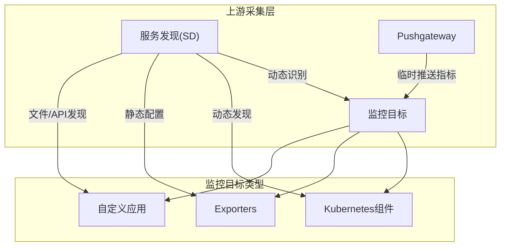

> **动态目标采集流**：`服务发现` → 识别 `K8s/Exporters/自定义应用` → Prometheus 定期抓取其 `/metrics`
>
> **临时指标采集流**：批处理作业 → 推送指标到 `Pushgateway` → `Pushgateway` 成为监控目标 → Prometheus 抓取 Pushgateway

#### 2.1 k8s 集成

一些组件默认暴露接口给 prometheus 用

- **内置监控支持**：
  
  - API Server
  - Kubelet（节点资源）
  - CoreDNS
  - etcd（需开启指标端口）
- **发现机制**：
  - 自动发现Pod/Service/Endpoint
  - 通过annotations筛选目标：
    ```yaml
    prometheus.io/scrape: "true"
    prometheus.io/port: "8080"
    ```

#### 2.2 Exporters体系

> Exporter 是 **Prometheus 生态的核心组件**，充当**“指标翻译器”**的角色柱。它们将**非 Prometheus 原生格式**的监控数据（如系统状态、应用程序内部指标、数据库性能、服务健康等），转化为 Prometheus 能够直接抓取和存储的标准 Metrics 格式（即符合 Prometheus 数据模型的带有多维标签的时间序列数据），使得 Prometheus 强大的数据模型（标签、聚合、查询）能够应用到广泛的监控场景中。

| 类型     | 常用组件               | 监控目标               |
| -------- | ---------------------- | ---------------------- |
| 基础设施 | node_exporter          | 服务器硬件指标         |
| 数据库   | mysqld_exporter        | MySQL数据库状态        |
| 消息队列 | kafka_exporter         | Kafka集群监控          |
| 存储系统 | elasticsearch_exporter | ES集群健康状态         |
| HTTP服务 | blackbox_exporter      | 网站可用性（黑盒监控） |

#### 2.3 Pushgateway
- **定位**：临时任务指标中转站

  - 一个**短期的、内存中的（或辅以少量磁盘持久化）缓存服务**，不监控目标自身状态，只是**被动接收**别人推给它的指标数据，充当指标数据的临时中转站。

- **使用场景**：

  - 短期运行的批处理作业

    > - **问题**：`cron` 作业、CI/CD 流水线任务、一次性数据处理脚本等，运行时间极短（可能几秒到几分钟）。Prometheus 的抓取间隔（如 15s/30s/1m）可能来不及拉取，作业就结束了。
    > - **解决**：作业在启动时、运行关键步骤、或**结束时**，将其**自定义指标**推送到 Pushgateway。Pushgateway 暂时存储这些指标，等待 Prometheus Server 按照配置的抓取周期来拉取。Pushgateway 充当了任务与 Server 之间的“缓冲”。

  - 无法暴露HTTP端点的服务

    > - **问题**：
    >   - 一些古老或特定的服务/设备没有内置 HTTP 服务能力。
    >   - 由于安全策略限制，不允许开放监听端口供 Prometheus 抓取。
    >   - 资源极度受限的环境（如嵌入式设备）无法运行额外的 HTTP 服务进程。
    > - **解决**：这些服务可以在内部收集指标，然后通过**推送（HTTP POST）** 的方式将指标数据发送到集中部署的 Pushgateway。**只需 Pushgateway 能访问即可**，无需目标暴露端口给 Prometheus。
  - 跨网络隔离区域的数据采集

    > - **问题**：
    >   - Prometheus Server 部署在 A 网络区域，被监控的服务部署在严格隔离的 B 区域（如生产核心区），A 区无法主动访问 B 区。
    >   - 可能有单台 Pushgateway 部署在 DMZ 区，能被两个区域的机器访问。
    > - **解决**：B 区域的服务将指标推送到位于“中间地带”（如 DMZ）的 Pushgateway。Prometheus Server 在 A 区域抓取这个 Pushgateway，从而**跨越了网络隔离**获取到 B 区域的指标。实现了**单向数据流**（内部服务 -> Push -> Pushgateway <- Pull <- Prometheus Server）。
- **工作流程**：

  ```mermaid
  sequenceDiagram
      任务服务->>Pushgateway: POST /metrics Job推送指标
      Prometheus->>Pushgateway: 定时拉取数据
      Pushgateway-->>Prometheus: 返回聚合指标
  ```
### 3. 中间存储处理层（Prometheus Server）

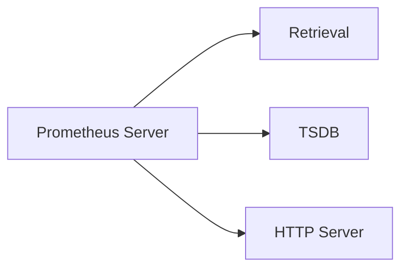

#### 3.1 Retrieval模块

对接上游，周期性去上游的监控目标target里拉取监控数据

- **工作模式**：主动拉取（Pull）模式
- **抓取流程**：
  1. 根据配置生成抓取任务（Scrape Job）
  2. 启动定时器（默认15s间隔）
  3. 并发执行HTTP请求
  4. 数据预处理（标签重写、指标过滤）
- **关键配置**：
  ```yaml
  scrape_interval: 15s		# 抓取指标数据的时间间隔
  evaluation_interval: 15s	# 用记录规则和告警规则来评估最新指标数据的时间间隔。即 Prometheus 会每 15 秒读取一次配置的规则文件，并使用最新的指标数据来计算规则表达式的结果。对于记录规则，计算结果会被存储为新的时序指标；对于告警规则，如果计算结果满足触发条件，就会生成或更新告警状态
  scrape_timeout: 10s			# 等待目标响应指标数据的超时时间，必须小于等于scrape_interval
  ```

#### 3.2 TSDB存储引擎

按照时序存储数据

| 特性         | 说明                          |
| ------------ | ----------------------------- |
| 数据分区     | 按2小时时间窗口分块存储       |
| 压缩机制     | 多级压缩（原始数据→持久化块） |
| 索引结构     | 倒排索引（指标名→时间序列）   |
| 数据保留策略 | 默认15天，可配置              |
| 高效查询     | 支持毫秒级时间范围检索        |

> ##### **详解**（辅助了解）：
>
> **数据分区**：**按 2 小时时间窗口分块存储**
>
> ```mermaid
> graph LR
>     A[新数据] --> B[内存 Block]
>     B -- 每2小时 --> C[持久化 Block]
>     C --> D[磁盘目录结构]
> ```
>
> - **内存块 (Head Block)**
>   最新写入的数据先存在内存中（默认为 2 小时窗口），称为“Head”。保障​**​高速写入​**​。
> - **持久化块 (Persistent Block)**
>   每 2 小时将 Head 数据压缩为不可变的文件块存入磁盘。​**​块按时间命名​**​。
>
> **压缩机制：多级压缩**
>
> ```mermaid
> graph LR
>     RAM[内存数据] -->|每2小时| Block1["磁盘 Block (未压缩)"]
>     Block1 -->|后台| Block2["压缩块1 (2小时)"]
>     Block2 -->|再压缩| Block3["压缩块2 (8小时)"]  
>     Block3 -->|递归压缩| BlockN[更大时间跨度块]
> ```
>
> - **层级压缩 (Vertical Compaction)**
>   合并多个小块为更大时间跨度的块（如 4x2h → 1x8h 块），​**​减少文件数量​**​。
> - **数据压缩 (Horizontal Compaction)**
>   清理已删除数据、合并重复采样点、重构索引，​**​降低磁盘占用率​**​。
> - **压缩触发**
>   由后台协程智能调度（非实时），避免影响写入性能。
>
> **索引结构：倒排索引**
>
> ```mermaid
> graph LR
>     M[指标名 http_requests_total] -->|映射| S1[序列ID: 1001]
>     M -->|映射| S2[序列ID: 1002]
>     T1["标签 method = "POST""] -->|映射| S1
>     T2["标签 region = "us-east""] -->|映射| S2
>     S1 -->|定位| D1[磁盘数据块1]
>     S2 -->|定位| D2[磁盘数据块2]
> ```
>
> - **核心思想**
>   建立 ​**​标签键值 → 时间序列ID​**​ 的映射关系（类似搜索引擎）。
> - **索引组件**
>   - `Symbol Table`：存储所有标签键值对的字典（减少重复）
>   - `Posting List`：记录包含某标签的序列 ID 列表
>   - `Postings Offset Table`：快速定位数据块位置
> - **查询加速**
>   查找 `http_requests_total{method="POST"}` 时：
>   ① 定位 `method="POST"` 的序列 ID 列表
>   ② 与指标名序列列表取交集
>   ③ 快速读取对应数据块

#### 3.3 HTTP Server

对下游暴露访问TSDB的接口

- **接口类型**：
  - 管理API：/-/reload（热加载配置）
  - 数据查询：/api/v1/query（即时查询）
  - 元数据：/api/v1/targets（查看采集目标状态）
- **协议支持**：
  - 原生PromQL查询
  - 兼容OpenMetrics格式
  - 支持gRPC远程调用
### 4. 下游数据应用层

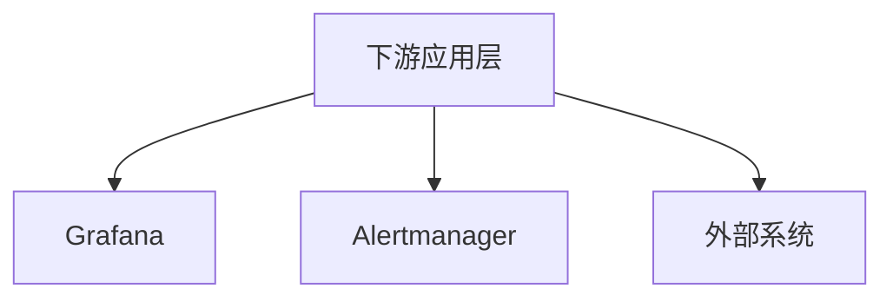

#### 4.1 Grafana可视化
- **数据源配置**：
  ```ini
  [prometheus]
  url = http://prometheus:9090
  access = proxy
  ```
- **典型仪表盘**：
  - 主机资源全景视图（CPU/MEM/Disk）
  - 微服务黄金指标（延迟/流量/错误/饱和度）
  - 业务自定义看板（订单量/支付成功率）

#### 4.2 Alertmanager告警管理
- **处理流程**：
  
  ```mermaid
  sequenceDiagram
      Prometheus->>Alertmanager: 推送告警事件（含原始标签）
      Alertmanager->>分组: 按alertname/env/app分组
      分组->>抑制: 过滤冗余告警
      抑制->>路由: 根据优先级/标签路由
      路由->>接收方: 发送聚合后通知
  ```
  
  > **分组**：将相同本质的告警合并为一条通知
  >
  > - 示例：
  >
  >   ```
  >   # 原始告警（未分组）
  >   - 告警1：主机A CPU使用率>90%  
  >   - 告警2：主机B CPU使用率>90%  
  >   - 告警3：主机C CPU使用率>90%  
  >   
  >   # 分组后（按alertname=HighCPU）  
  >   [HighCPU] 3台主机CPU超阈值：  
  >   - 主机A: 95%  
  >   - 主机B: 92%  
  >   - 主机C: 98%  
  >   ```
  >
  > - 配置关键：
  >
  >   ```yaml
  >   route:
  >     group_by: ['alertname', 'cluster']  # 按告警名+集群维度分组：Alertmanager 会将所有具有相同 alertname（告警类型）和 cluster（集群名称）标签的告警视为同一组
  >     group_wait: 30s                    # 等待新告警进入组的时间
  >     group_interval: 5m                 # 同组告警的发送间隔
  >   ```
  >
  >   ```mermaid
  >   graph LR
  >       A[收到第一批告警] -->|T=0秒| B[创建新分组]
  >       B -->|等待30秒| C{缓冲期内有新告警}
  >       C -->|是| D[合并到分组]
  >       C -->|否| E[立即发送通知]
  >       D -->|T=30秒| F[发送聚合通知]
  >       F -->|T=5分30秒| G{分组内仍有活跃告警}
  >       G -->|是| H[发送更新通知]
  >       G -->|否| I[结束]
  >   ```
  >
  >   告警生命周期管理流程图：
  >
  >   ```mermaid
  >   sequenceDiagram
  >       participant P as Prometheus
  >       participant A as Alertmanager
  >       participant R as 接收方
  >           
  >       loop 每evaluation_interval(默认15s)
  >           P->>P: 规则评估
  >       end
  >           
  >       alt 新告警触发
  >           P->>A: 发送 firing 状态(活跃)
  >           A->>A: 加入分组并标记 active
  >       else 告警持续
  >           P->>A: 再次发送 firing 状态(刷新活跃)
  >           A->>A: 更新分组内告警时间戳
  >       else 告警恢复
  >           P->>A: 发送 resolved 状态(恢复)
  >           A->>A: 标记分组内该告警为 inactive
  >       end
  >           
  >       A->>A: 检查分组状态
  >       alt 分组存在active告警
  >           A->>R: 按group_interval发送通知
  >       else 全部分组告警恢复
  >           A->>R: 发送恢复通知
  >       end
  >   ```
  >
  > **抑制**：当高级别告警触发时，自动屏蔽相关联的低级别告警
  >
  > - 示例：
  >
  >   ```yaml
  >   inhibit_rules:
  >   - source_match:                     # 源告警（高级别）
  >       severity: 'disaster'             # 灾难级事件
  >     target_match:                     # 目标告警（需屏蔽的）
  >       severity: 'warning'              # 普通警告
  >     equal: ['cluster', 'region']       # 要求这些标签匹配
  >   ```
  >
  >   效果：
  >
  >   - 当 `集群A-华东地区` 发生 `severity: disaster` 级故障（如网络瘫痪）
  >   - 自动抑制该集群同区域内所有 `severity: warning` 告警（如单机CPU高）
  >     ​**​价值​**​：避免在重大故障时被海量次级告警淹没
  >
  > **分组与抑制的关系**：
  >
  > ```mermaid
  > graph LR
  >     A[原始告警] --> B{分组}
  >     B -->|同一组| C[组内告警聚合]
  >     C --> D{抑制检查}
  >     D -->|满足抑制条件| E[丢弃该组告警]
  >     D -->|不满足抑制| F[发送通知]
  > ```
  >
  > 
  
- **高级特性**：
  - 静默规则（Maintenance Windows）
  
    - 主动声明“某些告警暂时不必通知”
  
      ```mermaid
      graph LR
          S[创建静默规则] -->|指定匹配器| M[规则库]
          A[新告警] -->|标签匹配| M
          M -->|符合静默条件| N[丢弃通知]
          M -->|不符合| SEND[正常告警]
      ```
  
    - 示例：
  
      ```yaml
      # 静默所有 "NodeDown" 告警（2023-12-25 维护窗口）
      - matchers:
        - name: alertname
          value: NodeDown
        startsAt: '2023-12-25T00:00:00Z'
        endsAt: '2023-12-25T06:00:00Z'
      ```
  
    - 适用场景：
      - 计划内维护（如服务器重启）
      - 已知问题修复期间临时屏蔽
  
  - 告警模板（自定义通知格式）
  
  - 多租户支持（基于标签路由）

#### 4.3 外部系统集成
- **日志分析**：Loki对接Prometheus标签体系
- **CI/CD**：Argo CD监控部署状态
- **自动化运维**：通过Webhook触发故障自愈

### 5. 数据流向全景图


## 三、Prometheus Server 二进制安装指南

### 1. 版本选择策略
#### 1.1 版本获取渠道
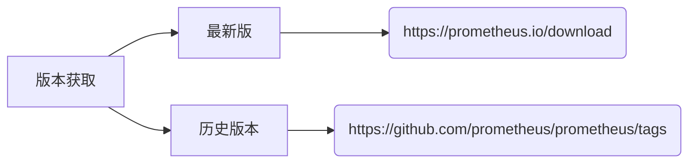

#### 1.2 版本注意事项
- **生产推荐**：LTS 长期支持版本
- **最新版本风险**：
  - Grafana模板兼容性问题
  - PromQL语法变更导致告警规则失效
  - Exporter数据格式变更

### 2. 安装部署流程
#### 2.1 环境准备
```bash
# 创建监控专用目录
mkdir /monitor
chmod 755 /monitor
```

#### 2.2 软件包管理
```bash
# 下载指定版本（以2.53.0为例）
wget https://github.com/prometheus/prometheus/releases/download/v2.53.0/prometheus-2.53.0.linux-amd64.tar.gz

# 解压并建立软链接
tar xvf prometheus-*.tar.gz -C /monitor
ln -s /monitor/prometheus-2.53.0.linux-amd64 /monitor/prometheus

# 创建数据存储目录
mkdir -p /monitor/prometheus/data
chown -R prometheus:prometheus /monitor/prometheus/data  # 若使用专用用户
```

#### 2.3 prometheus.yml 基本配置


> 1. 全局设置（global）中的 scrape_interval 和 scrape_timeout 是默认值。
> 2. 在 scrape_configs 的每个 job 中，可以覆盖这些默认值。
>
> 因此，具体的工作方式为：
>
> - 如果某个 job 没有设置 scrape_interval 和 scrape_timeout，那么它将使用全局设置的值。
> - 如果某个 job 显式设置了 scrape_interval 或 scrape_timeout，则使用 job 内的设置，覆盖全局值。

Prometheus 也可以通过该配置文件来启动：（了解）

```bash
./prometheus --config.file=prometheus.yml
```

#### 2.4 添加系统服务

`/usr/lib/systemd/system/prometheus.service` 文件详解：

```ini
[Unit]
Description=prometheus server daemon
After=network.target

[Service]
User=prometheus		# 建议使用非root用户
Group=prometheus
Restart=on-failure	# 当服务因为失败而退出时，systemd 会尝试重新启动该服务。	
RestartSec=5s		# 在每次重启尝试之间等待 5 秒
# RestartMax=3 		# 最多尝试重启 3 次
ExecStart=/monitor/prometheus/prometheus \
  --config.file=/monitor/prometheus/prometheus.yml \     # 主配置文件
  --storage.tsdb.path=/monitor/prometheus/data \         # 数据存储路径
  --storage.tsdb.retention.time=30d \                    # 数据保留30天
  --web.enable-lifecycle \                               # 启用配置热加载
  --web.listen-address=0.0.0.0:9090                      # 监听地址

[Install]
WantedBy=multi-user.target
```

#### 2.5 服务管理命令
```bash
# 重载系统服务
systemctl daemon-reload

# 设置开机自启（可选）
systemctl enable prometheus.service

# 启动服务
systemctl start prometheus.service

# 验证状态
systemctl status prometheus
ss -tunlp | grep 9090  # 确认端口监听
```

### 3. 测试环境搭建
#### 3.1 Go环境配置
```bash
# CentOS安装Golang
yum install golang -y

# 配置环境变
# GOPROXY：Go 语言的代理地址，设置后可加速 Go 模块的下载
echo 'export GOPROXY=https://goproxy.cn' >> /etc/profile
source /etc/profile
```

#### 3.2 示例程序部署
```bash
# 获取示例代码
git clone https://github.com/prometheus/client_golang.git
cd client_golang/examples/random

# 编译程序
go mod init random-example  # 初始化一个新的 Go 模块，模块名为 random-example。这会在当前目录下生成 go.mod 文件，记录模块版本和依赖关系。
go mod tidy                	# 下载缺失的依赖，并移除未使用的依赖
go build -o random         	# 编译当前目录下的 Go 代码，生成名为 random 的二进制文件
```

#### 3.3 启动测试服务
```bash
# 启动三个实例（不同终端执行）
./random -listen-address=:8080 &  # 生产实例1
./random -listen-address=:8081 &  # 生产实例2 
./random -listen-address=:8082 &  # 金丝雀实例

# 验证指标暴露(metrics:指标)
curl -s http://localhost:8080/metrics | head -n5
```

### 4. 监控配置实战
#### 4.1 Prometheus 配置详解
`prometheus.yml` 配置片段：
```yaml
scrape_configs:
  - job_name: 'example-random'
    scrape_interval: 5s              # 覆盖全局采集间隔
    metrics_path: '/metrics'         # 默认指标路径
    static_configs:
      - targets: 
          - '192.168.71.101:8080'
          - '192.168.71.101:8081'
        labels:
          group: 'production'        # 生产环境标签
          env: 'prod'

      - targets: ['192.168.71.101:8082']	# 可以是不同节点
        labels:
          group: 'canary'            # 金丝雀发布标签
          env: 'test'
          
# 检查配置语法
/monitor/prometheus/promtool check config /monitor/prometheus/prometheus.yml
```

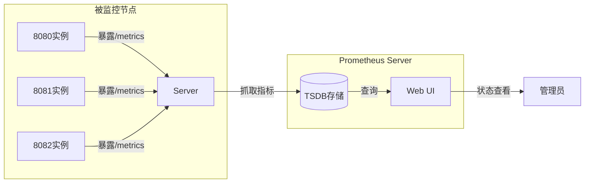

## 四、Prometheus 在 k8s 上的部署指南

### 1. 部署架构图
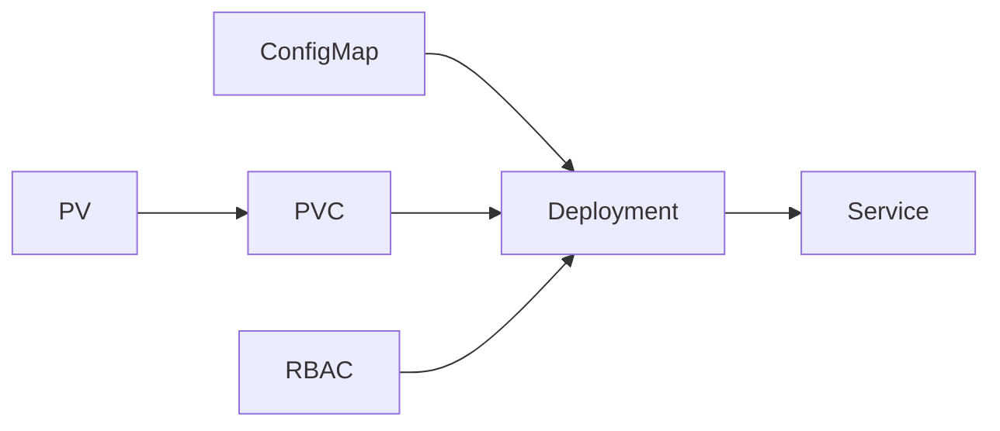

### 2. 部署清单详解

#### 2.1 命名空间管理
```bash
kubectl create namespace monitor
```

#### 2.2 配置文件管理 (prometheus-cm.yaml)

```yaml
apiVersion: v1
kind: ConfigMap
metadata:
  name: prometheus-config
  namespace: monitor
data:
  prometheus.yml: |
    global:
      scrape_interval: 15s  # 数据抓取的间隔时间
      scrape_timeout: 15s    # 必须 ≤ scrape_interval
      evaluation_interval: 15s
      
    scrape_configs:
      - job_name: "prometheus"
        static_configs:
          - targets: ["localhost:9090"]
      
      - job_name: "example-random"
        scrape_interval: 5s			# 覆盖全局采集间隔
        metrics_path: "/metrics"	# 默认指标路径
        static_configs:
          - targets:
              - "192.168.71.101:8080"
              - "192.168.71.101:8081"
            labels:
              group: "production"
              env: "prod"
              
          - targets:
              - "192.168.71.101:8082"
            labels:
              group: "canary"
              env: "test"
```

#### 2.3 存储配置 (prometheus-pv-pvc.yaml)
```yaml
# 若有对应的 storageClass，则无需手动创建 PV
apiVersion: v1
kind: PersistentVolume
metadata:
  name: prometheus-local
spec:
  capacity: {storage: 20Gi}
  persistentVolumeReclaimPolicy: Retain
  storageClassName: local-storage
  local:
    path: /data/k8s/prometheus
  nodeAffinity: # 固定调到同一节点，保证数据不丢失
    required:
      nodeSelectorTerms:
        - matchExpressions:
            - key: kubernetes.io/hostname
              operator: In
              values: [master01]
apiVersion: v1
kind: PersistentVolumeClaim
metadata:
  name: prometheus-data
  namespace: monitor
spec:
  resources:
    requests: {storage: 20Gi}
  storageClassName: local-storage
```

**存储注意事项**：
1. 提前创建数据目录：`mkdir -p /data/k8s/prometheus`
2. 确保节点标签正确：`kubectl label nodes master01 kubernetes.io/hostname=master01`
3. PV回收策略为`Retain`保证数据安全

   > - **Retain（保留）**：
   >   - 当 PV 不再被使用时，其存储空间不会被自动回收。
   >   - 管理员需要手动删除 PV 以释放存储空间。
   >   - 这种策略适用于需要保留数据以供将来使用的场景。
   > - **Recycle（回收）**：
   >   - 当 PV 不再被使用时，其**存储空间**会被自动清空，以便重新使用。
   >   - 这种策略适用于不需要保留数据的场景。
   > - **Delete（删除）**：
   >   - 当 PV 不再被使用时，其**存储空间和 PV 对象**本身都会被自动删除。
   >   - 这种策略适用于不需要保留数据和 PV 对象的场景。
   >

#### 2.4 权限控制 (prometheus-rbac.yaml)
```yaml
apiVersion: v1
kind: ServiceAccount
metadata:
  name: prometheus
  namespace: monitor
apiVersion: rbac.authorization.k8s.io/v1
kind: ClusterRole
metadata:
  name: prometheus
rules:
  - apiGroups: [""]
    resources: ["nodes", "services", "endpoints", "pods"]
    verbs: ["get", "list", "watch"]
  - nonResourceURLs: ["/metrics"]
    verbs: ["get"]
apiVersion: rbac.authorization.k8s.io/v1
kind: ClusterRoleBinding
metadata:
  name: prometheus
roleRef:
  apiGroup: rbac.authorization.k8s.io
  kind: ClusterRole
  name: prometheus
subjects:
  - kind: ServiceAccount
    name: prometheus
    namespace: monitor
```

**权限说明**：

- 监控集群级资源需要ClusterRole
- 非资源型URL `/metrics` 需要单独授权

#### 2.5 核心部署 (prometheus-deploy.yaml)
```yaml
apiVersion: apps/v1
kind: Deployment
metadata:
  name: prometheus
  namespace: monitor
spec:
  template:
    spec:
      serviceAccountName: prometheus
      securityContext: # 增加这一段
        runAsUser: 0
      containers:
        - image: prom/prometheus:v2.53.0
          args:	# 指定容器启动时需要传递的命令行参数，影响 Prometheus 容器的启动行为
            - --config.file=/etc/prometheus/prometheus.yml # 容器中的路径
            - --storage.tsdb.path=/prometheus
            - --storage.tsdb.retention.time=24h # 指定 TSDB 数据的保留时间为 24 小时
            - --web.enable-admin-api # 启用 Prometheus 的管理员 API。这个 API 提供了一些额外的管理功能，如删除时间序列数据等。
            - --web.enable-lifecycle # 启用配置热加载
          volumeMounts:
            - name: config-volume
              mountPath: /etc/prometheus
            - name: data
              mountPath: /prometheus
      volumes:
        - name: data
          persistentVolumeClaim:
            claimName: prometheus-data
        - name: config-volume
          configMap:
            name: prometheus-config
```

- `securityContext.runAsUser: 0`：使用root用户运行（生产环境建议使用非root用户）

  - 因为 prometheus 的镜像默认使用 nobody，而 `/data/k8s/prometheus` （数据目录）的属主是 root

  |              |      `serviceAccountName`       |  `securityContext.runAsUser`   |
  | :----------: | :-----------------------------: | :----------------------------: |
  | **作用对象** |     Pod对K8s API的访问权限      |    容器内进程的操作系统权限    |
  | **权限层级** |          集群RBAC权限           | 容器内用户权限（Linux用户/组） |
  | **典型用途** | 控制API操作（如监控、读取资源） |   解决文件权限、特权操作需求   |
  | **安全风险** |     过度授权可能导致API滥用     |   以root运行增加容器逃逸风险   |

#### 2.6 服务暴露 (prometheus-svc.yaml)
```yaml
apiVersion: v1
kind: Service
metadata:
  name: prometheus
  namespace: monitor
spec:
  type: NodePort
  ports:
    - port: 9090
      targetPort: 9090
      nodePort: 30090
  selector:
    app: prometheus
```

**访问方式**：
- 集群内访问：`http://prometheus.monitor.svc.cluster.local:9090`
- 节点访问：`http://<NodeIP>:30090`

### 3. 部署流程
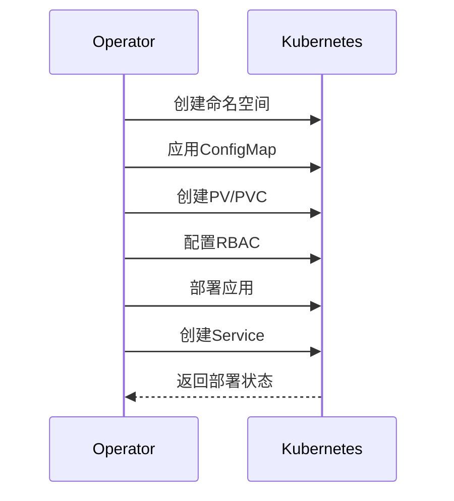

1. 执行部署命令：
```bash
kubectl apply -f prometheus-cm.yaml
kubectl apply -f prometheus-pv-pvc.yaml
kubectl apply -f prometheus-rbac.yaml
kubectl apply -f prometheus-deploy.yaml
kubectl apply -f prometheus-svc.yaml
```

2. 验证部署状态：
```bash
kubectl -n monitor get pods -l app=prometheus
kubectl -n monitor get svc prometheus
```

### 4. 配置热更新
1. 修改ConfigMap：	
```bash
kubectl -n monitor edit cm prometheus-config
```

2. 触发热加载：（了解，方式很原始）
```bash
POD_NAME=$(kubectl -n monitor get pods -l app=prometheus -o jsonpath='{.items[0].metadata.name}')
kubectl -n monitor exec $POD_NAME -- curl -X POST http://localhost:9090/-/reload # /-/reload：Prometheus 热加载的API
```

当你使用 Prometheus Operator 时，你创建一个 `Prometheus` 或 `ServiceMonitor` 的自定义资源（CRD）。Operator 会自动监听这些资源以及相关的 `ConfigMap` 或 `Secret` 的变化。一旦检测到变化，它会**自动**地执行滚动更新 Prometheus Pod 的操作，从而无缝地应用新配置，完全不需要你手动执行 `curl` 命令。

## 五、应用软件监控配置指南

### 1. 监控分类与原理

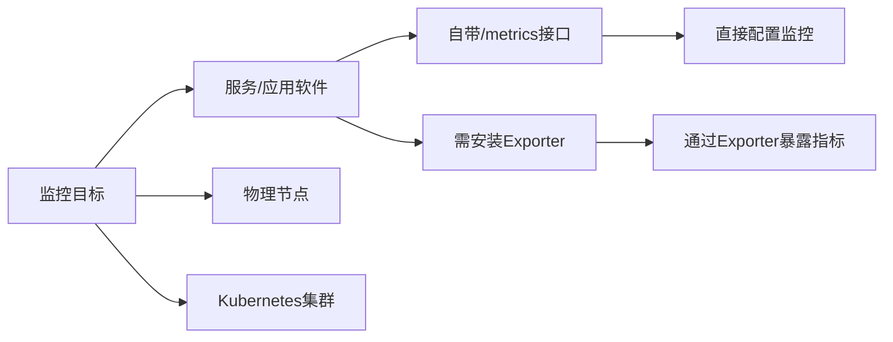

上述三类监控 targets 的配置有两种：

- **服务发现（Service Discovery）**：

  - **原理**：通过 K8s 的标签（Labels）或注解（Annotations）信息进行筛选。
  - **机制**：符合特定规则（即标签或注解匹配）的 Pod 或服务会被选出来，作为 Prometheus 周期性拉取数据的目标（targets）。

- **暴露 `/metrics` 接口**：
  - **要求**：目标服务必须暴露一个 `/metrics` 接口。
  - **过程**：Prometheus Server 会向该 `/metrics` 接口发送请求，目标服务需要按照 Prometheus 定义的格式返回监控数据。
  
  - **注意**：
  - 如果目标服务已经提供了 `/metrics` 接口，并且该接口返回的数据符合 Prometheus 的要求，那么可以直接使用该接口进行监控。
    
  - 如果目标服务没有提供 `/metrics` 接口，或者返回的数据格式不符合 Prometheus 的要求，则需要部署一个 Exporter。Exporter 是一种适配器，它可以采集目标服务的指标数据（web服务器发送请求），并将其转换为 Prometheus 能够理解的格式，然后通过 `/metrics` 接口暴露出来。

### 2. 自带Metrics接口的服务监控（以CoreDNS为例）

#### 2.1 配置流程
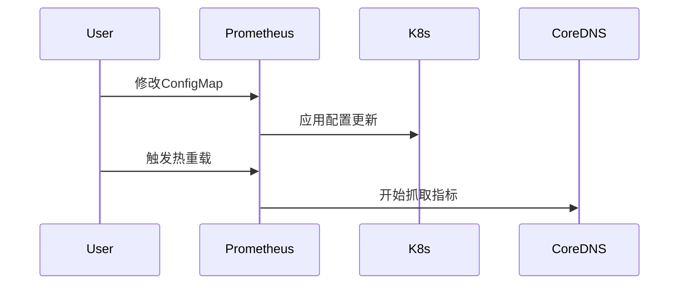

#### 2.2 操作步骤
**prometheus-cm.yaml 配置示例**：

```yaml
scrape_configs:
  - job_name: "coredns"
    static_configs:
      - targets: ["kube-dns.kube-system.svc.cluster.local:9153"]
```

**应用配置**：
```bash
kubectl apply -f prometheus-cm.yaml
# 原始热加载方式
curl -X POST "http://prometheus-pod-ip:9090/-/reload"
```

#### 2.3 验证方法
```bash
curl http://kube-dns.kube-system.svc.cluster.local:9153/metrics | head
```

### 3. 通过Exporter监控服务（以Redis为例）

#### 3.1 裸部署

##### 3.1.1 Redis服务部署
```bash
# 安装Redis
yum install redis -y

# 修改配置
# 将Redis绑定地址从127.0.0.1更改为0.0.0.0，以便可以从任何IP地址访问
sed -ri 's/bind 127.0.0.1/bind 0.0.0.0/g' /etc/redis.conf
# 将Redis端口从默认的6379更改为16379
sed -ri 's/port 6379/port 16379/g' /etc/redis.conf
# 在Redis配置文件中添加密码保护，设置密码为123456
echo "requirepass 123456" >> /etc/redis.conf

# 启动Redis
systemctl start redis
systemctl status redis

# 测试登录
redis-cli -a 123456 -p 16379
```

##### 3.1.2 Redis Exporter部署
**安装配置**：
```bash
wget https://github.com/oliver006/redis_exporter/releases/download/v1.61.0/redis_exporter-v1.61.0.linux-amd64.tar.gz # 记得更新
tar xf redis_exporter-*.tar.gz 
mv redis_exporter-v1.61.0.linux-amd64/redis_exporter /usr/bin/
```

**系统服务配置**：
```ini
# 制作系统服务 /usr/lib/systemd/system/redis_exporter.service
[Unit]
Description=Redis Exporter
After=network.target

[Service] # 启动命令
ExecStart=/usr/bin/redis_exporter \
  --redis.addr=redis://127.0.0.1:16379 \	
  --redis.password=123456 \
  --web.listen-address=0.0.0.0:9122 \	# 让 Redis Exporter 在所有网络接口上监听 9122 端口，以便 Prometheus 可以从任何网络位置通过这个端口抓取 Redis 的监控指标
  --exclude-latency-histogram-metrics	# 阻止特定的监控组件（如 Kube-state-metrics）生成或传递与延迟相关的直方图指标

[Install]
WantedBy=multi-user.target
```

**启动服务**：

```bash
systemctl daemon-reload
systemctl enable --now redis_exporter # 系统启动时自动启用并立即启动redis_exporter服务
```

##### 3.1.3 Prometheus配置更新
```yaml
# prometheus-cm.yaml 
- job_name: "redis-server"
  static_configs:
    - targets: ["192.168.71.101:9122"] # exporter的ip:port
```

**应用配置**：

```bash
kubectl apply -f prometheus-cm.yaml
# 原始热加载方式
curl -X POST "http://prometheus-pod-ip:9090/-/reload" # 等一会儿（cm更新）再重载
```

#### 3.2 K8s Sidecar模式

如果 redis-server 跑在 k8s 中，通常不会像上面一样裸部署一个 redis_exporter，而是会以 `sidecar` 的形式将 redis_exporter 和主应用 redis_server 部署在同一个 Pod 中，如下所示：

**部署文件片段**： 

```yaml
apiVersion: apps/v1
kind: Deployment
metadata:
  name: redis
spec:
  template:
    spec:
      containers:
      - name: redis
        image: redis:4
        ports:
          - containerPort: 6379
      - name: redis-exporter
        image: oliver006/redis_exporter
        ports:
          - containerPort: 9121
```

**Service配置**：

```yaml
apiVersion: v1
kind: Service
metadata:
  name: redis
spec:
  ports:
  - name: redis
    port: 6379
  - name: prom
    port: 9121
```

**Prometheus配置更新**：

```yaml
- job_name: 'redis'
  static_configs:
	- targets: ['redis:9121']	# pod:port
```

## 六、物理节点监控配置指南

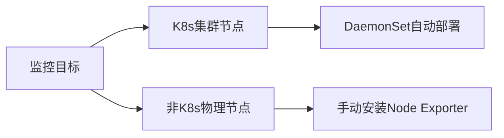

接下来的内容以监控目标在 k8s 集群为例：

### 1. Node Exporter 架构设计

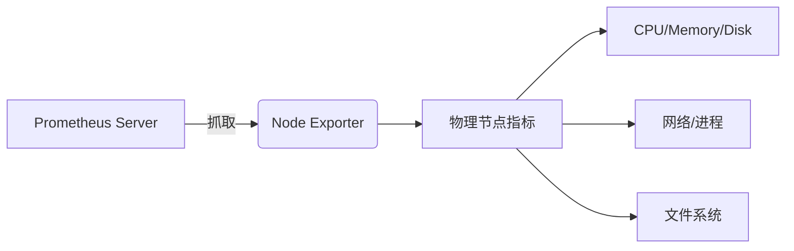

### 2. DaemonSet 部署配置详解

#### 2.1 核心配置解析

```yaml
apiVersion: apps/v1
kind: DaemonSet
metadata:
  name: node-exporter
  namespace: monitor
spec:
  template:
    spec:
      # 关键配置项
      # 为获取主机的监控指标数据，需确保运行在容器中的 node-exporter 能采集宿主机的系统级指标，为此需做两件事
      # 第一：
      hostPID: true      # 共享主机PID命名空间
      hostIPC: true      # 共享主机IPC命名空间
      hostNetwork: true  # 使用主机网络
      # 第二：
      volumes:           # 关键目录挂载
        - name: proc
          hostPath: {path: /proc}
        - name: dev
          hostPath: {path: /dev}
        - name: sys
          hostPath: {path: /sys}
        - name: root
          hostPath: {path: /}
          
      tolerations:       		# 容忍所有污点
        - operator: 'Exists'	# 只要节点上存在任何污点，Pod 就会容忍它
      nodeSelector:      # 节点选择(该标签所有节点都有，加不加无碍)
        kubernetes.io/os: linux
```

#### 2.2 容器配置说明

```yaml
containers:
- name: node-exporter
  image: quay.io/prometheus/node-exporter:latest
  args: # 选项定制详见：https://github.com/prometheus/node_exporter
    - --web.listen-address=$(HOSTIP):9100 # 指定监听地址和端口，使得Prometheus可以连接并拉取指标
    - --path.procfs=/host/proc
    - --path.devfs=/host/dev
    - --path.sysfs=/host/sys
    - --path.rootfs=/host/root
    - --collector.filesystem.ignored-mount-points=^/(dev|proc|sys) # 忽略特定系统目录，优化监控数据，避免收集不必要或无意义的信息
  securityContext:
    runAsNonRoot: true    # 非root运行
    runAsUser: 65534      # UID:65534，是nobody用户
  volumeMounts:
    - name: proc
      mountPath: /host/proc # 容器内路径
    - name: dev
      mountPath: /host/dev
    - name: sys
      mountPath: /host/sys
    - name: root
	  mountPath: /host/root
```

#### 2.3 部署操作命令

```bash
kubectl apply -f prome-node-exporter.yaml
kubectl -n monitor get pods -l app=node-exporter
```

### 3. Prometheus 监控配置

#### 3.1 手动静态配置

```yaml
# prometheus-cm.yaml 
- job_name: "node-exporter"
  static_configs:
    - targets: 
        - "node1:9100"
        - "node2:9100"
        - "node3:9100"
# 应用配置步骤同之前
```

#### 3.2 自动服务发现配置

```yaml
# prometheus-cm.yaml 
- job_name: 'nodes' # node-eporter
  kubernetes_sd_configs:
    - role: node  # 发现所有节点，还有其他类型
  relabel_configs:	
    - source_labels: [__address__] # 获取地址
      regex: '(.*):10250' 		# 正则匹配刚获取的地址（10250是kubelet[节点的代理]的默认端口）
      replacement: '${1}:9100'  # 替换端口
      target_label: __address__ # 替换的目标
      action: replace
   # 将集群中节点的标签映射到Prometheus的指标数据的标签
    - action: labelmap         # 映射节点标签
      regex: __meta_kubernetes_node_label_(.+)
```

> #### relabel_configs
>
> 本质是 Prometheus 的**数据预处理管道**
>
> **核心功能：动态重写标签系统**
>
> 允许在服务发现之后、实际抓取之前：
>
> 1. **修改**目标的元数据标签
> 2. **创建**新标签
> 3. **过滤**目标（保留或丢弃）
> 4. **重构**目标的标识信息
>
> ```mermaid
> graph LR
>     A[服务发现元标签] -->|relabel_configs处理| B[决策引擎]
>     B --> C{执行操作}
>     C --> D[目标保留/丢弃]
>     C --> E[标签转换]
>     C --> F[抓取参数控制]
>     D --> G[实际抓取对象]
>     E & F --> H[指标元数据]
>     H --> I[存储查询]
>     I --> J(Prometheus UI/Grafana等)
> ```
>
> **源标签来源：从 Service 的注解创建的元标签**
>
> 示例：
>
> ```yaml
> # 源标签 __meta_kubernetes_service_annotation_prometheus_io_scheme 对应：
> metadata:
>   annotations:
>     prometheus.io/scheme: "https"
> ```

##### Kubelet 监控配置

kubelet 也自带一些监控指标数据

```yaml
- job_name: 'kubelet' # 默认端口号：10250
  kubernetes_sd_configs:
    - role: node
  scheme: https
  tls_config:
    ca_file: /var/run/secrets/kubernetes.io/serviceaccount/ca.crt
    insecure_skip_verify: true
  bearer_token_file: /var/run/secrets/kubernetes.io/serviceaccount/token
# 定义了一个名为 kubelet 的抓取作业，通过 Kubernetes 服务发现自动发现集群中的所有节点，并使用 HTTPS 协议抓取这些节点的 kubelet 指标。TLS 配置和认证令牌文件确保了与 kubelet 的安全通信
```
## 七、K8s 集群监控配置指南

### 1. 监控项分类

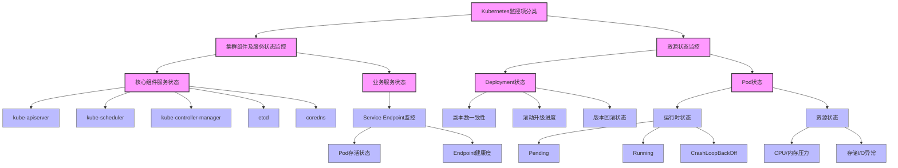
### 2. 监控容器状态

- **监控目标**：采集 K8s 集群中容器的资源使用指标（CPU、内存、磁盘、网络等）。
- **核心组件**：
  - `cAdvisor`：容器指标采集工具，已内置在 `kubelet` 中，无需额外安装。
  - **访问路径**：通过 kubelet 的 `10250` 端口暴露指标数据，路径为 `/metrics/cadvisor`。
#### **2.1 手动验证指标可访问性**
1. **获取 Prometheus Pod 的 ServiceAccount Token**：
   ```bash
   kubectl -n monitor exec -ti prometheus-6c9459cc48-6ppnn -- cat /var/run/secrets/kubernetes.io/serviceaccount/token
   ```
   记录输出的 Token 值（替换下文 `$TOKEN`）。

2. **使用 curl 测试指标采集**：
   ```bash
   TOKEN="xxxxxx"
   curl --header "Authorization: Bearer $TOKEN" --insecure https://192.168.71.101:10250/metrics/cadvisor
   ```
   - `--insecure`：跳过证书验证（生产环境建议配置有效证书）。
   - `Authorization: Bearer`：携带 ServiceAccount Token 认证。
#### **2.2 Prometheus 采集配置**
```yaml
# prometheus-cm.yaml
- job_name: 'kubernetes-cadvisor'
  # 使用 K8es 服务发现机制动态发现所有节点
  kubernetes_sd_configs:
    - role: node  # 发现集群所有 Node 对象

  # 配置 HTTPS 协议及认证
  scheme: https
  tls_config:
    ca_file: /var/run/secrets/kubernetes.io/serviceaccount/ca.crt  # 使用集群 CA 证书
    insecure_skip_verify: true  # 跳过证书验证（简化配置，生产环境谨慎使用）
  bearer_token_file: /var/run/secrets/kubernetes.io/serviceaccount/token  # 自动挂载的 Token

  # 指标路径重写规则
  relabel_configs:
    - action: labelmap
      regex: __meta_kubernetes_node_label_(.+)  # 将节点标签映射为指标标签
      replacement: ${1}
    - source_labels: [__meta_kubernetes_node_name]	# ➡️ 作为"是否存在"的判断
      regex: (.+)
      target_label: __metrics_path__  # 修改指标路径为 /metrics/cadvisor
      replacement: /metrics/cadvisor
```

**关键配置解析**

- **服务发现**：`role: node` 动态发现集群节点，自动适应节点扩缩容。
- **认证机制**：
  - **TLS**：使用 ServiceAccount 的 CA 证书（`ca.crt`）建立安全连接。
  - **Bearer Token**：通过 Pod 挂载的 Token 完成身份认证。
- **Relabel 规则**：
  - `__metrics_path__`：重写指标路径，指向 cAdvisor 端点。
#### **2.3 容器 CPU 使用率计算（PromQL）**
计算每个 Pod 的 CPU 使用率百分比：
```promql
(
  sum(rate(container_cpu_usage_seconds_total{image!="", pod!=""}[1m])) 
  by (namespace, pod)
)
/
(
  sum(container_spec_cpu_quota{image!="", pod!=""}) 
  by (namespace, pod) 
  / 100000  # 将 CPU Quota 单位转换为核（1核=100000微秒/秒）
) 
* 100
```
- **分子**：统计每个命名空间中每个pod中的每个容器每秒 CPU 使用时间（单位：秒），按 1 分钟窗口计算速率。
- **分母**：每个命名空间中每个pod中的容器 CPU 配额（单位：微秒/秒），除以 100000 转换为核数。 （只计算带有limits的pod的quota总和）
- **结果**：使用率百分比（实际使用量 / 配额 * 100）。
- **指标过滤**：`image!=""` 和 `pod!=""` 用于排除无效指标

### 3. 监控集群组件服务状态

所有组件都自带 `/metrics` 接口

#### **3.1 抓取 K8s API Server 指标**

 `api-server` （`coredns` 也）组件会**自动关联 endpoints 资源**，其他未关联的组件要进行服务发现时，必须先创建 endpoints 资源（通过创建 service 自动完成）

```yaml
- job_name: 'kubernetes-apiservers'
  kubernetes_sd_configs:
    - role: endpoints  # 发现所有 Endpoints 对象

  scheme: https
  tls_config:
    ca_file: /var/run/secrets/kubernetes.io/serviceaccount/ca.crt  # 集群 CA 证书
    insecure_skip_verify: true  # 跳过证书验证（生产环境不推荐）
  bearer_token_file: /var/run/secrets/kubernetes.io/serviceaccount/token  # 认证 Token

  relabel_configs:
    - source_labels: [__meta_kubernetes_namespace, __meta_kubernetes_service_name, __meta_kubernetes_endpoint_port_name]
      action: keep  # 仅保留符合以下条件的 Endpoint
      regex: default;kubernetes;https  # 匹配 default 命名空间、服务名为 kubernetes、端口名 https
      # 部署完k8s集群后，默认就会创建一个可以访问所有api-server的service，它的命名空间是default，名字是kubernetes，endpoint的端口名是https
```
#### **3.2 抓取 kube-controller-manager 指标**

**步骤说明：**

1. **创建 Service**：

   ```yaml
   apiVersion: v1
   kind: Service
   metadata:
     name: kube-controller-manager
     namespace: kube-system
     labels:
       k8s-app: kube-controller-manager
   spec:
     clusterIP: None  # Headless Service
     ports:
     - name: https-metrics
       port: 10257
       targetPort: 10257
     selector:
       component: kube-controller-manager  # 选择controller-manager Pod
   ```

   > **Headless Service 工作原理**
   >
   > ```mermaid
   > graph TD
   >     A[Prometheus]
   >     B(Headless Service)
   >     C[Pod1 IP]
   >     D[Pod2 IP]
   >     E[Pod3 IP]
   >     
   >     A -->|DNS 查询| B
   >     B -.返回.-> C
   >     B -.返回.-> D
   >     B -.返回.-> E
   >     A -->|直接抓取| C
   >     A -->|直接抓取| D
   >     A -->|直接抓取| E
   > ```
   >
   > |      特性       |        普通 Service         |         Headless Service         |
   > | :-------------: | :-------------------------: | :------------------------------: |
   > |    clusterIP    | 自动分配 VIP (如 10.96.0.1) |         None (无虚拟 IP)         |
   > |    DNS 解析     |     返回单个 ClusterIP      |       返回所有 Pod IP 列表       |
   > |    流量处理     |   iptables/ipvs 负载均衡    |        客户端直接连接 Pod        |
   > |    适用场景     |        常规应用服务         | 有状态服务、数据库、控制平面组件 |
   > | Prometheus 监控 |      只能看到聚合指标       |     可获取每个实例的完整指标     |

2. **修改监听地址**：

   - 编辑每个 Master 节点的 `/etc/kubernetes/manifests/kube-controller-manager.yaml`：

     ```yaml
     spec:
       containers:
       - command:
         - --bind-address=0.0.0.0  # 从 127.0.0.1 改为 0.0.0.0
     ```

   - 使 kube-controller-manager 能够接收来自集群中其他节点和服务的请求，从而使得 Prometheus 能够成功抓取其监控指标。

3. **Prometheus 配置**：

   ```yaml
   - job_name: 'kube-controller-manager'
     kubernetes_sd_configs:
       - role: endpoints  # 基于 Endpoints 发现
     scheme: https
     tls_config:
       ca_file: /var/run/secrets/kubernetes.io/serviceaccount/ca.crt
       insecure_skip_verify: true
     bearer_token_file: /var/run/secrets/kubernetes.io/serviceaccount/token
     relabel_configs:
       - source_labels: [__meta_kubernetes_namespace, __meta_kubernetes_service_name, __meta_kubernetes_endpoint_port_name]
         action: keep
         regex: kube-system;kube-controller-manager;https-metrics  # 匹配 Service 端口名
   ```
#### **3.3 抓取 kube-scheduler 指标**

配置方式与 `kube-controller-manager` 相同，需：

1. 创建同名 Service（端口通常为 `10259`）。
2. 修改 Scheduler 的 `--bind-address=0.0.0.0`。
3. Prometheus Job 中调整端口名匹配规则（如 `regex: kube-system;kube-scheduler;https-metrics`）。
#### **3.4 抓取 etcd 指标**

**步骤说明：**

1. **修改 etcd 监听配置**：

   - 编辑每个 Master 节点的 etcd 静态 Pod 配置（如 `/etc/kubernetes/manifests/etcd.yaml`）：

     ```yaml
     spec:
       containers:
       - command:
         - --listen-metrics-urls=http://0.0.0.0:2381  # 暴露指标端口
         # 控制端口：2379 (HTTPS，数据操作)
     	# 指标端口：2381 (可单独配置 HTTP)
     ```

   - 区别于上述两个组件：

     - 协议是http协议
     - etcd 本身没有一个默认的专门用于监听指标（metrics）的端口，需显式指定指标端口

2. **创建 Service**：

   ```yaml
   apiVersion: v1
   kind: Service
   metadata:
     name: etcd
     namespace: kube-system
   spec:
     clusterIP: None
     ports:
     - name: http
       port: 2381
       targetPort: 2381
     selector:
       component: etcd  # 选择 etcd Pod
   ```

3. **Prometheus 配置**：

   ```yaml
   - job_name: 'etcd'
     kubernetes_sd_configs:
       - role: endpoints
     scheme: http  # 使用 HTTP 协议
     relabel_configs:
       - source_labels: [__meta_kubernetes_namespace, __meta_kubernetes_service_name, __meta_kubernetes_endpoint_port_name]
         action: keep
         regex: kube-system;etcd;http  # 匹配端口名 http
   ```

### 4. 监控业务服务状态

**抓取业务服务状态所需条件：**

- **指标暴露**：
   - 业务服务需暴露 `/metrics` 接口。
   - 若服务本身不暴露该接口，需引入sidecar容器（如exporter）负责指标暴露。
- **服务发现**：
   - 创建Service（svc），系统将自动生成对应的endpoint资源，以便Prometheus服务器能够筛选并发现这些服务。
- **标签注解**：
   - 在Service上添加特定注解或标签，例如 `prometheus.io/scrape: "true"`，以指示Prometheus进行指标抓取。

**Prometheus 配置：**

```yaml
- job_name: 'kubernetes-endpoints'
  kubernetes_sd_configs:
    - role: endpoints  # 发现所有 Endpoints

  relabel_configs:
    # ！！！保留包含注解 prometheus.io/scrape: "true" 的服务
    - source_labels: [__meta_kubernetes_service_annotation_prometheus_io_scrape]
      action: keep
      regex: true
	
	# source_labels 转换为 target_label
    # 根据注解设置协议（默认 HTTP）
    - source_labels: [__meta_kubernetes_service_annotation_prometheus_io_scheme]
      action: replace
      target_label: __scheme__
      regex: (https?)  # 匹配 http 或 https，匹配到https则为https，否则默认http

    # 根据注解设置指标路径（默认为 /metrics）
    - source_labels: [__meta_kubernetes_service_annotation_prometheus_io_path]
      action: replace
      target_label: __metrics_path__
      regex: (.+)

    # 组合 IP 和端口（注解 prometheus.io/port 指定）
    - source_labels: [__address__, __meta_kubernetes_service_annotation_prometheus_io_port]
      action: replace
      target_label: __address__
      regex: ([^:]+)(?::\d+)?;(\d+)
      replacement: $1:$2  # 格式为 IP:Port

    # 映射服务标签到指标标签
    - action: labelmap
      regex: __meta_kubernetes_service_label_(.+)

    # 添加 Namespace、Service、Pod 名称标签
    - source_labels: [__meta_kubernetes_namespace]
      target_label: kubernetes_namespace
    - source_labels: [__meta_kubernetes_service_name]
      target_label: kubernetes_name
    - source_labels: [__meta_kubernetes_pod_name]
      target_label: kubernetes_pod_name
```

**自动发现测试（Redis 示例）**

**部署 Redis 带 Exporter：**

```yaml
apiVersion: apps/v1
kind: Deployment
metadata:
  name: redis
  namespace: monitor
spec:
  template:
    metadata:
      labels:
        app: redis
    spec:
      containers:
      - name: redis
        image: redis:4
        ports: [{ containerPort: 6379 }]
      - name: redis-exporter
        image: oliver006/redis_exporter:latest
        ports: [{ containerPort: 9121 }]
apiVersion: v1
kind: Service
metadata:
  name: redis
  namespace: monitor
  annotations:
    prometheus.io/scrape: "true"  # 启用抓取
    prometheus.io/port: "9121"    # Exporter 端口
spec:
  selector:
    app: redis
  ports:
  - name: redis
    port: 6379
  - name: prom
    port: 9121
```

### 5. 监控k8s集群资源的状态（基于 kube-state-metrics）
#### **5.1 组件功能对比**
| **组件**               | **核心功能**                                                 | **适用场景**                       |
| ---------------------- | ------------------------------------------------------------ | ---------------------------------- |
| **metrics-server**     | 提供实时资源指标（CPU/MEM 使用率），供 HPA 动态扩缩容使用    | 实时监控，短期数据决策             |
| **kube-state-metrics** | 采集集群资源对象**状态**（节点、Pod、Deployment 等），生成历史指标数据，对接 Prometheus（会提供 `/metrics` 接口） | 历史数据分析、资源健康状态长期监控 |
#### **5.2 部署 kube-state-metrics**
##### **5.2.1 下载代码（国内镜像加速）**
```bash
git clone https://github.com/kubernetes/kube-state-metrics.git

cd kube-state-metrics/examples/standard
```

##### **5.2.2 替换镜像地址**
- **原镜像**：`registry.k8s.io/kube-state-metrics/kube-state-metrics:v2.12.0`
- **国内镜像**：自定义

修改 `kube-state-metrics/examples/standard/deployment.yaml` 中的镜像地址：
```yaml
spec:
  containers:
  - image: <自定义>
```

##### **5.2.3 配置 Service 自动发现**
在 `service.yaml` 中添加 Prometheus 自动发现注解：
```yaml
apiVersion: v1
kind: Service
metadata:
  name: kube-state-metrics
  namespace: kube-system
  annotations:
    prometheus.io/scrape: "true"  # 允许 Prometheus 抓取
    prometheus.io/port: "8080"    # 指定指标端口
spec:
  clusterIP: None  # Headless Service
  ports:
  - name: http-metrics
    port: 8080      # 应用指标端口（核心数据）
    targetPort: http-metrics
  - name: telemetry
    port: 8081      # 遥测端口（健康检查等）
    targetPort: telemetry
  selector:
    app.kubernetes.io/name: kube-state-metrics
```

##### **5.2.4 部署组件**
```bash
kubectl apply -f service-account.yaml
kubectl apply -f cluster-role-binding.yaml
kubectl apply -f cluster-role.yaml
kubectl apply -f deployment.yaml
kubectl apply -f service.yaml
```

##### **5.2.5 关键配置解析**
- **RBAC 权限**：  
  - `cluster-role.yaml` 定义集群角色，允许读取节点、Pod、Deployment 等资源信息。
  - `service-account.yaml` 创建 ServiceAccount 并绑定权限。
- **服务暴露**：  
  - 通过 Headless Service 暴露指标，端口 `8080` 提供核心指标，`8081` 用于健康检查。
- **自动发现**：  
  - Prometheus 根据 `prometheus.io/scrape` 和 `prometheus.io/port` 注解自动识别抓取目标。
#### **5.3 数据验证与常用 PromQL**
##### **5.3.1 集群节点状态监控**
```promql
# 检查节点是否就绪（Ready 状态为 true）
kube_node_status_condition{condition="Ready", status="true"} == 1

# 检查异常节点（Ready 状态不为 true）
kube_node_status_condition{condition="Ready", status!="true"} == 1
```

##### **5.3.2 Pod 状态监控**
```promql
# 过滤处于 Failed 或 Unknown 状态的 Pod
kube_pod_status_phase{phase=~"Failed|Unknown"} == 1

# 正常运行的 Pod（排除 Failed/Unknown）
kube_pod_status_phase{phase!~"Failed|Unknown"} == 1
```

##### **5.3.3 容器重启监控**
```promql
# 最近 30 分钟内有容器重启的 Pod（重启次数变化 >0）
changes(kube_pod_container_status_restarts_total[30m]) > 0

# 无重启的容器（重启次数变化 =0）
changes(kube_pod_container_status_restarts_total[30m]) == 0
```
